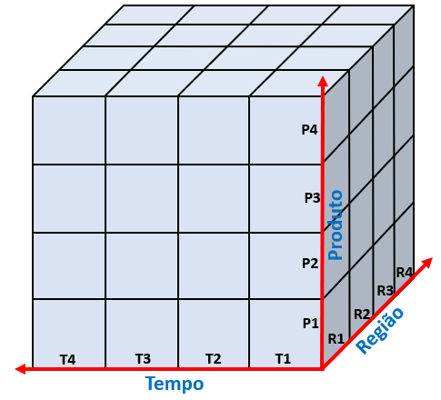
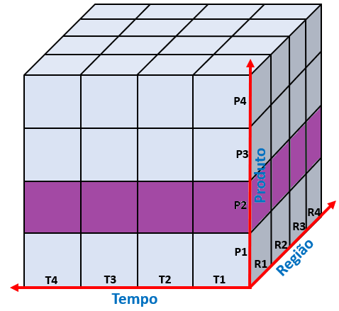
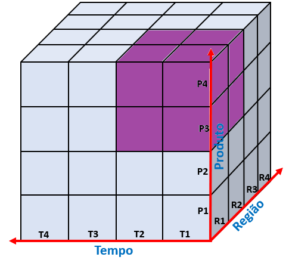
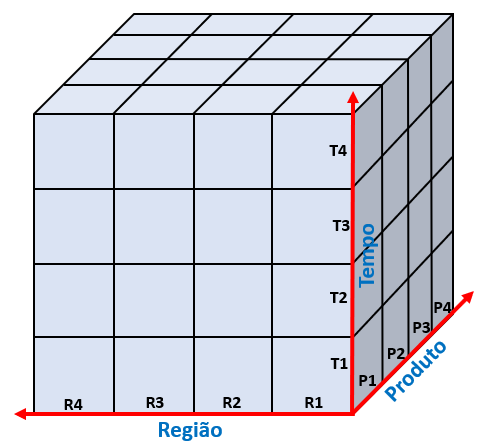

# OLAP (Online Analytical Processing)

O OLAP (Processamento Analítico Online) é uma ferramenta para realizar análises em grandes quantidades de dados, geralmente são armazenados em Data Warehouses, e utilizados em modelos dimensionais.

É muito aplicado no ambiente empresarial para analisar o comportamento de seus usuários, com o objetivo de analisar tendências no mercado, condutas positivas ou negativas dos funcionários, preferências dos clientes etc.

A <u>análise multidimensional</u> é a grande característica do OLAP, é um tipo de análise baseada em <u>cubos de informações</u>, na qual é possível que sejam realizadas estudos por meio de diferentes variáveis, que são chamadas de **dimensões.** 

As informações do banco de dados são distribuídas em 3 dimensões (Tempo, Região e Produto). Assim, poderá ter diversas combinações entre as dimensões, exemplos: {T1, R2, P3}, {T3, R1, P2} etc.

**Exemplo do mundo real:**
Uma empresa vendedora automotiva inicia suas operações em 2022, comercializando caminhões, carros, motocicletas e bicicletas em todos regiões do Brasil.

Onde a **dimensão tempo** seria (2022 até 2025), a **dimensão região** (Norte, Sul, Nordeste, Sudeste) e a **dimensão produto** (Caminhões, Carros, Motocicletas e Bicicletas). Assim, poderia ser analisado a quantidade de vendas de carros na região sudeste em 2023.

| Dimensão T | Dados T | Dimensão R | Dados R  | Dimensão P |   Dados P    |
| :--------: | :-----: | :--------: | :------: | :--------: | :----------: |
|     T1     |  2022   |     R1     |  Norte   |     P1     |  Caminhões   |
|     T2     |  2023   |     R2     |   Sul    |     P2     |    Carros    |
|     T3     |  2024   |     R3     | Nordeste |     P3     | Motocicletas |
|     T4     |  2025   |     R4     | Sudeste  |     P4     |  Bicicletas  |
## OLAP x OLTP

Os bancos de dados tradicionais também possuem suporte para o processamento de transações de um negócio, através da ferramenta [OLTP (Online Transaction Processing)](../OLTP/OLTP.md). O Processamento de Transações Online é focado em realizar <u>transações rotineiras e cotidianas</u> em **tempo real**, com muita agilidade, através de **inserções, exclusões e atualizações** de informações, sendo também possível a consulta dos dados.

Essa é a diferença OLTP é focada nestas transações citadas anteriormente, enquanto que o OLAP tem o foco em análises, de maneira a subsidiar decisões gerenciais e estratégicas, além de ter <u>características transacionais</u> e focado em <u>modelos multidimensionais.</u>

| Banco de Dados | Objetivo                      | Modelo                         | Velocidade |
| -------------- | ----------------------------- | ------------------------------ | ---------- |
| OLTP           | Foco em transações rotineiras | Relacional de uso transacional | Rápido     |
| OLAP           | Foco em análise               | Multidimensional               | Lento      |
## Variações do OLAP

Pode ser dividido de acordo com a estrutura de armazenamento dos dados e de acordo com a origem da consulta de informações.

### Por Armazenamento
#### MOLAP (Processamento Analítico Multidimensional Online)

Nessa estrutura, são realizados <u>consultas multidimensionais diretamente</u> em dados armazenados **em bancos também multidimensionais**, possuindo um **alto desempenho**. Além de, possuir como característica a limitação da quantidade de informações que pode ser analisada simultaneamente **(baixa escalabilidade).**
#### ROLAP (Processamento Analítico Reacional Online)

Os **dados utilizados** para as operações multidimensionais estão <u>armazenados em bases de dados relacionais</u>, através de tabelas formadas por linhas e colunas, possuindo um **baixo desempenho de consulta.** Mas não há restrições quanto à quantidade de dados a ser analisada, ou seja, possui uma **alta escalabilidade.**
##### HOLAP (Processamento Analítico Online Híbrido)

Ele é uma combinação entre MOLAP e HOLAP, possui um **bom desempenho** em consultas, bem como uma **boa escalabilidade.**

### Por Consulta

#### DOLAP (Desktop Online Analytical Processing)

A consulta é realizada por meio de uma <u>estação cliente</u> diretamente a um servidor, retornando o cubo de informações solicitadas. Desse modo, o tráfego na rede é reduzido, melhorando o desempenho do servidor.

#### WOLAP (Web Online Analytical Processing)

A consulta é realizada por meio de um <u>navegador web</u> a um servidor, retornando ao usuário o cubo de dados solicitados.

## Operações OLAP

Como já dito anteriormente, as operações OLAP permitem que sejam visualizados **subconjuntos** específicos dentro do cubo de dados, sendo possível solicitar e receber apenas aqueles dados de interesse o usuário. 

### Slice

Esta operação é caracterizada pela fixação de um valor para uma das dimensões. Uma **fatia (slice)** do cubo de dados.

**Exemplo:** 

### Dice 

A operação é realizada através da **seleção de dois ou mais valores das dimensões**, de modo a formr um <u>subcubo</u> de informações.

### Pivot (Rotação)

Realiza a **rotação do cubo**, de modo a <u>alterar a posição das dimensões</u>, sendo utilizado para realizar uma **apresentação alternativa** das informações da base de dados multidimensional

### Drill (Furar/Perfurar)
#### Drill Down (Roll Down)

Quando o usuário necessita de <u>informações mais detalhadas</u>, sendo isto realizado através da **redução de granularidade** da análise. Exemplo: informações baseadas em anos são reduzidas para meses. Dizemos que houve **uma redução do grão Tempo.**

#### Drill Up (Roll Up)

É invero ao drill down, quando o usuário necessita de <u>informações com menos detalhes</u> dos dados, havendo um **aumento de granularidade**. Exemplo: se temos uma dimensão de regiões brasileiras e aumentamos para dimensão país. Dizemos que houve **um aumento do grão Região.**

#### Drill Across

Este processo navega entre os dados, <u>realizando saltos entre os níveis</u> **da mesma dimensão**, sem necessidade de passar pelos níveis intermediários. Exemplo: Supondo que dentro da dimensão região haja os níveis (Região, Estado, Município), e é possível navegar dentro da consulta do nível Região para Município, sem a necessidade de entrar no nível Estado.
#### Drill Through

Quando houver uma <u>mudança de dimensões</u> durante a consulta. Por exemplo: o usuário pode estar navegando na dimensão região e, após, analisar os dados da dimensão tempo.

## Referências

- [OLAP](https://www.estrategiaconcursos.com.br/blog/o-que-e-olap/)

