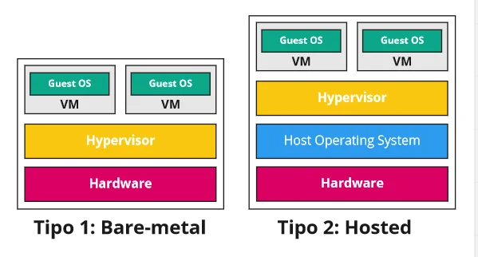

É um grande conjunto de **recursos virtualizados** de fácil acesso, os usuários podem demandar hardware, serviços e até mesmo plataformas completas. É um modelo onde o usuário paga apenas pela quantidade de recursos utilizados e podem ser ajustados e reconfigurados conforme desejar.

A _nuvem_ computacional é que cuida de todo o trabalho de processamento e armazenamento de dados, ao usuário cabe somente se preocupar com sua acessibilidade a ela, que na maior parte dos casos, se resume ao acesso à internet.

> A nuvem pode ser vista como o estágio mais evolutivo do conceito de virtualização, a virtualização do próprio data center. 

É através de um acordo de nível de serviço, O **SLA (Service Level Agreement)**, que é elaborado um **contrato formal** entre o **provedor de serviços** (por exemplo, uma empresa de nuvem como a AWS, Azure, Google Cloud) e o **cliente**, que define **os níveis mínimos de qualidade, disponibilidade e desempenho** que o serviço deve oferecer.
### Principais características
- Cria uma ideia de disponibilidade de recursos infinitos, acessíveis conforme sua necessidade.
- Elimina a necessidade de adquirir e provisionar recursos antecipadamente.
- Oferece <u style="font-weight: bold">elasticidade</u>, permitindo que as empresas usem os recursos na quantidade que forem necessários, aumentando e diminuindo a capacidade computacional de forma dinâmica.
- Como já dito, o pagamento dos serviços é feito pela quantidade de recursos utilizados.

### Principais vantagens
- **Escalabilidade e flexibilidade:** os usuários podem aumentar ou diminuir facilmente os recursos para atender às necessidades em constante mudança sem investimento inicial em hardware ou infraestrutura.
- **Redução de custos:** a computação em nuvem elimina a necessidade de gastos iniciais de capital e reduz o custo de manutenção e gerenciamento da infraestrutura local.
- **Confiabilidade e disponibilidade:** os provedores de nuvem normalmente oferecem infraestrutura robusta com sistemas redundantes e mecanismos de backup, garantindo alta disponibilidade e recuperação de desastres.
- **Colaboração e acessibilidade:** os serviços em nuvem facilitam a colaboração entre equipes geograficamente dispersas, permitindo que acessem e trabalhem em documentos e recursos compartilhados em tempo real.
- **Automação e eficiência:** as plataformas de nuvem geralmente fornecem ferramentas de automação e serviços gerenciados, reduzindo a carga de tarefas administrativas e melhorando a eficiência operacional.
### Características Essenciais da Cloud Computing

São 5 as principais características do serviços de Cloud Computing:
- **Auto-atendimento sob demanda (On-Demand Self-Service):** O consumidor pode usar os serviços da nuvem e, se achar necessário, aumentar ou diminuir as capacidades computacionais alocadas, como tempo de servidor, armazenamento de rede. Tudo isso sem precisar de interação humana com o provedor de serviços.
- **Acesso amplo à rede (Broad network access):** Os serviços em nuvem podem ser acessados pela Internet usando vários dispositivos, como computadores, smartphones e tablets.
- **Amplo acesso a rede (Ubiquitous Network Access):** Amplo acesso a rede significa que os serviços da nuvem são acessíveis de qualquer plataforma. São utilizados mecanismos padrões que promovem o uso de plataformas heterogêneas. Assim o cliente pode acessar tanto de seu celular quanto de seu PC ou qualquer outra plataforma.
- **Pool de Recursos (Resource Pooling):** Os recursos computacionais da nuvem ficam reunidos geograficamente. Seus recursos virtuais são dinamicamente atribuídos ou retribuídos pelo cliente conforme sua demanda. O cliente não possui controle sobre a real localização dos recursos que está utilizando, tendo somente uma informação mais ampla como o país em que se encontra, o estado ou o _Data Center._ Os tipos de recursos são: armazenamento, processamento, memória, banda e máquinas virtuais. Até mesmo nuvens privadas tendem a reunir seus recursos entre partes da organização.
- **Elasticidade Rápida (Rapid Elasticy):** Elasticidade é definida como a capacidade de alocar mais ou menos recursos no momento em que for necessário, com agilidade. Na ótica do consumidor, a nuvem parece ser infinita, pois ele pode adquirir quanto mais ou menos poder computacional for necessário para suas aplicações. Essa é uma das principais características que tornam a Cloud Computing um serviço muito atrativo.
- **Serviços Mensuráveis (Measured Service):** Todos os serviços são controlados e monitorados automaticamente pela nuvem, de maneira que fica tudo transparente tanto para o consumidor quanto para o fornecedor. Isso ajuda o consumidor a otimizar sua utilização da nuvem de acordo com sua produção, e ajuda o provedor na hora da cobrança dos recursos.
### Modelos de Serviço
- **SaaS:** Software as a Service, o cliente "aluga" o software. exs.: email, CRM, ERP
- **PaaS:** Plataform as a Service, fornecida toda a plataforma e ambiente de desenvolvimento para o cliente. exs.: streaming, desenvolvimento de aplicação
- **IaaS:** Infrastructure as as Service, disponibilização de máquinas virtuais para o cliente. exs.: sistema legado, servidor de arquivos.

#### SaaS - Software as a Service
Diferentemente da forma tradicional de venda de licenças e cópias dos softwares para instalação local, o software passa a ser entregue como serviço. Surge um cenário onde as empresas buscam cada vez mais diminuir os custos desnecessários. A responsabilidade de suporte, manutenção e atualização do produto ficam sob responsabilidade do provedor do serviço.

**Vantagens:**
- O cliente paga uma taxa mensal baseada no número de usuários que utilizam o produto, não sendo responsável pela infraestrutura requerida pelo mesmo (rede, servidores, sistema operacional, armazenamento e funcionalidade das aplicações).
- O software pode ser utilizado de qualquer lugar, tipicamente através de um navegador web.

🤖 **Chatgpt** diz que estes são os 10 SaaS mais utilizados:

|Produto|Empresa|Descrição|
|---|---|---|
|**Google Workspace**|Google|Pacote de produtividade (Gmail, Docs, Drive, Meet) totalmente online.|
|**Microsoft 365**|Microsoft|Versão em nuvem do Office (Word, Excel, Outlook, Teams).|
|**Salesforce**|Salesforce|CRM líder mundial — gestão de vendas e relacionamento com clientes.|
|**Zoom**|Zoom Video Comm.|Plataforma de videoconferência e colaboração em nuvem.|
|**Slack**|Salesforce|Comunicação corporativa e integração de equipes.|
|**Dropbox**|Dropbox Inc.|Armazenamento e compartilhamento de arquivos em nuvem.|
|**Google Drive**|Google|Serviço de armazenamento e sincronização de arquivos.|
|**HubSpot**|HubSpot|Plataforma de marketing, CRM e automação de vendas.|
|**Zendesk**|Zendesk Inc.|Atendimento e suporte ao cliente via nuvem.|
|**Shopify**|Shopify|Criação e gestão de lojas virtuais via navegador.|
#### PaaS - Plataform as a Service
Oferece a possibilidade de construir e operar as próprias aplicações, utilizando ferramentas suportadas pelo provedor do serviço. Não se perde mais tempo baixando ou instalando aplicações, pois todos os serviços estarão disponíveis na nuvem, incluindo ferramentas de desenvolvimento, testes, administração, gerenciamento e hospedagem.

🤖 **Chatgpt** diz que estes são os 10 PaaS mais utilizados:

| Plataforma                      | Empresa       | Descrição                                                                      |
| ------------------------------- | ------------- | ------------------------------------------------------------------------------ |
| **Google App Engine**           | Google Cloud  | Plataforma para desenvolver e hospedar aplicativos web e APIs.                 |
| **Microsoft Azure App Service** | Microsoft     | Plataforma para criar e implantar apps em várias linguagens.                   |
| **AWS Elastic Beanstalk**       | Amazon        | Serviço da AWS que facilita o deploy e o gerenciamento de aplicações.          |
| **Heroku**                      | Salesforce    | PaaS simples para deploy rápido de apps (muito usado por desenvolvedores web). |
| **Red Hat OpenShift**           | IBM / Red Hat | Plataforma PaaS baseada em Kubernetes e Docker.                                |
| **Oracle Cloud PaaS**           | Oracle        | Soluções de banco de dados e desenvolvimento em nuvem.                         |
| **IBM Cloud Foundry**           | IBM           | Plataforma para desenvolver e integrar aplicações corporativas.                |
| **Engine Yard**                 | Engine Yard   | PaaS para aplicativos Ruby on Rails.                                           |
| **SAP Cloud Platform**          | SAP           | Desenvolvimento e integração de sistemas empresariais.                         |
| **Mendix**                      | Siemens       | PaaS para desenvolvimento low-code (sem necessidade de programar muito).       |

#### IaaS - Infrastructure as a Service

Tem-se a infraestrutura de computação como um serviço, onde disponibilizam-se recursos como servidores virtualizados, rede, armazenamento e etc.

>Também referenciado como HaaS (_Hardware as a Service_)

🤖 **Chatgpt** diz que estes são os 10 IaaS mais utilizados:

|Plataforma|Empresa|Descrição|
|---|---|---|
|**Amazon Web Services (AWS)**|Amazon|Maior provedor de IaaS do mundo; inclui EC2, S3, RDS, etc.|
|**Microsoft Azure**|Microsoft|Infraestrutura e serviços em nuvem corporativos (VMs, storage, rede).|
|**Google Cloud Platform (GCP)**|Google|Máquinas virtuais, IA e bancos de dados escaláveis.|
|**IBM Cloud**|IBM|Infraestrutura híbrida e segura com IA integrada.|
|**Oracle Cloud Infrastructure (OCI)**|Oracle|Foco em alto desempenho e bancos de dados empresariais.|
|**Alibaba Cloud**|Alibaba|Principal provedor da Ásia; oferece IaaS globalmente.|
|**DigitalOcean**|DigitalOcean|IaaS popular entre desenvolvedores; fácil de configurar.|
|**Linode (Akamai Cloud)**|Akamai|Hospedagem e infraestrutura para desenvolvedores e startups.|
|**VMware Cloud**|VMware|Soluções de virtualização e nuvem híbrida.|
|**OpenStack**|Open Source|Plataforma open-source para construir nuvens privadas.|

### Outros Modelos de Serviço
- **MaaS (Monitoring as a Service):** É um tipo de serviço oferecido para as empresas, através de provedores especializados, que utilizam ferramentas para coletar informações remotamente. É ofertado para atuar em tempo real, agindo proativamente e reativamente contra ameaças internas e externas
- **BaaS (Backup as a Service):** Oferece uma solução de backup e recuperação dos dados eficiente, permitindo controle dos custos e aumento no nível de serviço.
- **CaaS (Communication as a Service):** Os principais tipos de serviços oferecidos atualmente são mensagens em tempo real, serviços de dados, bate-papo, serviços locais e de longa distância de voz, correio eletrônico de voz, conferência, videoconferência e voz sobre IP.
- **DaaS (Database as a Service):** As empresas utilizam os serviços da nuvem para armazenar e acessar suas informações, sem arcar com os custos de infraestrutura

### Principais Provedores e Serviços
#### Amazon
- **Amazon Elastic Compute Cloud (EC2):** Serviço que funciona na web e permite que se faça as requisições de máquinas virtuais em minutos, aumentando ou diminuindo facilmente sua capacidade, baseando-se na demanda.
- **Amazon Simple Storage Service (S3):** Fornece uma interface de serviços de armazenamento e recuperação de dados remota. Os dados podem ser armazenados e acessados de qualquer lugar na Internet com alta disponibilidade.
- **Amazon SimpleDB (SDB):** É um serviço web para armazenamento, recuperação, processamento e enfileiramento de conjuntos de dados estruturados. É fácil de usar e fornece a maioria das funções de um banco de dados relacional.

#### Microsoft
- **Azure:** Oferece serviço de IaaS, como a locação de máquinas virtuais e armazenamento de arquivos, serviço de banco de dados SQL e distribuído globalmente (Azure Cosmos DB)

### Tipos de Nuvens: Pública, Privada e Híbrida
As públicas são acessíveis em toda a internet, e as privadas ficam em um ambiente protegido (firewall) como o de uma empresa, com acesso restrito aos seus funcionários ou parceiros de negócios.

- **Pública:** Maior risco de privacidade
	- Alto desempenho
	- Acesso imediato
	- Baixo custo
	- Escalabilidade
- **Privada:** Custo contínuo da operação, alto investimento
	- Segurança
	- Controle total
- **Nuvem Comunitária:** A infraestrutura de uma nuvem comunitária é compartilhada por várias organizações que partilham interesses como a missão, requisitos de segurança, políticas, entre outros. Pode ser administrada pelas próprias organizações ou por um terceiro e pode existir no ambiente da empresa ou fora dele.
- **Hibrida:** Uma composição de duas ou mais nuvens, sejam elas privadas, publicas ou comunitárias, combina recursos de nuvem pública e privada (ou infraestrutura local) em um ambiente integrado, permitindo que dados e aplicações sejam compartilhados entre eles.

### Open Cloud Manifesto
O Manifesto é uma tentativa de dar um rumo ao conceito de Computação em Nuvem que acredita que deve ser tão aberta como todas as outras tecnologias em TI, Com isso, qualquer um que tem poder computacional, ou seja, servidores web o suficiente, para possuir sua própria nuvem, poderia conseguir a tecnologia para montá-la.

- **Objetivos:** O cliente poderá escolher de acordo com suas necessidades, assim como fazem com todos os outros serviços de TI. Quando a nuvem é aberta, os líderes das corporativas se beneficiam de diversas maneiras.
- **Escolha:** Deve ser facilitada a mudança de provedor dos serviços ou arquitetura da nuvem para que as organizações tenham liberdade de escolha e não fiquem presas a provedores específicos devido à estrutura e arquitetura de sua nuvem. Tudo deve ser feito de maneira que priorize o consumidor e sua fácil mudança entre fornecedores.
- **Flexibilidade:** Uma organização poderá facilmente trabalhar com outras, independentemente de qual provedor ou arquitetura estas escolheram. Uma nuvem aberta irá promover a interação entre organizações com diferentes provedores de Cloud Computing.
- **Rapidez e Agilidade:** Com as interfaces abertas, será possível construir novas soluções para integrar nuvens públicas, privadas. Uma nuvem aberta permitirá à organização responder com rapidez e agilidade as novas organizações que surgirem com o desenvolvimento das técnicas e organização da Computação em Nuvem.
- **Competências:** Com a unificação dos projetos, haverá mais profissionais qualificados nas novas tecnologias, que serão relativamente poucas frente a infinitas possibilidades de modelagens e arquiteturas desenvolvidas por diversos fornecedores proprietários. Como será menor o número de tecnologias, o número de profissionais nelas aumentará.

> Cloud Computing e Virtualização não são a mesma coisa. Entretanto, virtualização é essencial para o funcionamento de computação em nuvem. Por isso, será brevemente abordado:
### Base de Infraestrutura: Virtualização
Virtualização é uma forma de esconder as características físicas de uma plataforma computacional dos utilizadores, mostrando outro hardware virtual, emulando um ou mais ambientes isolados.

#### Máquina Virtual (Virtual Machine) VM
É uma duplicata eficiente e isolada de uma máquina real. Ou ainda, é uma cópia totalmente protegida e isolada de um sistema físico.

Simula um ou mais ambientes de hardware para que sistemas operacionais possam ser instalados em um único hardware físico compartilhado

Os sistemas instalados nestas máquinas virtuais têm a percepção de que estão instalados diretamente no hardware real, e desta maneira podem operar da forma convencional

#### Monitor de Máquina Virtual (Virtual Machine Monitor – VMM)
- Conhecido como sistema operacional para sistemas operacionais ou hypervisor.
- Cria e gerencia as máquinas virtuais.
- Cada máquina virtual, que recebe uma cópia da máquina real, pode fornecer facilidades e recursos a uma aplicação ou mesmo a um sistema operacional convidado (gues
- O sistema operacional convidado que é instalado na máquina virtual acredita estar sendo executado em um ambiente convencional com acesso direto ao hardware.

### Tipos de Virtualização
**Hypervisor Tipo I (Virtualização Nativa | Bare-Metal):**
 - O VMM é implementado entre os sistemas convidados (guests) e o hardware. 
 - O VMM tem total controle do hardware e cria um ambiente de máquinas virtuais onde cada um se comporta como se fosse uma máquina física que pode executar o seu próprio sistema operacional.
 - Este tipo de virtualização gera a possibilidade de diversos sistemas operacionais serem instalados no mesmo hardware e serem executados simultaneamente.
 - Exemplo: KVM

**Hypervisor Tipo II (Virtualização Hospedada | Hosted):**
- O VMM é implementado entre o sistema hospedeiro (anfitrião ou host) e o convidado (guest).
- O VMM é executado no sistema hospedeiro como um processo.
- Este funciona de forma muito parecida ao VMM do tipo I, sendo que sua principal diferença é a existência de um sistema hospedeiro abaixo dele
- Neste modelo, o VMM simula todas as operações que o sistema hospedeiro controlaria.
- Exemplo: Estando no Ubuntu Linux, instalar o Virtualbox e dentro desta virtualização instalar o Kali Linux.

