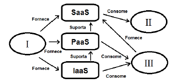

# Questões FGV
## 2025

**(CNU/2025)** Ana está avaliando as opções para hospedagem dos serviços e sistemas de informação do seu órgão da Administração Pública federal que possuem dados com restrição de acesso e crescem sob demanda. Por isso, Ana precisa de um ambiente de serviços de computação em que os serviços sejam exclusivamente suportados e compartilhados por um grupo específico de órgãos e entidades que têm requisitos compartilhados e um relacionamento entre si. Diante dos requisitos analisados,  Ana deve contratar ou adquirir um(a):

- switch;
- firewall;
- storage all-flash;
- chave criptográfica;
- ✔ nuvem comunitária.

**(DPE RO/2025)** Assinale a afirmativa correta relacionada às estratégias para migração de um sistema legado para um ambiente de nuvem.

- O software legado é arquitetado para ser executado dentro dos firewalls corporativos, mas não depende do hardware físico.
- ✔ As arquiteturas de computação em nuvem requerem arquiteturas fracamente acopladas.
- A elasticidade não é um motivo válido para mover o aplicativo para a nuvem
- Os serviços em nuvem são stateful, já os sistemas legados, em geral, são stateless
- Devemos unificar as iniciativas de computação em nuvem em uma entrega só para gerar valor comercial mais rapidamente.

**(MPE RJ/2025)** Igor precisa repassar os dados de compra de um fornecedor de papel ofício que está em formato de .TXT para um serviço de armazenamento de dados em nuvem. Em relação ao caso, analise as afirmativas a seguir.

1. Somente é possível utilizar serviços de nuvem para armazenar informações referentes a arquivos DOC e PDF.
2. Serviços de armazenamento em nuvem podem ser utilizados para armazenar arquivos como documentos de qualquer tipo de formato.
3. Serviços de nuvem podem armazenar arquivos que podem ser vistos tanto por Igor quanto seu fornecedor para realizar conferência de informações.

Está correto o que se afirma em

- 1, apenas.
- 2, apenas.
- 3, apenas.
- 1 e 2, apenas.
- ✔ 2 e 3, apenas.

**(Prefeitura de Canaã dos Carajás/2025)** Elton é um técnico de informática recém-contratado pela Prefeitura, o qual precisa usar serviços de armazenamento e recuperação de qualquer quantidade de dados em nuvem. Assinale a opção que indica os _serviços_ que podem ser usados a qualquer momento e de qualquer lugar na _web._

- ✔ s3 e _dropbox._
- _pass_ e _icloud._
- _saas_ e _github._
- b64 e _onedrive._
- _iass_ e _google drive._

**(TCE-PE/2025)** Um analista necessita armazenar, em nuvens de computadores, grandes volumes de diferentes tipos de dados processados pelo TCE-PE. Ele sabe que o armazenamento em nuvens oferece flexibilidade e escalabilidade, e que a classificação mais comum dos tipos de armazenamento se baseia na forma como os dados são organizados e acessados.

Os três tipos principais de armazenamento em nuvem são:

- ✔ objetos, arquivos e blocos.
- arquivos, diretórios e links.
- cadeias de blocos, _hashes_ e índices.
- objetos, diretórios e cadeias de caracteres.
- estruturado, não estruturados e semiestruturado.

**(Prefeitura de Canaã dos Carajás/2025)** Relacione os tipos de _serviços de nuvem_ de computadores com suas respectivas definições.
1. Ambientes de nuvem pública.
2. Ambientes de nuvem privada.
3. Ambientes de nuvem híbrida.
4. Ambientes de múltiplas nuvens.

- (  ) Serviços de nuvem operados por provedores de serviços de nuvem diferentes.
- (  ) São executados por provedores de serviços de nuvem, sendo os servidores compartilhados por vários locatários.
- (  ) Trata-se de uma combinação de _datacenters_ locais e nuvens de terceiros.
- (  ) É um _datacenter_ de propriedade de um cliente ou executado por um provedor de serviços de nuvem pública. Sendo os servidores de locatário único, estas organizações não precisam dividir espaço com outras empresas.

Assinale a opção que indica a relação correta, segundo a ordem apresentada.
- ✔ 4 – 1 – 3 – 2.
- 1 – 2 – 4 – 3.
- 2 – 3 – 1 – 4.
- 3 – 4 – 1 – 2.
- 4 – 1 – 2 – 3.
## 2024

**(Dataprev/2024)** Uma empresa está montando uma arquitetura de nuvem, de modo que possa disponibilizar serviços para terceiros. No caso, a empresa está trabalhando com a configuração do _back-end_, cuidando dos seus componentes, cujas principais partes são:

- camada de virtualização, infraestrutura híbrida e sistema operacional.
- infraestrutura híbrida, interface com o usuário e tecnologia de acesso.
- ✔ hardware do data center, camada de virtualização e camada de aplicativos e serviços.
- hardware do data center, interface com o usuário e sistema operacional.
- hardware do data center, camada de aplicativos e serviços e tecnologia de acesso.

~~~
Front-end: interface com o usuário, tecnologia de acesso, cliente web
Back-end: hardware, virtualização, sistema operacional, camada de serviços
Infraestrutura Híbrida é um modelo de implementação
~~~
**(Dataprev/2024)** Uma empresa de comércio eletrônico que atende clientes em todo o território nacional está expandindo rapidamente e busca migrar sua infraestrutura para a nuvem. A empresa tem como prioridade garantir alta disponibilidade, baixa latência, escalabilidade e recuperação de desastres, ao mesmo tempo em que precisa otimizar seus custos operacionais.

Dado o contexto de operação nacional e os requisitos da empresa, a arquitetura de nuvem correta para essa organização é

- utilizar múltiplas regiões geográficas globais, com servidores distribuídos entre diferentes países, para garantir baixa latência para todos os clientes.
- implementar uma arquitetura com múltiplas zonas de disponibilidade dentro de uma única região, para garantir alta disponibilidade e recuperação de desastres sem a complexidade de múltiplas regiões.
- criar subscrições separadas para cada estado do país, com recursos isolados, garantindo uma melhor distribuição de carga em nível regional.
- ✔ distribuir os recursos entre várias regiões dentro do país, com uma política de escalabilidade automática, para atender a demanda em diferentes estados.
- escolher uma única zona de disponibilidade com alto desempenho, focando na redução de custos e aceitando possíveis riscos de indisponibilidade em caso de falha.

**(TJ-RR/2024)** A computação em nuvem permite armazenamento, processamento e acesso flexível a dados e aplicações remotamente. Sobre os conceitos envolvidos na computação em nuvem, é correto afirmar que

- em nuvens públicas, os recursos de computação são hospedados em provedores externos, enquanto em nuvens privadas estes recursos devem ser hospedados localmente.
- modelos PaaS (Plataform as a Service) e IaaS (Infrastructure as a Service) só podem ser empregados em nuvens públicas.
- nuvens públicas permitem maior personalização graças ao acesso compartilhado da plataforma, ao contrário de nuvens privadas.
- modelos SaaS na nuvem privada são mais caros que na nuvem pública, porém modelos IaaS e PaaS apresentam custos semelhantes em ambos os tipos de nuvem.
- ✔ nuvens privadas minimizam ou eliminam o multitenancy, enquanto nas nuvens públicas o multitenancy é um conceito central.

~~~
Multitenacy = Multilocação que é quando vários clientes diferentes da nuvem acessam os mesmos recursos computacionais.
~~~
**(STN - Auditor Federal/2024)** A estratégia de gestão de infraestrutura em tecnologia da informação que busca a flexibilidade operacional por meio do uso combinado de diferentes serviços de nuvem pública, como _Amazon Web Services_ (AWS), Microsoft Azure e Google Cloud Platform, permitindo que uma organização se beneficie das características únicas de cada serviço, conforme suas necessidades específicas, é conhecida como

- Infraestrutura Hiperconvergente (HCI).
- ✔ Multi Cloud.
- Híbrida.
- Edge.
- Privada.

**(Dataprev/2024)** Uma empresa de médio porte está planejando migrar suas operações para a computação em nuvem. A empresa precisa manter controle total de seus dados sensíveis, como informações financeiras e dados de clientes, mas também quer aproveitar a flexibilidade e escalabilidade oferecida por provedores externos para outras funções menos críticas, como desenvolvimento de software.

O modelo de implantação correto para atender a essas necessidades de segurança e flexibilidade é

- Nuvem Pública - Recursos de baixo custo e alta escalabilidade, com total controle sobre os dados.
- Nuvem Privada - Exclusividade de recursos, controle completo sobre dados, com escalabilidade limitada e custos mais altos.
- ✔ Nuvem Híbrida - Combina nuvem privada para dados sensíveis e nuvem pública para maior escalabilidade, oferecendo o melhor dos dois mundos.
- Nuvem Comunitária - Compartilhamento de infraestrutura entre várias organizações com flexibilidade limitada e baixo controle.
- SaaS - Modelo que permite o acesso a software de terceiros, com foco na segurança e controle sobre dados confidenciais.

**(ALE-TO/2024)** Em relação aos sistemas e serviços de armazenamento de dados na nuvem, analise as afirmativas a seguir e assinale (V) para a verdadeira e (F) para a falsa.
- ( ) O serviço de armazenamento de dados não estruturados para empresas na nuvem do Google é o Drive.
- ( ) O Dropbox é um aplicativo de armazenamento na nuvem.
- ( ) No OneDrive é possível ativar arquivos sob demanda para manter arquivos em seu disco rígido e usar _offline_.
- ( ) Os serviços de armazenamento de dados na nuvem são sempre gratuitos.

As afirmativas são, respectivamente,
- ✔ V – V – V – F.
- V – V – F – F.
- F – V – V – F.
- F – V – F – F.
- V – V – F – V.

**(Dataprev/2024)** Uma empresa de sistemas de informação deseja montar uma estrutura de nuvem privada no local. Nesse caso, significa que

- ✔ a infraestrutura da nuvem será hospedada internamente no data center da empresa e gerenciada por sua equipe de TI.
- os recursos de nuvem pública serão de terceiros, inclusive com mando externo na operação de provedor de nuvem.
- os serviços de nuvem serão executados fora da empresa, em servidores de nuvem de um fornecedor terceirizado.
- todos os recursos e serviços da nuvem serão compartilhados entre vários clientes, de forma multilocatária.
- vai-se oferecer computadores da empresa, em um ambiente isolado, mas serão usados recursos compartilhados de infraestrutura de nuvem pública.

**(TRF/2024)** Roberto foi contratado para gerenciar a implantação de um novo data center, que servirá para hospedar o ambiente de nuvem de um conjunto de organizações. Nesse ambiente, cada organização participante poderá criar seus serviços, com base nas ferramentas disponibilizadas no ambiente de nuvem, mas sem poder utilizar tecnologias arbitrárias.

Segundo as definições da recomendação NIST SP 800-145, o ambiente configurado por Roberto é classificado como:

- nuvem pública com modelo de serviço SaaS;
- nuvem comunitária com modelo de serviço IaaS;
- nuvem pública com modelo de serviço IaaS;
- nuvem privada com modelo de serviço PaaS;
- ✔ nuvem comunitária com modelo de serviço PaaS.

**(CVM/2024)** Um órgão público contratou serviço de um provedor de computação em nuvem pública no modelo SaaS (_Software as a Service_), mas, por ter dados sigilosos, contratou também uma solução de nuvem privada para manipulá-los, em consonância com a LGPD (Lei Geral de Proteção de Dados). Os requisitos tecnológicos para ambas as soluções são iguais, porém o órgão possui apenas uma conexão com a internet para intercambiar informações entre as soluções contratadas.
Uma vantagem da nuvem privada em relação à nuvem pública contratada é o(a):

- menor demanda de profissionais do órgão para administrar a solução;
- ✔ maior controle na administração e configuração da infraestrutura;
- maior confiabilidade devido ao maior número de provedores de infraestrutura de comunicação;
- maior desempenho devido às configurações dos equipamentos tecnológicos;
- maior elasticidade por causa da maior quantidade de equipamentos envolvidos na solução.

**(Prefeitura de São José dos Campos/2024)** Assinale a opção que melhor descreve o conceito de cloud storage.

- Armazenamento físico de dados em discos rígidos locais.
- ✔ Armazenamento de dados em servidores remotos acessíveis pela internet.
- Armazenamento de dados exclusivamente em dispositivos móveis.
- Armazenamento de dados em CDs e DVDs.
- Armazenamento de dados em pen drives.

**(CVM/2024)** O analista Ricardo adquiriu de um provedor as soluções de nuvem A, B e C, para a CVM. Os serviços da solução A replicam dados diretamente na solução B. A solução C não possui conectividade com as demais soluções. Todas as soluções atendem exclusivamente à CVM, porém as soluções A e C operam na Internet, enquanto a solução B opera na Intranet.
Em relação ao modelo de implantação da arquitetura de nuvem, as soluções:

- ✔ A, B e C são nuvens privadas;
- A, B e C formam uma multicloud;
- A, B e C formam uma nuvem híbrida;
- A e C são nuvens públicas, enquanto B é nuvem privada;
- A e B formam uma nuvem híbrida, enquanto C é nuvem privada.

~~~
"Todas as soluções atendem EXCLUSIVAMENTE à CVM", por ser exclusivo todas elas são nuvens privadas.
~~~

**(Prefeitura de São José dos Campos/2024)** Com relação ao Google Drive, analise as afirmativas a seguir.

I. Oferece acesso criptografado e seguro aos seus arquivos.
II. É nativo da nuvem, o que diminui muito a necessidade de arquivos locais, bem como o risco para seus dispositivos.
III. Os arquivos compartilhados podem ser verificados e removidos proativamente se forem _malware_, _spam_, _ransomware_ ou _phishing_.

Está correto o que se afirma em
- I, apenas.
- I e II, apenas.
- I e III, apenas.
- II e III, apenas.
- ✔ I, II e III.

**(TRF 2024)** A equipe de TI de um órgão público contratou uma nuvem específica para prover os serviços financeiros para um grupo de órgãos diretamente subordinados. Apenas as equipes das áreas de orçamento e finanças terão acesso aos serviços ofertados nessa nuvem.

De acordo com o NIST SP 800-145, o modelo de implementação adotado pelo órgão foi:

- private cloud;
- ✔ community cloud;
- public cloud;
- hibrid cloud;
- software cloud.

**(TRF 2024)** A plataforma digital do Poder Judiciário brasileiro (PDPJ-Br) foi criada com o objetivo integrar e consolidar todos os sistemas eletrônicos do Judiciário brasileiro em um único ambiente unificado.
Para tanto, a PDPJ-BR adota soluções que abrangem o conceito de computação em nuvem.
A PDPJ-Br poderá ser provida por um serviço de computação em nuvem fornecido por uma empresa privada, desde que:

- o armazenamento dos dados ocorra em datacenter abrigado na sede da empresa contratada;
- ✔ atenda aos requisitos de disponibilidade, de escalabilidade, de redundância e de criptografia;
- permita o compartilhamento não oneroso do código-fonte dos artefatos que venham a ser hospedados na nuvem;
- permita a mensuração de uso dos recursos da nuvem conforme critérios pactuados pela empresa contratada;
- possibilite a conformidade com as normas técnicas e outras estabelecidas em ato próprio do coordenador do comitê gestor de segurança da informação do Poder Judiciário.
## 2023

**(BBTS/2023)** Atualmente, há diferentes opções tecnológicas para armazenamento de dados em nuvem.
Assinale a opção que indica a tecnologia de armazenamento que usa pratos giratórios mecânicos e um cabeçote móvel de leitura/gravação para acessar dados.

- ✔ hdd.
- ram.
- rom.
- ssd.
- usb.

~~~
Note que HDD = Hard Disk Drive
SSD é memória flash
~~~

## 2022

**(TJDFT/2022)** O Poder Judiciário criou a Plataforma Digital do Poder Judiciário Brasileiro (PDPJ-Br) para disponibilizar soluções para uso por todos os sistemas de processo judicial eletrônico do Poder Judiciário nacional. A PDPJ-Br é disponibilizada na forma de um _marketplace_ que pode ser hospedada em nuvem.

O requisito a ser observado para permitir a hospedagem da PDPJ-Br em um provedor de serviços de nuvem é que a nuvem:

- seja híbrida e exclusiva para o Poder Judiciário;
- seja híbrida, podendo ser compartilhada somente outro órgão público;
- ✔ armazene os dados em um _datacenter_ em território nacional;
- transmita os dados por equipamentos em território nacional;
- realize o _backup_ dos dados em equipamentos do Poder Judiciário.

**(SF - Analista de Informática Legislativa/2022)** Os executivos responsáveis por uma empresa decidiram, recentemente, migrar toda sua força de trabalho para o modelo de _home-office_. Para facilitar essa migração, os serviços de diretório de identidades e armazenamento de arquivos foram migrados para provedores de serviços externos (nuvem pública), onde os usuários têm acesso diretamente aos serviços sem necessidade de estar na rede da empresa.

Nesse sentido, assinale a opção que indica a ação efetiva para:
- Prover visibilidade sobre o uso dos serviços externos.
- Controle sobre os cumprimentos das políticas de segurança da informação.
- Proteção contra vazamento de identidades.

Marque a opção corrreta:
- Implementar uma ferramenta de DLP no _firewall_ da empresa e uma ferramenta de controle de contas com acesso privilegiado.
- ✔ Implementar uma ferramenta de CASB, uma ferramenta de controle de contas com acesso privilegiado e uma ferramenta de _login_ centralizado (SSO) com uso de um segundo fator de autenticação.
- Implementar uma ferramenta de controle de configurações, implementar monitoramento na VPN corporativa.
- Implementar política solicitando que os usuários criptografem os dados antes de utilizarem os serviços externos.
- Implementar uma ferramenta de antivírus com _sandboxing_ em todas as estações da rede da empresa.

~~~
CASB é a sigla para Cloud Access Security Broker (Corretor de Segurança de Acesso à Nuvem), uma ferramenta de segurança que atua entre usuários e serviços em nuvem para aplicar políticas de segurança, garantir a conformidade e proteger dados. Ele fornece visibilidade sobre o uso da nuvem, proteção contra ameaças, prevenção de perda de dados (DLP) e controle de acesso para garantir que os dados corporativos na nuvem sejam seguros.
~~~

**(MPE GO/2022)** Júlia e seus colegas de faculdade estão fazendo um trabalho em grupo e decidiram compartilhar seus arquivos de imagens e texto na nuvem de modo que cada integrante do grupo possa ver e acessar as atualizações dos outros pela Internet.
Para compartilhar na nuvem os arquivos do trabalho com os colegas do grupo, Júlia deve usar o

- ✔ Dropbox.
- Pendrive.
- Mozilla Thunderbird.
- Windows Explorer.
- Infraestrutura como Serviço (IaaS).

**(TJDFT-2022)** O órgão XPTO do Poder Judiciário está implementando tecnologia em nuvem para prover serviços para outros órgãos. Os serviços ofertados consistirão em um ambiente no qual os clientes receberão máquinas virtuais, com suas áreas de armazenamento definidas (_storage_) e as interfaces de rede de acordo com os ambientes (produtivos ou não produtivos), nas quais poderão instalar os sistemas operacionais e suas aplicações para disponibilizarem serviços para seus clientes.
De acordo com a NIST SP 800-145, o modelo de serviço de nuvem implementado pelo órgão XPTO é o:

- ✔ _infrastructure as a service;_
- _on-demand self-service;_
- _software as a service;_
- _platform as a service;_
- _measured service._

**(MPE-GO/2022)** A equipe de suporte de redes do MP-GO decidiu modernizar seu parque computacional para otimizar a alocação dos seus recursos implantando uma nuvem.
Usando equipamentos próprios hospedados internamente, a nuvem que a equipe de suporte deve implantar é

- distribuída.
- múltipla.
- híbrida.
- comunitária.
- ✔ privada.

**(Analista de Informática Legislativa/2022)** Nos últimos anos, a adoção de ambientes em nuvem cresceu expressivamente. Modelos de serviços em nuvem facilitam a criação de soluções tecnológicas modernas de maneiras diferentes.
A seguir, estão listadas algumas características de um desses modelos.

- I. O provedor de nuvem fica responsável pelo gerenciamento da infraestrutura de servidores, sistemas operacionais, atualizações e outras tarefas administrativas.
- II. Acessível pela internet por meio do navegador web.
- III. Permite equipes de desenvolvimento colaborarem em todo o ciclo de vida de um aplicativo, incluindo codificação, integração, teste, entrega, implantação e feedback.

As características descritas nos itens I, II e III referem-se a
- IAC.
- TaaS.
- SaaS.
- IaaS.
- ✔ PaaS.
## 2018

**(BANESTES/2018)** A modalidade de computação em nuvem que oferece os recursos necessários para o desenvolvimento e gerenciamento de aplicações em que o provedor da cloud é o responsável por cuidar de toda a configuração de infraestrutura necessária como instalação de servidores, firewalls, conectividade, é denominada:

- CaaS;
- IaaS;
- ✔ PaaS;
- Qemu;
- SaaS.

**(SEPLAG/2018)** O modelo de computação em nuvem, no qual um provedor de serviços fornece acesso de usuário a recursos de computação sob demanda, como servidores, armazenamento e rede, para que organizações utilizem seus próprios aplicativos e plataformas sobre estes recursos computacionais, é denominado

- ✔ IaaS.
- PaaS.
- SaaS.
- BPaaS.
- DBaaS.

**(BANESTES/2018)** Uma empresa pretende colocar seu desenvolvimento em um ambiente baseado em computação em nuvem. Para isso, está verificando soluções que permitam a implantação na nuvem de aplicativos criados pela própria empresa, que utilizem, porém, sistemas operacionais, ferramentas de desenvolvimento e banco de dados oferecidos pelo fornecedor. A empresa está procurando uma solução de nuvem com base em:

- SaaS (software as a service);
- IaaS (infrastructure as a service);
- ✔ PaaS (platform as a service);
- IaaP (infrastructure as a platform);
- SaaP (software as a platform).

## 2017

**(SEPOG/2017)** A _Computação em Nuvem_ tem se tornado uma tecnologia inovadora em termos de desenvolvimento de soluções de TI para as empresas.
A esse respeito, relacione os diversos tipos de serviço com suas respectivas características.

1. IaaS (infraestrutura como serviço)
2. PaaS (plataforma como serviço)
3. SaaS (_software_ como serviço)

- (  ) Neste tipo de serviço os usuários tem acesso a uma única cópia da aplicação criada especificamente pelo provedor de serviço e atualizada de uma forma uniforme para todos os usuários.
- (  ) Este tipo de serviço permite aos desenvolvedores construírem aplicações e serviços na Internet, sendo acessado pelos usuários simplesmente com o uso do navegador.
- (  ) Neste tipo de serviço os usuários tem acesso direto aos servidores e ao armazenamento virtualizados por meio da Internet e, de modo similar, a um centro de dados convencional, podendo escalar esses recursos com mais flexibilidade de acordo com a demanda.

Assinale a opção que mostra a relação correta, de cima para baixo:
- 1, 2 e 3.
- 2, 3 e 1.
- 3, 1 e 2.
- 1, 3 e 2.
- ✔ 3, 2 e 1.

## 2013

**(ALE MA/2013)** Com relação às características, vantagens e desvantagens da computação em nuvem, analise as afirmativas a seguir.

- I. Computação em nuvem é a prática de se usar um conjunto de servidores remotos, acessíveis via Internet, para armazenar, gerenciar e processar dados de usuários, ao invés de servidores locais ou computadores pessoais.
- II. IaaS (_Infrastructure-as-a-Service_) é um tipo de computação em nuvem que fornece aplicativos por meio do navegador para milhares de usuários conectados à Internet. Um exemplo é o Google Apps, que oferece aplicativos para negócios e escritórios, mantendo os softwares e os dados do usuário armazenados em servidores da Google.
- III. Uma das preocupações existentes com a computação em nuvem é sobre a segurança dos dados do usuário, pois esses dados ficam armazenados na infraestrutura de servidores mantida pelo provedor do serviço via nuvem.

-  se somente a afirmativa I estiver correta.
- se somente a afirmativa III estiver correta.
-  se somente as afirmativas I e II estiverem corretas.
- ✔ se somente as afirmativas I e III estiverem corretas.
-  se todas as afirmativas estiverem corretas.

## 2015

**(DPE-MT/2015)** A respeito do armazenamento de dados na nuvem, analise as afirmativas a seguir.

- I. A principal função da nuvem é o armazenamento de dados.
- II. A robustez da conexão à Internet é essencial para o uso da nuvem.
- III. Uma nuvem descartável é indicada para projetos que são realizados uma única vez.
Assinale:
-   se somente a afirmativa I estiver correta.
- se somente a afirmativa II estiver correta.
- se somente a afirmativa III estiver correta.
- se somente as afirmativas I e II estiverem corretas.
- ✔ se somente as afirmativas II e III estiverem corretas.

**(DPE MT/2015)** Na figura a seguir é apresentado um esquema com os atores na computação em nuvem de acordo com os papéis desempenhados.

Na figura acima, I, II e III correspondem, respectivamente, a
- consumidor, provedor e desenvolvedor.
- desenvolvedor, consumidor e provedor.
- desenvolvedor, provedor e consumidor.
- ✔ provedor, consumidor e desenvolvedor.
- provedor, desenvolvedor e consumidor.

## 2014

**(Prefeitura de Osasco)** Uma nova tendência surgida nos últimos anos é a “computação em nuvem”. Observe as seguintes afirmativas sobre o uso de aplicativos por meio dessa modalidade.
- I. Permite o uso de computadores locais com configurações de hardware mais simples e econômicas.
- II. Permite acesso aos aplicativos por meio de outros computadores.
- III. Não requer instalações de software sofisticadas nos computadores de onde é feito o acesso.
- IV. O gerenciamento de pastas e arquivos dos aplicativos fica bastante simplificado.
- V. Não requer o uso de senhas de acesso.

NÃO está correta a afirmativa
- I;
- II;
- III;
- IV;
- ✔ V.

**(SEDUC-AM/2014)** _Cloud Computing_ ou Computação em Nuvem é uma tecnologia que permite acesso remoto a _softwares_ e a arquivos de documentos, músicas, jogos, fotos, vídeos e serviços por meio da Internet. O sistema permite rodar aplicativos e utilitários em nuvem e guardar os dados do usuário, dispensando o disco rígido do computador.

Assinale a opção que indica três exemplos de serviços atualmente disponíveis de computação em nuvem.

- Dropbox, iCloud e Android
- Ubuntu, SkyDrive e Dropbox
- iCloud, Android e Ubuntu
- ✔ SkyDrive, Dropbox e iCloud
- Android, Ubuntu e SkyDrive

## 2013

**(CONDER/2013)** A computação em nuvem tem sido considerada uma nova fronteira da era digital. Nuvem é uma metáfora para a Internet e seus serviços, como o acesso a informações e programas e o armazenamento de arquivos.

Sobre essa tendência recente, assinale V para a afirmativa verdadeira e F para a afirmativa falsa.

- (...) Esta tecnologia suscita problemas internacionais de tipo econômico e político, quando dados públicos são armazenados em arquivos privados, em países diversos daqueles dos usuários da nuvem.
- (...) Os sistemas de computação em nuvem podem aumentar a “dívida digital” entre países ricos e pobres, caso o acesso ao conhecimento não seja livremente garantido a todos.
- (...) A computação em nuvem torna o usuário dependente de investimentos crescentes em recursos de _hardware_ e _software_, que devem ser adquiridos junto ao servidor contratado.

As afirmativas são, respectivamente,
- F, V e F.
- F, V e V.
- V, F e F.
- ✔ V, V e F.
- F, F e V.
