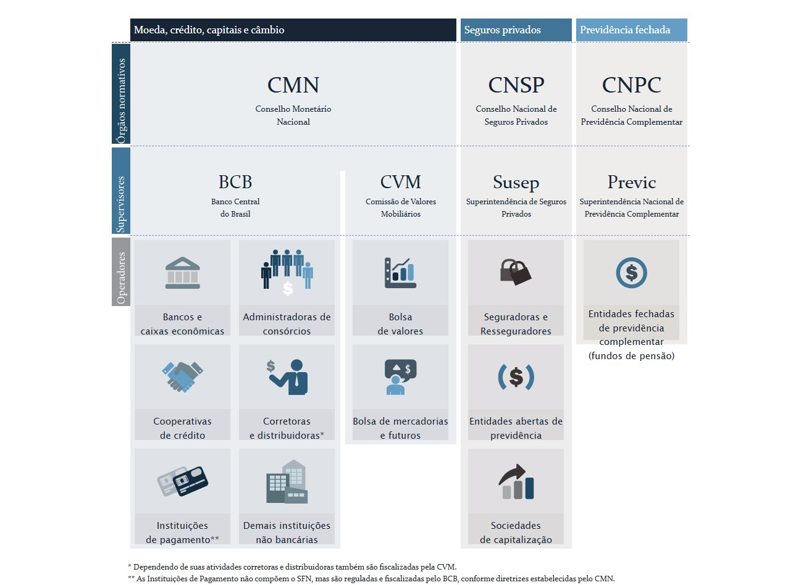

# Sistema Financeiro Nacional (SFN)

O SFN é formado por um **conjunto de entidades e instituições** que promovem a intermediação financeira, isto é, o encontro entre credores e tomadores de recursos. É por meio do sistema financeiro que as pessoas, as empresas e o governo circulam a maior parte dos seus ativos, pagam suas dividas e realizam seus investimentos.

## Funções do SFN

- **Intermediação Financeira:** é o encontro entre quem precisa de dinheiro, o ==tomador de recursos ou agente deficitário==, e quem tem dinheiro para emprestar, o ==credor, poupador ou agente superavitário==. Essa relação não ocorre diretamente pois há diversos fatores que impedem uma troca direta: falta de confiança, risco de inadimplência, dificuldade em encontrar uma contraparte. (procurar quem necessita do dinheiro que se tem sobrando, ou procurar quem tem sobrando para emprestar)
- Agora temos o cenário onde um banco é necessário para fazer a intermediação, onde serão centralizadas as transferências. Ex.: Agente superavitário empresta R$ 100 ao banco, o banco devolve R$ 110 depois de um determinado tempo, o agente deficitário toma R$ 100 de recursos do banco e pagará R$ 120, o banco ficará com R$ 10 pela intermediação, que é chamado de _spread bancário._ Esse dinheiro é a diferença entre o que o banco recebe do agente deficitário com o que ele paga para o agente superavitário (R$ 120 - R$ 110 = R$ 10), **não é essencialmente o lucro!** pois há outros gastos para realizar essa transação.

**Questão Cebraspe (2009)** O SFN atua na intermediação financeira, ou seja, no processo pela qual os agentes que estão superavitários, com sobra de dinheiro, transferem esses recursos para aqueles que estejam deficitários, com falta de dinheiro.

~~~
Certo
~~~

Devido ao porte das instituições do SFN, elas possuem algumas vantagens ao exercerem a função de intermediadores, tais como:
- Fornecem liquidez aos agentes; (o agente superavitário pode retirar o dinheiro mais fácil)
- Possuem acesso a informações importantes dos clientes;
- São reguladas e supervisionadas, o que aumenta a confiança os agentes em atividade;
- Estão autorizados a cobrar taxas de juros superiores ao teto estabelecido pelo decreto 22.626 de 1933 (Lei da Usura)

**Prestação de Serviços e Gerenciamento de Recursos:** se traduz em facilidades que o SFN proporciona aos cidadãos e ao governo.
- A existência de um sistema de pagamentos para transferência de recursos e arrecadação de tributos;
- O serviço de custódia (guarda) de valores, bens e títulos;
- A disponibilização de meios de pagamento, tais como cartões de crédito e cheques;
- A disponibilização de seguros para as mais diferentes finalidades (automóvel, viagem, vida, saúde, etc)

**Questão** São facilidades que a prestação de serviços e gerenciamento de recursos permitem aos cidadãos e governo, **exceto**:
- [ ] A disponibilização de seguros de automóvel
- [ ] O serviço de custódia de títulos públicos
- [ ] A existência de um sistema de pagamentos
- [ ] ==A disponibilização de informações de caráter sigiloso a terceiros==

## Mercados do SFN

### Mercado Monetário

É o mercado onde se concentram as operações para controle da oferta de moeda e das taxas de juros de curto e curtíssimo prazo com vistas a garantir a liquidez da economia.

### Mercado de Crédito

É o mercado onde são realizados operações de empréstimos e financiamentos entre credores e devedores.

### Mercado de Câmbio

É o mercado onde ocorre a compra e venda de moedas estrangeiras.

### Mercado de Crédito

É o mercado onde as empresas captam recursos para financiar suas atividades através de negociações de instrumentos financeiros com investidores.

### Mercado de Seguros Privados

É o mercado onde são negociados contratos de seguros, resseguros, capitalização e previdência aberta.

### Mercado de Previdência Fechadas

É o mercado onde são comercializadas as previdências fechadas, conhecidas como fundos de pensão.

## Órgãos de Regulação, Autorregulação e Fiscalização

### Autorregulação

Acontece quando os entes privados se juntam, geralmente em forma de associações, e escolhem um ente privado que estabelece regras entre os próprios participantes, via um contrato voluntário (autorregulação de base contratual) ou por determinação legal (autorregulação de base legal)