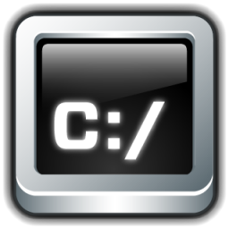

# Comandos do Git e cmd | bash

## Iniciando com Git

### Download

 Faça o [Download do Git](https://git-scm.com/downloads/)

Após instalar o Git, a versão poderá ser checada através do comando:

~~~cmd
git --version
~~~

Para atualizar o Git no Windows, use o comando:

~~~cmd
git update-git-for-windows
~~~

### Comando cd

`cd` significa *change command*, este comando serve para navegar entre as pastas do sistema operacional, um destes comandos retornam o diretório atual:

 Windows (cmd)

~~~cmd
cd
echo %cd%
~~~

`pwd` significa *Print Working Directory*, que irá retornar o diretório atual

 Linux | MacOS (bash)

~~~bash
pwd
~~~

Para avançar um diretório usamos `cd nome_do_diretório` ou podemos passar o caminho completo para onde queremos ir, o comando abaixo irá mudar o diretório atual para a raiz do disco rígido C

~~~cmd
cd "C:\"
~~~

Para voltar um diretório, usamos:

~~~cmd
cd ..
~~~

Para voltar mais de um diretório ao mesmo tempo, acrescentamos barra invertida e novamente dois pontos

~~~cmd
cd ..\..
cd ..\..\..\..\..
~~~

### Comando cls (cmd) | clear (bash)

`cls` significa *Clear Screen*, irá limpar a tela

 Windows (cmd)

~~~cmd
cls
~~~

 Linux | MacOS (bash)

~~~bash
clear
~~~

## Diretórios

### Comando mkdir 

`mkdir` significa *make directory*, este comando serve para criar um diretório/pasta, o comando abaixo irá **criar uma pasta** chamada git

~~~cmd
mkdir git
cd git
~~~

Criando vários diretórios

~~~cmd
mkdir gitone gittwo gitthree
~~~

### Editar Nome do Diretório

Para trocar o nome de uma pasta utilizamos o comando `ren`, que significa: *rename*, renomear o diretório.

 Windows (cmd)

~~~cmd
ren nome_antigo novo_nome
~~~

Já para sistemas baseado no `bash`, utilize o comando `mv` de *move*

 Linux | MacOS (bash)

~~~bash
mv nome_antigo novo_nome
~~~

### Mover Diretório

Para mover uma pasta/arquivo de lugar utilizamos o comando `move (cmd)` e `mv (bash)`. Lembre-se de usar **barra invertida** `\` para separação dos diretórios.

 Windows (cmd)

~~~cmd
move nome_pasta_ou_arquivo novo_destino
~~~

 Linux | MacOS (bash)

~~~bash
mv nome_pasta_ou_arquivo novo_destino
~~~

###  Apagar Diretório(s) no cmd

`rmdir` ou `rd` significa *remove directory*, se tiver algo na pasta, será informado que a pasta não está vazia

~~~cmd
rmdir pasta
rmdir pasta1 pasta2
rd pasta
~~~

- `/s` remove a pasta e todo seu conteúdo, pedirá confirmação se realmente deseja apagar
- `/q` modo silencioso *quiet*, não perguntará "tem certeza?"

~~~cmd
rmdir pasta /s /q
rd pasta /s /q
~~~

###  Apagar Diretório(s)  no bash

`rmdir` ou `rm` significa *remove directory*

~~~bash
rmdir pasta
rm pasta
~~~

- `-r` significa `recursive`, irá apagar tudo dentro
- `-f` significa *force*, não pede confirmação

### Comando dir (cmd) | ls (bash)

`dir` significa *directory*, irá listar todos os arquivos que podem ser visto através do diretório atual

 Windows (cmd)

~~~cmd
dir
~~~

 Linux | MacOS (bash)

`ls` significa *list*, irá listar todos os arquivos que podem ser visto através do diretório atual

~~~bash
ls
~~~

Para listar inclusive os arquivos ocultos que começam com `.ponto`, usamos:

 Windows (cmd)

`a` significa *all*, todos arquivos
`s` significa *subdirectories*, de forma recursiva mostra todos os subdiretórios
`b` significa *bare* (desnudo), lista apenas os arquivos e diretórios 
`d` signfica *directory*, lista os arquivos em um formado de `[nome_pasta]`  `[nome_arquivo.txt]`

~~~cmd
dir/a
dir/s
dir/b
dir/d
~~~

 Linux | MacOS (bash)

`-l` significa *long listing*, lista detalhada
`-a` significa *all*, todos os arquivos, incluindo os ocultos

~~~bash
ls -la
~~~

### Comando tree (cmd)

Irá exibir as pastas em hierarquias de um árvore

~~~cmd
tree
~~~

Com adição do comando `/f` irá mostrar o que tem dentro das pastas

~~~cmd
tree /f
~~~

## Fluxo do Git 

### Inicializando o Git

`init` significa *initialization*, irá inicializar um novo repositório Git no diretório atual ou reinicializar um existente, criando a pasta oculta `.git`

~~~cmd
cd gitone
git init
dir/a
~~~

> usará o **git init** uma vez por projeto

Verificar o *status* para exibir o estado atual do repositório, mostrando quais arquivos foram modificados

~~~cmd
cd .git
dir/a
~~~

Escrever ou alterar arquivos, adicionar as modificações e por fim confirmar através de um `commit` , comando este que criará uma espécie de *checkpoint*, como acontece nos vídeo games.
$$
\text{Write} \rightarrow \text{Add} \rightarrow \text{Commit}\\
\text{(Working Dir)} \rightarrow \text{git add} \rightarrow \text{(Staging Area)} \rightarrow \text{git commit} \rightarrow \text{(Repo)} \rightarrow \text{git push} \rightarrow \text{(Github)}\\
$$

### Stage Area

- Inicialização com `git init`
- Criar arquivo(s) `git add file1 file2 || git add .`
- Verificar status com `git status`

Com o  **Visual Studio Code** instalado vá até o repositório `gitone` e execute o comando

~~~cmd
code .
~~~

Dentro do Visual Studio Code instale a extensão **Git Graph**

## Arquivos

### Criação de Arquivo(s)

Criar dois arquivos `.txt`

 Windows (cmd)

~~~cmd
type nul > testone.txt & type nul > testtwo.txt
~~~

Passando uma string para o arquivo `.txt` através do comando `echo`

~~~cmd
echo Oi > texto.txt
~~~

Vale ressaltar que:

- `>` sobrescreve o arquivo, substituindo os dados antigos pelo novo
- `>>` funciona como um *append*, adicionando o que for passado de novo no final

 Linux | MacOS (bash)

~~~bash
touch testone.txt testtwo.txt
~~~

### Abrir Arquivo(s)

Bastar passar o nome do arquivo e sua extensão

 Windows (cmd)

~~~cmd
arquivo.txt
~~~

Outros modos:

 Windows (cmd)

~~~cmd
start nome_arquivo.extensao
~~~

Ao apertar `ctrl+c` pode acabar fechando o programa, no **PowerShell** tem um comando para inicializar o arquivo como um processo separado.

 Windows (PowerShell)

~~~powershell
Start-Process nome_arquivo.extensao
~~~

 Linux | MacOS (bash)

~~~bash
xdg-open (Linux) | open (MacOS) nome_arquivo.extensao
~~~

###  Apagar Arquivo(s) no cmd

`del` significa *delete*, irá apagar um arquivo ou vários arquivos

~~~cmd
del arquivo.txt
del arq1.txt arq2.txt arq3.txt
~~~

- Coringa `?` irá substituir um único caractere
- Coringa `*` irá substituir qualquer sequência de caracteres

Supondo que tenhamos os arquivos `ana.txt`, `ane.txt` e `any.txt`. O comando abaixo irá apagar todos estes 3 arquivos, não possui uma confirmação se realmente deseja apagar

~~~cmd
del an?.txt
~~~

Passando `*.*` irá apagar todos os arquivos do diretório atual, terá uma confirmação se realmente deseja apagar

~~~cmd
del *.*
~~~

Para apagar todos os arquivos de uma determinada extensão, sem confirmação

~~~cmd
del *.txt
~~~

Apagar qualquer arquivo que tenha no meio o nome "ens" ou especificando uma extensão, sem confirmação

~~~cmd
del *ens*
del *ens*.txt
~~~

###  Apagar Arquivo(s) no bash

`rm` significa `remove`, não irá mandar para a lixeira, apaga de vez

~~~bash
rm arquivo.txt
rm arq1.txt arq2.txt
rm *.txt
rm -f arquivo2.txt
~~~

## Comandos do git

 ### git add

`add` significa adicionar, serve para preparar alterações nos diretórios para o **próximo commit**

~~~cmd
echo "Primeiro Arquivo." > testone.txt
echo "Segundo Arquivo." > testtwo.txt
git add testone.txt
~~~

Use o `. ponto` para adicionar todos os arquivos

~~~cmd
git add .
~~~

### git commit

`commit` significa "cometer, enviar, entregar, mandar", serve para salvar permanentemente as alterações que foram preparadas na *Stage Area* (área de estado).

~~~cmd
git commit -m
~~~

`-m` significa `message`, isto é muito importante pois irá adicionar uma mensagem que ficará de lembrete para o determinado commit

### git log

`log` significa "uma gravação escrita de algo", irá exibir o histórico de commits de um `branch`, mostra do mais recente para o mais antigo: os detalhes como hash, autor, data e mensagem de cada commit.

~~~cmd
git log
~~~

> Para encerrar o log aperte a **tecla Q**

`branch` significa "ramo, galho, ramificação" é um ponteiro móvel para um determinado commit, significa que você pode divergir da linha principal de desenvolvimento, este que seria na analogia o troco do projeto, e continua a trabalhar sem alterar essa linha principal, por analogia os galhos podem ser variados, unidos e até cortados.

~~~cmd
git log --oneline
~~~

Com o uso do `--oneline` irá retornar uma linha concisa, com apenas o hash encurtado do commit e a mensagem

### git config

`config` significa *configuration*, é usada para definir valores de configuração do Git

~~~cmd
git config
~~~

- `--local` irá aplicar as configurações apenas no repositório atual, que são guardados no `.git/config`
- `--global` irá realizar as configurações de modo global, aplicadas a todos os repositórios do sistema

~~~cmd
git config --local
git config --global
~~~

- `user.name` configura o nome do autor
- `user.email` configura o e-mail do autor

~~~cmd
git config --global user.name "Ranie"
git config --global user.email "raniedev@gmail.com"
~~~

- `core.editor` irá definir qual editor o Git deve usar para abrir algo
- `code` manda o Git usar o **Visual Studio Code** como editor
- `--wait` faz o Git esperar você fechar o VS Code antes de continuar a operação

~~~cmd
git config --global core.editor "code --wait"
~~~

### .gitignore

É um arquivo de texto que indica ao Git quais arquivos ou pastas não devem ser rastreados, ou seja, deve ignorar em um projeto.

 Windows (cmd)

~~~cmd
type nul > .gitignore
~~~

 Linux | MacOS (bash)

~~~bash
touch .gitignore
~~~

Adicionar novos arquivos `testthree.txt` e `testfour.txt`

~~~cmd
git add .
git commit
~~~

Vá até o `.gitconfig` que geralmente é instalado em `C:\Users\Nome\.gitconfig` e execute o comando

- Onde `nome` obviamente deve ser trocado pelo nome de usuário que está na máquina

 Windows (cmd)

~~~cmd
type .ipconfig
~~~

`type` significa "tipo" e serve para exibir o conteúdo de um arquivo de texto, sem modificá-lo.

 Linux | MacOS (bash)

~~~bash
cat .ipconfig
~~~

`cat` significa `concatenate` (con**cat**enar), é usado para exibir, criar e combinar arquivos de texto.

## Estrutura do Diretório .git

Voltando para o projeto e onde iniciou o `init`, podemos notar com `dir/a (cmd)` ou `ls -la (bash)` que há uma pasta chamada `.git`

### .git/hooks/

Contém scripts executáveis que o Git roda automaticamente, estes hooks tem o mesmo conceito dos hooks do React

### .git/info/

Armazena informações adicionais de configuração do repositório

### .git/logs/

Guarda logs de referências (também chamados de reflogs). Rastreia o histórico de mudanças nos ponteiros, como `HEAD` e branches, o que permite recuperar commits "perdidos".

Estrutura:

- `logs/HEAD` histórico de mudanças no `HEAD`
- `logs/refs/heads/` histórico em cada branch

**O que é HEAD?** O `HEAD` é um ponteiro especial que indica em qual commit ou branch está atualmente trabalhando.

### .git/objects/

O banco de dados do Git, onde ficam os objetos comprimidos que representam tudo no repositório. Cada objeto é identificado pelo seu hash SHA-1 ou SHA-256.

Tipos de objetos:

- **blob:** conteúdo dos arquivos
- **tree:** estrutura de diretórios (como um snapshot)
- **commit:** ponto do histórico, com autor, mensagem e referência para tree e commits anteriories
- **tag:** referência anotada para um commit específico

Estrutura de um objeto

- O nome do objeto é dividido: os 2 primeiros caracteres viram uma pasta, o resto é arquivo:
- Objeto `e83c5163316...` &rightarrow; `.git/objects/e8/3c5163316...`

### .git/refs/

Armazena referências para objetos do repositório (apontam para commits)

Estrutura:

- `refs/heads/` branches locais
- `refs/remotes/` branches remotas
- `refs/tags/` tags

## Branches

Agora indo até o diretório `gittwo`, vamos iniciar uma branch. Um branch é um caminho alternativo que podemos criar de forma separada.

~~~cdm
cd gittwo
~~~

Abra o projeto no **Visual Studio Code**

~~~cmd
code .
~~~

Crie um arquivo `index.html` 

~~~cmd
git add index.html
~~~

No **Visual Studio Code** aperte o comando `ctrl + ,`  para abrir os *settings*, na parte de *glob patterns* deve remover o `.git`para que apareça no projeto.

### git branch

Como já mencionado anteriormente, `branch` é uma ramificação do projeto principal, um caminho alternativo. Note que o primeiro branch `master` ou `main`, somente é criado a partir do momento que o `commit` for usado pelo menos uma vez.

O comando abaixo irá mostrar listará os branches existentes

~~~cmd
git branch
~~~

Parar criar uma nova ramificação

~~~cmd
git branch nav-bar
~~~

> Onde nav-bar pode ser qualquer nome

Para renomear use o comando `-m`

~~~cmd
git branch -m novo_nome
~~~

Para mudar de ramificação use `checkout` ou `switch`

~~~cmd
git checkout nav-bar
~~~

Ao fazer novamente o `git branch` para listar, notará que o `* asterísco`, que informa qual é o branch atual, mudou para o novo branch criado.

Crie um novo arquivo chamado `nav-bar.html` e depois use `add` e `commit` nele

~~~cmd
git add nav-bar.html
git commit -m "add navbar to code base"
~~~

Poderá notar agora na ferramenta **Git Graph** que a ramificação fica bem destacada em comparação com a linha principal do projeto.

Mas ao trocar o branch para o `master` novamente, perceberá que o arquivo `nav-bar.html` desapareceu porque aconteceu um `merge` nos branches e eles foram unidos.

Vamos criar outro arquivo chamado `hero-section.html` e depois usar `add` e `commit` nele

~~~cmd
git add hero-section.html
git commit -m "add hero section to code base"
~~~

Mudar através do `checkout` para

~~~cmd
git checkout nav-bar
git checkout master
git branch
~~~

Você pode criar com o comando `switch`  uma nova branch, `-c` significa `create`, passa para o comando `switch` que deseja criar o branch e mover para ela

~~~cmd
git switch -c dark-mode
~~~

Da mesma forma, ficaria o seguinte para o comando `checkkout`, `-b` significa `branch`

~~~cmd
git checkout -b light-mode
~~~

- commit before switching to another branch
- go to .git before and checkout HEAD file

### git tag

É um marcador permanente para um commit específico, são usadas principalmente para marcar versões de releases. Existem dois tipos de tags:

1. **Lightweight (Leve):** São apenas um nome associado ao commit;

   ~~~cmd
   git tag v1,0
   ~~~

2. **Annotaded (Anotada):** Contém metadados (autor, data, mensagem, etc.) e são armazenada de forma direta no repositório.

   ~~~cmd
   git tag -a v2.0 -m "Versão 1.0 estável"
   ~~~

   - ``-a`` de *annotaded*, cria uma tag com metadados completos;
   - Nome da tag, hash do commit apontado, autor da tag, data de criação e mensagem de anotação

### git show

É possível exibir os detalhes de um objeto

~~~cmd
git show v1.0
~~~

### git merge

`merge` significa "unir, juntar", determinado caminho alternativo será aplicada na linha principal do projeto

~~~cmd
git merge nav-bar
~~~

Ao apagar o `branch` recentemente aplicado

~~~cmd
git branch -d nav-bar
~~~

`-d` significa `delete`, comando para apagar

Crie um novo `branch` chamado footer

~~~cmd
git checkout -b footer
git type nul > footer.html
~~~

📄`footer.html`

~~~html
<footer>
	
&copy;Copyright 2025

</footer>
~~~

~~~cmd
git add footer.html
git commit -m "add footer action to code base"
git checkout master
git merge footer
~~~

## Pontos de Conflito

📄`index.html` adicionar no final do `body`

~~~html

footer added

~~~

~~~cmd
git add index.html
git commit -m "add footer index file"
~~~

Ao mudar o `branch` para `footer` o código acima adicionado desaparecerá dentro do 📄`index.html`. E ao adicionar novamente algum código pela `branch` chamada `footer` você terá um código diferente em cada ramificação.

~~~html

Footer added sucessfuly

~~~

~~~cmd
git add index.html
git commit -m "footer index.html updated"
git checkout master
git merge footer
~~~

> Resultará em uma mensagem de erro por causa de um conflito e no VS Code notará que foram adicionados os dois códigos bem destacados e há também uma opão de **Resolve in Merge Editor**

Ao resolver os conflitos, seja apagando ou pela ferramenta, faça:

~~~cmd
git add .
git commit -m "Merge footer branch"
~~~

### git diff

Mostra as diferenças entre versões de arquivos no repositório, exibindo linha por linha, entre dois estados.

**Como ler Diff?**

Adicionar no arquivo 📄`index.html` 

~~~html

I would love to add nav bar here

~~~

Ao utilizar o comando `diff` juntamente com o nome do arquivo, irá mostrar o que foi modificado

~~~cmd
git status
git diff index.html
~~~

Caso o arquivo tenha sido adicionado ao `stage area`, poderá  ser verificado pelo comando `--staged`

~~~cmd
git add index.html
git diff --staged
~~~

- As diferenças são colocadas em dois arquivos: `a/index.html` `b/index.html`
- `---` indica o arquivo A
- `+++` indica o arquivo B

Adicionar uma mudança no arquivo 📄`footer.html` 

~~~html

Todos os Direitos Reservados &copy;Copyright 2025

~~~

~~~cmd
git commit -m "change index and footer"
~~~

Ao executar o comando de linha única, poderá fazer comparações `diff` pelos hashes

~~~cmd
git log --oneline
git diff hash1 hash2
~~~

### git stash

Serve para guardar temporariamente suas mudanças sem fazer um commit.

~~~cmd
git switch -c bugfix
~~~

Adicionar uma mudança no arquivo 📄`footer.html` 

~~~html

Trying to fix this bug

~~~

~~~cmd
git branch
git status
git stash
~~~

O comando `stash pop` irá recuperar (restaurar) as mudanças guardadas pelo `stash`, irá aplicá-las novamente no diretório de trabalho e posteriormente remové-la da pilha das `stashes`.

~~~cmd
git stash pop
~~~

Se quiser restaurar sem remover da lista

~~~cmd
git slash apply
~~~

Mostrar todas as stashes guardadas em uma lista

~~~cmd
git stash list
~~~

Mostrar apenas o primeiro stash da lista

~~~cmd
git stash list stash@{0}
~~~

Apagar uma stash específica

~~~cmd
git stash drop
~~~

Para apagar todas as stashes

~~~cmd
git stash clear
~~~

### git checkout

Serve para mudar o conteúdo atual do seu diretório de trabalho. Dependendo do contexto, pode fazer 3 coisas  principais:

- Mudar de Branch
- Restaurar Arquivos
- Explorar commits antigos

Com o comando de `checkout` o  `hash` passado se torna o `HEAD`

~~~cmd
git log --oneline
git checkout <hash>
~~~

> Onde hash seria o valor na lista ex.: 62a36da

Para restaurar as mudanças para o último commit

~~~cmd
git checkout HEAD
~~~

Para restaurar as mudanças de um arquivo específicio

~~~cmd
git checkout HEAD arquivo.html
~~~

Mudar de branch

~~~cmd
git checkout master
~~~

> Obs.: Em alguns projetos deve usar a palavra main, como abaixo: 
> git checkout main

É possível criar uma nova `branch` com `checkout` e já trocando para ela com o `-b`

~~~cmd
git checkout -b nome_branch
~~~

### git reflog

Reflog corresponde ao histórico do `HEAD`, é o registro de todos os movimentos feito dentro do repositório.

~~~cmd
git reflog
~~~

- deve apertar `p` para sair do comando de reflog
- `space` para avançar uma página
- `b` para voltar uma página
- ↑→↓← para mover a página

## Git Rebase

O `git rebase` serve para reaplicar commits sobre outra base (outro ponto da história), reorganizando o histórico de commits de forma linear e limpa.

Adicionar uma mudança no arquivo 📄`index.html` 

~~~html

this looks nice

~~~

Efetuar as mudanças

~~~cmd
git commit -am "updated main website"
~~~

`-am` é uma redução de `add` and `message`, para que faça ambas ao mesmo tempo

Adicionar uma mudança no arquivo 📄`nav-bar.html`

~~~html
<li>Bug Fix</li>
~~~

~~~cmd
git commit -am "updated navbar"
~~~

Adicionar uma mudança no arquivo 📄`index.html`

~~~html

images added

~~~

~~~cmd
git commit -am "updated navbar"
~~~

Caso erre a mensagem de um commit, use o comando `--amend` para que o último commit seja aberto no editor, para ser editado de forma manual.

~~~cmd
git commit --amend
~~~

> Trocar para updated images

Também há a opção de passar a nova mensagem direto via linha de comando

~~~cmd
git commit --amend -m "New commit message"
~~~

Se mudar agora para o `branch` bugfix 

~~~cmd
git checkout bugfix
~~~

Notará que não terá o parágrafio de imagens adicionadas pelo `commit` mais recente

~~~cmd
git merge master
~~~

Adicione outro `<li>` dentro do arquivo 📄`nav-bar.html`

~~~html
<li>News</li>
~~~

~~~cmd
git commit -am "News added"
git checkout master
~~~

Adicione outro parágrafo dentro do arquivo 📄`index.html`

~~~html

Today News

~~~

~~~cmd
git commit -am "News paragraph added"
git log --oneline
~~~

>  Vai aparecer apenas o "News paragraph added"

~~~cmd
git checkout bugfix
git log --oneline
~~~

> Vai aparecer apenas o "News added"

Vamos juntar o `branch` atual com o `master`

~~~cmd
git rebase master
git log --oneline
~~~

> Vai aparecer ambos os commits que antes estavam separados

Adicione outro `<li>` dentro do arquivo 📄`nav-bar.html`

~~~html
<li>Contact Us</li>
~~~

 ~~~cmd
 git commit -am "Contact us added"
 git checkout master
 ~~~

Adicione outro parágrafo dentro do arquivo 📄`index.html`

~~~html

Send us an email

~~~

~~~cmd
git commit -am "Contact us paragraph"
~~~

### git rebase

Ele serve para **retomar o processo do rebase** depois de uma pausa. Essa pausa pode acontecer por dois motivos:

1. **Você pediu pra editar algo** (`edit`, `reword`, `squash` etc.),
2. **O Git encontrou um conflito** ao aplicar algum commit.

~~~cmd
git rebase --continue
~~~

### git push

~~~cmd
git remote add origin <link do .git>
git push -u origin master
~~~

> Exemplo de link do .git https://github.com/raniedev/concurso.git
