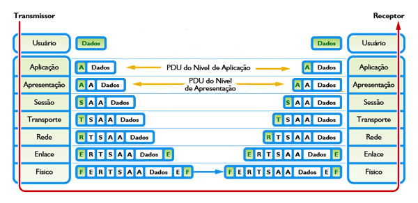
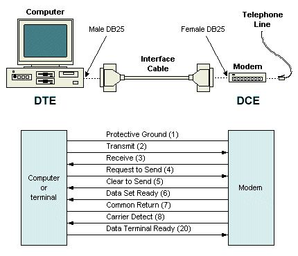
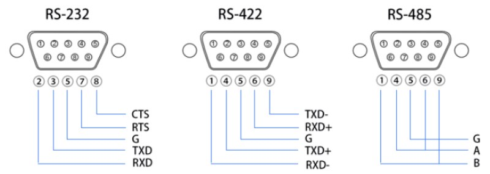
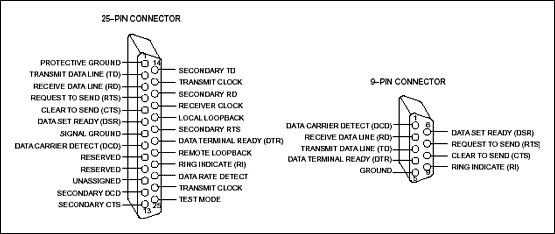
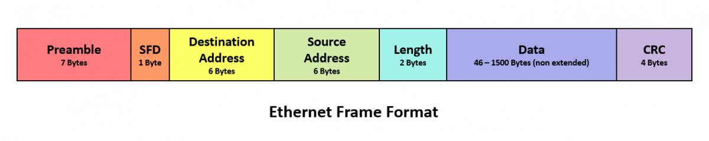
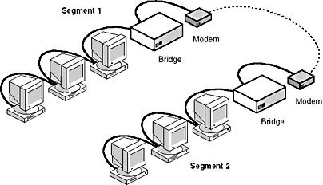
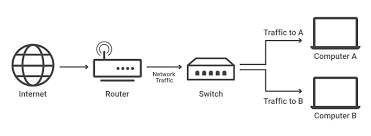
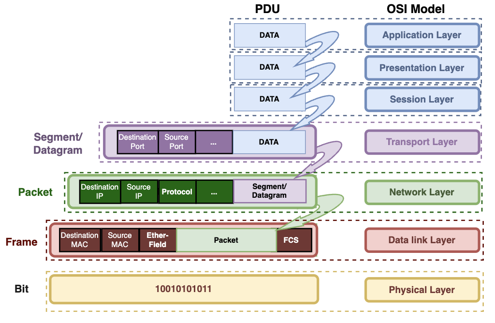
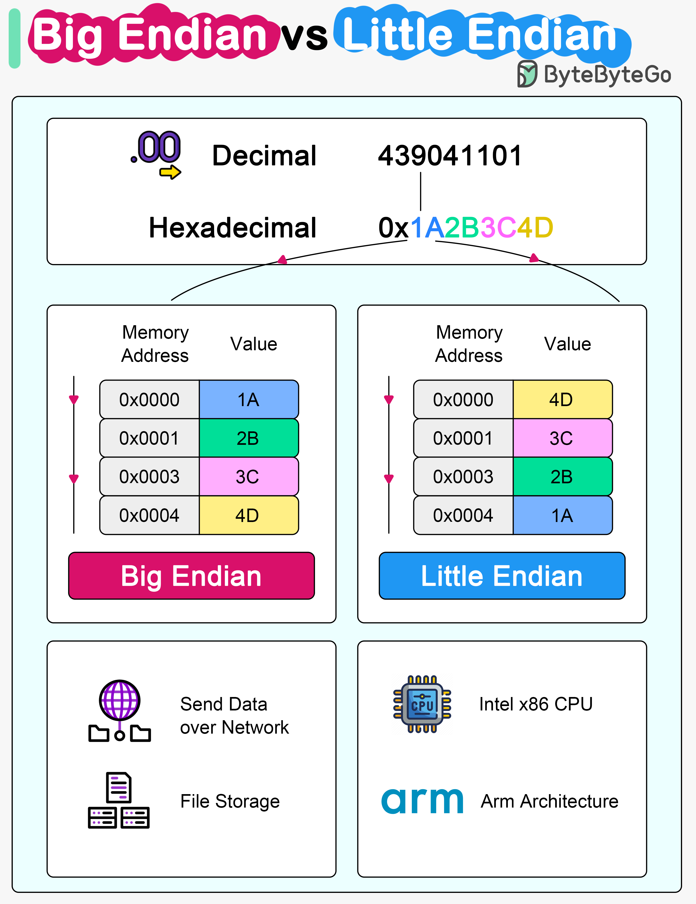

# Modelo OSI

O modelo OSI (*Open System Interconnection*) é constituído de 7 camadas:

Cada camada é responsável por um conjunto de funcionalidades específicas, conhecida como PDU (*Unit Protocol Data*) , a Unidade de Dados do Protocolo é um conjunto de informações, ou o pacote, gerado por uma camada.

As camadas são construídas umas sobre as outras, e uma camada oferece seus serviços para a camada superior utilizando-se dos serviços oferecidos pela camada inferior.

| Número | Camada                      | PDU                            | Opera no |
| ------ | --------------------------- | ------------------------------ | -------- |
| 7      | Aplicação / Application     | Mensagem / Data                | Software |
| 6      | Apresentação / Presentation | Mensagem / Data                | Software |
| 5      | Sessão / Session            | Mensagem / Data                | Software |
| 4      | Transporte / Transport      | Segmento / Segment or Datagram | Software |
| 3      | Rede / Network              | Pacote / Package               | Software |
| 2      | Enlace / Data Link          | Quadro / Frame                 | Hardware |
| 1      | Física / Physical           | Bit                            | Hardware |
>Variações de nomeclaturas: Camada 1, Camada Física, Nível 1, Nível Físico são a mesma coisa.

Quando tratamos da comunicação em rede, dizemos que cada camada de um nó transmissor se comunica com a mesma camada do nó receptor, em outras palavras, a camada N em uma máquina estabelece uma conversação com a camada N em outra máquina. As regras dessa conversação são chamadas de protocolo da camada N.

A comunicação entre as camadas N de duas máquinas não acontece diretamente, mas através de suas camadas inferiores. Quando uma camada N deseja enviar uma informação, ela é enviada para a camada imediatamente abaixo. Isso vai se repetindo até a informação chegar ao meio físico, em que é transmitida para a máquina destino e percorre o caminho inverso.

>💡 Mnemônico: AASTREF

## Camada 1: Física

Essa camada é a responsável por transformar os bits (0s e 1s) que representam as informações a serem transmitidas pelos meios de transmissão (cabos de par trançado, cabos coaxiais etc.) em forma de pulsos elétricos ou em forma de sinais de luz (caso das fibras ópticas). No receptor, a camada física desfaz o processo, ou seja, transforma esses sinais recebidos em bits novamente.

Como as principais funções da camada física, podemos citar:

1. Definir como os bits 0 e 1 serão representados no enlace durante a transmissão;
2. Definir a quantidade de tempo dado em nano segundos que um bit deve durar;
3. Especificar se a transmissão pode ocorrer nos dois sentidos, simultaneamente;
4. Definir a quantidade de pinos dos conectores, e qual será a finalidade de cada pino etc.

> O repetidor é um equipamento da camada Física, pois ele apenas transmite bits. O mesmo se pode dizer do hub (até porque o hub é um repetidor multiporta).

Alguns exemplos de interfaces físicas responsáveis pela transmissão de dados nos meios físicos, podem ser guiados ou não, onde o termo "ser guiado" é o mesmo que cabeado.

- **Guiados (Cabeados):** O sinal é conduzido dentro de um meio físico. exemplos:
	- Par trançado (UTP/STP), através do conector Porta RJ-45 (Ethernet)
	- Cabo coaxial, através do conector BNC
	- Fibra óptica, através do conector SC/LC
- **Não guiados (Não cabeados):** O sinal se propaga pelo ar, sem um meio físico que o direcione
	- Wi-Fi (radiofrequência)
	- Bluetooth
	- Infrared (Infravermelho)
	- Satélite
	- Micro-ondas

### RS-232 ou EIA RS-232C ou V.24

É um padrão de protocolo para troca série de dados binários entre um **DTE** (*Data Terminal Equipment*) e um **DCE** (*Data Communication Equipment*). É comunente usado nas portas seriais dos computadores.

Além do RS-232 de 9 pinos, também chamado de DB9, existem o o conector de 25 pinos (DB25).

O que é feito quando uma unidade de informação é mandada de uma camada para outra?
Ao enviar informação é chamado de **encapsulamento**, enquanto que o inverso seria o **desencapsulamento**.

Cada camada do modelo pega os dados da camada superior, adiciona o seu próprio cabeçalho (ou rodapé) e passa para a camada inferior.

| Camada               | Unidade de dados   | O que é adicionado                                              | Exemplo de função        |
| -------------------- | ------------------ | --------------------------------------------------------------- | ------------------------ |
| **7 – Aplicação**    | **Dados**          | —                                                               | Ex: HTTP, SMTP, DNS      |
| **6 – Apresentação** | **Dados**          | Codificação/criptografia                                        | Ex: SSL/TLS              |
| **5 – Sessão**       | **Dados**          | Controle de sessão                                              | Ex: RPC                  |
| **4 – Transporte**   | **Segmento**       | Cabeçalho com **porta origem/destino**, **número de sequência** | Ex: TCP, UDP             |
| **3 – Rede**         | **Pacote**         | Cabeçalho com **endereços IP origem/destino**                   | Ex: IP, ICMP             |
| **2 – Enlace**       | **Quadro (Frame)** | Cabeçalho + rodapé com **endereços MAC** e **CRC**              | Ex: Ethernet, PPP, Wi-Fi |
| **1 – Física**       | **Bits**           | Converte o quadro em **sinal elétrico / óptico / rádio**        | Ex: cabo, fibra          |

## Camada 2: Enlace

A camada de enlace usará os serviços de transmissão de bits oferecidos pela camada física para fornecer seus próprios serviços. Nesta camada é capaz de detectar problemas de envios de mensagens, não apenas enviar como na camada física. se considerarmos os bits a serem transmitidos como um grupo de bits, é possível inserir bits de redundância que permitem a detecção e eventual correção de erros.

Dessa forma, as redes transmitem as suas informações em quadros, que são compostos de diversos campos. O quadro é o nome dado a PDU da camada de enlace, e o termo campo corresponde a uma determinada informação contida na PDU. O número e o tipo desses campos são específicos para cada tecnologia de rede, mas tipicamente existe um campo de dados, que contém a mensagem que se deseja transmitir, e vários campos com informações para permitir que a camada de enlace realize suas funções, como campos de endereço e um campo para verificação de erros.

Quando a camada de enlace recebe informações da camada de rede para serem transmitidas, essas informações podem ser colocadas em apenas um quadro ou serem divididas em vários quadros. A camada de enlace é que toma essa decisão e realiza a montagem dos quadros.

E pode enviar imediatamente após a sua montagem? Depende do enlance, pois ele pode ser compartilhado por diversas outras máquinas.

Desse modo, é necessário que existam regras que determinem o instante em que uma dada placa (ou seja, a camada de enlace) possa enviar um quadro no enlace. Sem essas regras, várias máquinas poderiam transmitir ao mesmo tempo e os sinais enviados por cada uma delas iria interferir nos demais, de modo que nenhuma das transmissões seria bem sucedida. Essas regras são denominadas de protocolo de acesso ao meio, e cada tecnologia de rede possui o seu próprio protocolo.

Você acha que o formato do quadro tem algum impacto na velocidade da rede? Tem sim! E claro que a taxa de transmissão em termos de bits por segundo não muda. Mas o que realmente importa é quanto da taxa de transmissão de uma rede é utilizada para transmitir os dados dos usuários. Ter uma rede de 100Mbps significa que ela transmite 100.000.000 de bits por segundo, mas uma parte desses bits corresponde aos cabeçalhos dos quadros. Portanto, quanto maior o tamanho dos cabeçalhos, menos banda de rede disponível sobra para os dados dos usuários.

Fazendo uma conta simples, se a soma do tamanho dos campos de cabeçalhos para uma dada rede fosse 40 bytes, e o tamanho do campo de dados fosse também 40 bytes, a velocidade realmente disponível para o usuário seria reduzida pela metade. Para a rede de 100Mbps, essa velocidade seria de apenas de 50Mbps! E olha que estamos falando apenas dos cabeçalhos da camada de enlace, mas na verdade os cabeçalhos de todas as outras camadas também precisam entrar nessa conta. Por isso, é importante que o tamanho do campo de dados seja bem maior que o tamanho de todos os cabeçalhos somados.

### Controle de Erros

A camada de enlace insere um campo no quadro com bits de redundância, de modo que possa detectar se ocorreram erros durante a transmissão dos quadros pelo nível físico, esse campo se chama genericamente de *Frame Check Sequence* (FCS), mas pode assumir outros nomes de acordo com o algoritmo utilizado, como é o caso das redes Ethernet, onde ele é chamado de *Cyclic Redundancy Check* (CRC).

É possível saber se um quadro foi recebido com erro ou não. Isso permite a camada de enlace ter um serviço confiável ou não, ou seja, ela pode garantir que seus quadros são entregues sem erros ou apenas tentar entregá-los. Chamamos isso de serviço confiável e serviço não-confiável, respectivamente.

No serviço confiável, o receptor envia quadros especiais informando se o quadro foi recebido com sucesso ou não. Essas confirmações podem ser para cada quadro individualmente, ou feitas por grupos de quadros de cada vez, para reduzir o tráfego adicional gerado na rede. Já o serviço não-confiável, não informa se os quadros foram recebidos com sucesso ou com erros. O receptor apenas descarta os quadros com erro. Em princípio, você pode estar achando que uma rede assim não vai funcionar, mas lembre-se de que existem as camadas superiores e em alguma delas alguém vai se preocupar em tornar o serviço confiável, quando isso for necessário.

### Controle de Fluxo

Quando os quadros são recebidos pela camada de enlace, eles ficam armazenados até que sejam processados. Embora isso ocorra rapidamente, pode acontecer dos quadros estarem chegando pela rede mais rapidamente do que são processados. Isso implica na falta de espaço para armazená-los. Para evitar tal situação, o receptor pode informar ao transmissor para reduzir a frequência com que está enviando os quadros (ou até mesmo suspender temporariamente o envio). À medida que os quadros vão sendo processados, o receptor informa ao transmissor para aumentar a frequência de envio deles.

Esse processo chama-se controle de fluxo e é de fundamental importância quando existem máquinas na rede com velocidades de transmissão diferentes ou quando uma determinada máquina é o destino dos quadros enviados por diversas outras.

Embora seja muito importante, essa característica não é obrigatória para a camada de enlace. Existem redes que não a implementam. Nessas redes, quando não existe mais espaço de armazenamento no receptor, os quadros são descartados.

> Bridge e Switch são exemplos de equipamentos da camada de Enlace

#### Bridge (Ponte)

É usado para dividir uma rede LAN em segmentos menores, reduzindo colisões. Analisa os endereços MAC de origem e destino dos quadros Ethernet.

#### Switch

É a evolução do Bridge, é muito mais rápido, inteligente e com múltiplas portas.
- Cria um domínio de colisão por porta, onde cada dispositivo tem sua conexão dedicada.
- Pode operar em modo full-duplex, sem colisões

## Camada 3: Rede

As camadas físicas e de enlace juntas formam uma rede, ou seja, permitem que diferentes máquinas se comuniquem. Podemos interligar as redes de duas empresas com um switch? Não podemos, uma vez que assim elas formariam uma única rede.

É necessário utilizar um equipamento que faça a separação das redes, este equipamento é o **roteador**, que tem a tarefa de implementar protocolos da camada de rede.

- interconectar redes diferentes (que podem ser da mesma tecnologia ou não);
- localizar o caminho até uma determinada rede;
- encaminhar os dados entre duas redes quaisquer.

A camada de rede define um novo tipo de endereço, chamado de **endereço lógico**, e este é completamente diferente do endereço da camada de enlace, que é chamado de **endereço físico**.

> Os roteadores são equipamentos da camada de rede

O usuário informa o endereço de rede da máquina com a qual quer se comunicar e existem protocolos que automaticamente traduzem o endereço de rede para o endereço de enlace da máquina de destino.

Caso a máquina de destino esteja em uma rede diferente da máquina de origem, o pacote é enviado para o roteador da rede de origem e será encaminhado de roteador em roteador até atingir a máquina de destino.

### Camada 4: Transporte

As funções implementadas pelas camadas estudadas (física, enlace e rede) estavam preocupadas em fazer a informação transmitida chegar à máquina destino. 

O principal objetivo da camada de transporte (quarta camada) é abstrair os detalhes de funcionamento das redes, permitindo que as aplicações usem os serviços de comunicação oferecidos por essas redes assim como usariam uma transportadora de encomendas. Desta forma, ao desenvolvermos um programa que precisa transmitir informações pela rede, utilizaremos as bibliotecas de programação que interagem com a camada de transporte, usando funções bem simples como enviar (dados) e receber (dados). Obviamente, por fazer parte do sistema operacional, a camada de transporte é um software instalado na máquina.

Para uma aplicação, a perda de um pacote pode não ser importante, como é o caso de aplicações que transmitem voz, mas para outras aplicações isso seria inaceitável, de modo que o pacote perdido precisaria ser retransmitido. Naturalmente, uma aplicação só consegue se comunicar com outras que utilizem a mesma camada de transporte.

Falamos sempre em endereços para identificar computadores (ou placas), mas precisamos de uma forma de identificar para qual aplicação as informações transmitidas são destinadas. Desse modo, quando a camada de transporte recebe um pacote, ela precisa saber para qual das aplicações deve entregá-lo. A PDU da camada de transporte possui um dos seus campos de cabeçalho destinado a essa finalidade.

### Camada 3: Sessão

O objetivo da camada de sessão é prover suporte para que os usuários consigam fazer a sincronização de seus diálogos e gerenciar a troca de informações. Para possibilitar que esses diálogos ocorram, ela cria uma conexão lógica chamada de conexão de sessão, que fica responsável por fornecer vários serviços que irão estruturar o diálogo entre as aplicações.

Assim, a camada de sessão tem a capacidade de proporcionar que dois computadores diferentes rodando aplicações possam estabelecer uma sessão de comunicação. Durante essa sessão, as aplicações “conversam” e decidem como será feita a transmissão dos dados e colocam pequenas marcações nos dados que serão transmitidos.

Como nós sabemos, pode haver falha na rede durante a transmissão. Então, o que ocorre? Terá que ser feita a transmissão desde o início?

 resposta é não. Lembra das marcações colocadas nos dados? Elas serão usadas para saber até onde as informações já foram transmitidas, sendo assim, a transmissão recomeça do ponto onde parou, ou seja, da última marcação recebida com sucesso.

A funcionalidade de controle de sessão dos usuários é muito importante para as aplicações de redes. Muitas aplicações de rede são multiusuários, isto é, servem a diversos usuários simultaneamente.
### Camada 2: Apresentação

Os computadores representam as informações através de códigos binários. A tabela ASCII, por exemplo, define um valor inteiro de um byte para cada possível caractere, mas existem outras formas de representação, como o EBCDIC. Portanto, uma máquina pode utilizar a tabela ASCII enquanto outra utiliza o esquema EBCDIC. Desse modo, uma mesma sequência de bits vai significar um valor se for considerada como um código ASCII e outro se for considerada como EBCDIC.

A principal função da camada de apresentação é evitar que as máquinas precisem conhecer os esquemas de codificação utilizados pelas outras máquinas. Para isso, as informações são transmitidas usando um formato padrão de representação, isto é, uma forma comum de apresentar os dados. Caso o formato utilizado pelo transmissor seja diferente desse formato, ele realiza uma operação de conversão antes da transmissão. Do mesmo modo, caso o formato do receptor seja diferente do formato padrão, ele converte as informações recebidas para seu formato.

Além dessa operação, a camada de apresentação também pode realizar a compressão dos dados de modo a gastar menos banda de rede, e a criptografia, para proteger as informações transmitidas contra a leitura indevida e a adulteração.

Um exemplo de uso das funções dessa sexta camada do modelo OSI seria a formatação das páginas web usando o formato padrão da linguagem HTML. Toda página Web possui códigos HTML que identificam o que é um caractere acentuado, uma imagem ou um vídeo, por exemplo, evitando problemas de interpretação das informações em diferentes plataformas de computador, como no caso de uma comunicação de um mainframe com um smartphone.

#### Big-endian e Little-endian

Big-endian e little-endian são duas maneiras de ordenar os bytes que compõem um dado de múltiplos bytes na memória de um computador. Big-endian armazena o byte mais significativo primeiro (no endereço de memória mais baixo), enquanto little-endian armazena o byte menos significativo primeiro. Essa diferença de ordem afeta como os dados são interpretados e é crucial para a comunicação entre diferentes sistemas.

### Camada 1: Aplicação

Aplicações que se comunicam em rede devem especificar quais mensagens elas vão trocar, quais os formatos dessas mensagens e a ordem em que podem ser trocadas. Isso é um protocolo de aplicação. Desse modo, os programas são apenas implementações desses protocolos. Não importa qual é o nome do programa, ou seja, quem o escreveu, tudo que ele transmite e recebe deve seguir esse padrão. Assim, mesmo que tenhamos dois browsers diferentes enviando requisições para acessar o mesmo servidor web, as mensagens enviadas pelos dois serão idênticas.

A camada de aplicação corresponde à definição desses protocolos. Com ela, os programas passam a ser apenas a implementação dos protocolos, permitindo, assim, que programas escritos por diferentes pessoas possam se comunicar. Existem protocolos de aplicação para e-mail, web, transferência de arquivos, tradução de nomes de máquinas para endereços numéricos, entre vários outros.