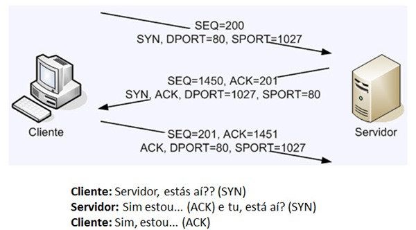

# Protocolo TCP IP

O Protocolo TCP (*Transmission Control Protocol*) é o processo conhecido como *Three Way Handshake*, que seria como um aperto de mão de três etapas. Para a web, a comunicação ocorre através do protocolo HTTP usando a porta 80 (inseguro) / 8080 (porta alternativa) ou HTTPS 443 (segura).

> TCP trabalha na camada de transporte e IP na camada de rede.
### O que é o Three Way Handshake?
É o processo que estabelece uma conexão confiável entre dois dispositivos através do protocolo TCP. Ele garante que cliente e servidor estejam prontos para trocar dados, minimizando erros de transmissão. Esse processo consiste de três etapas:
1. **SYN (Synchronize):** O cliente envia um pedido para iniciar a conexão, que contém:
	SYN = 1
	Número de sequência inicial, que é um número aleatório
	"Olá, servidor! Eu quero iniciar uma conexão, o meu número é `x`."

2. **SYN-ACK (Synchronize-Acknowledge):** O servidor responde confirmando o recebimento.
	SYN = 1 (O servidor também quer sincronizar)
	ACK = 1 (Confirma que recebeu o SYN do cliente)
	O servidor escolhe seu próprio número inicial e passa para o cliente (Seq = y)
	Confirma que recebeu o número de sequência do cliente (Ack = x + 1)
	"Recebi seu pedido `x`, aqui está meu número inicial `y`."

3. **ACK (Acknowledge):** O cliente confirma que recebeu a resposta e a conexão é estabelecida.
	ACK = 1 (Confirmação da resposta do servidor)
	Próximo número de sequência que o cliente usará. (Seq = x + 1)
	Confirma o número de sequência do servidor. (Ack = y + 1)
	"Recebi seu número `y`, vamos trocar dados."

- **SPORT:** Source Port = Porta de Origem 
	É uma porta qualquer entre **49152 e 65535** (faixa de portas efêmeras ou temporárias)
- **DPORT:** Destination Port = Porta de Destino
	É **fixa e conhecida**, pois representa o tipo de serviço solicitado.

Esses campos fazem parte do **cabeçalho TCP ou UDP**, e **identificam quais aplicações estão se comunicando** dentro dos dispositivos.

| Serviço                         | Porta Padrão (DPORT) |
| ------------------------------- | :------------------: |
| HTTP (web)                      |          80          |
| HTTPS (web segura)              |         443          |
| FTP (transferência de arquivos) |          21          |
| SSH (acesso remoto seguro)      |          22          |
| DNS (resolução de nomes)        |          53          |
| SMTP (envio de e-mails)         |          25          |
### Camadas

| **Modelo OSI**             | **Modelo Híbrido (TCP/IP V2)** | **Arquitetura TCP/IP**      | **Principais Protocolos**                                 |
| -------------------------- | ------------------------------ | --------------------------- | --------------------------------------------------------- |
| 7 – Camada de Aplicação    | 5 – Camada de Aplicação        | 4 – Camada de Aplicação     | _HTTP(S), FTP, SMTP, DNS, Telnet, POP3, IMAP, SNMP, DHCP_ |
| 6 – Camada de Apresentação |                                |                             | _SSL, TLS, MIME, XDR, ASN 1, ASCII, PGP_                  |
| 5 – Camada de Sessão       |                                |                             | _NetBIOS, SAP, PPTP, RTP, SOCKS_                          |
| 4 – Camada de Transporte   | 4 – Camada de Transporte       | 3 – Camada de Transporte    | _TCP, UDP, SCTP_                                          |
| 3 – Camada de Rede         | 3 – Camada de Rede             | 2 – Camada de Rede          | _IP, ICMP, IGMP_                                          |
| 2 – Camada de Enlace       | 2 – Camada de Enlace           |                             | _Ethernet, Wi-Fi, WiMAX, PPP, ARP, VLAN, MAC_             |
| 1 – Camada Física          | 1 – Camada Física              | 1 – Camada de Acesso à Rede | _Infrared, Bluetooth, USB_                                |

## Janela Deslizante

Protocolos de Janela Deslizante ou _Sliding Window_ são recursos usados na camada de enlace de dados do modelo OSI, bem como no protocolo TCP (equivalente à camada de transporte do modelo OSI). Janela deslizante é uma característica de alguns protocolos que permite que o remetente transmita mais que um pacote de dados antes de receber uma confirmação. Depois de receber a confirmação para o primeiro pacote enviado, o remetente desliza a janela e manda outra confirmação. O número de pacotes transmitidos sem confirmação é conhecido como o tamanho da janela; aumentando o tamanho da janela melhora-se a vazão.

Em sistemas distribuídos, supõe-se que uma mensagem enviada por um nó chegue integralmente ao seu destino, e que a ordem dos pacotes de informação é preservada entre os dois nós num meio de comunicação ideal. Entretanto, perdas de pacotes e erros de comunicação ocorrem no meio de comunicação real. Entretanto, protocolos que enviam um frame e aguardam sua confirmação são ineficientes do ponto de vista de <u style="font-weight: bold;">um canal de comunicação full duplex</u>. Com o uso de um sistema de janelas deslizantes esse problema pode ser contornado. O emissor mantém uma janela de transmissão dos frames enviados mas, ainda, não confirmados. Assim, é possível ao transmissor enviar um número maior de frames enquanto aguarda a confirmação do receptor. Essa técnica de retardar temporariamente as confirmações e enviá-las junto com o próximo quadro de dados é conhecida pelo nome de _piggybacking_ (superposição).

> Todas as conexões TCP são do tipo _full-duplex_ e ponto a ponto.

À medida que o receptor recebe os frames, envia para o emissor a confirmação até qual frame recebeu corretamente. Com base nas informações recebidas do receptor, o emissor desloca a janela de envio os frames já confirmados e transmite novos frames. Entretanto, o emissor deve manter um controle de _timeout_ para cada frame transmitido. Esse _timeout_ define o limite de tempo em que a confirmação deve chegar do receptor. Se a confirmação não chegar dentro desse tempo, o emissor assume que o frame não foi enviado ou não chegou ao seu destino.

### Problemas de Cibersegurança

😈 [Ataque DDoS](Cibersegurança/Ataque%20DDoS.md) de inundação SYN se aproveita de uma vulnerabilidade no handshake TCP/IP para sobrecarregar um servidor com conexões TCP.

## Referências

- <a alt="Janelas Deslizantes" href="https://site.projetoderedes.com.br/artigos/artigo_tcp_e_protocolos_de_janelas_deslizantes.php" target="_blank">Janelas Deslizantes</a>