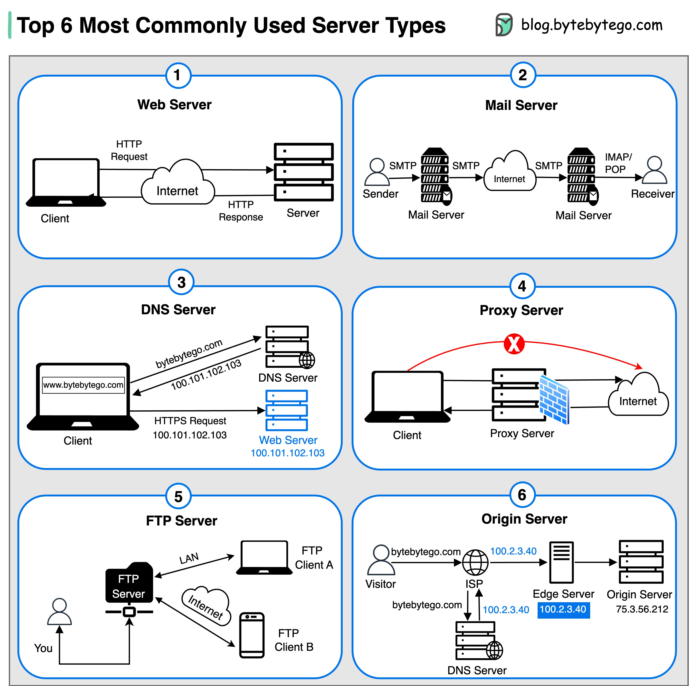

# Servidores

São sistemas computacionais ou dispositivos dedicados que fornecem funcionalidades para outros programas ou dispositivos através de armazenamento de dados.

## Tipos de Servidores

### Web Server 

Hospeda websites e entrega conteúdo web (páginas, APIs, Arquivos estáticos) através do protocolo HTTP para clientes através da internet. 

|Protocolo|Função|Porta insegura|Porta segura|
|---|---|---|---|
|**HTTP**|Páginas web|`80`|—|
|**HTTPS**|Páginas web seguras|—|`443`|
|**WebSocket (WS/WSS)**|Comunicação em tempo real|`80`|`443`|

### Mail Server 

Enviar, receber, armazenar e gerenciar mensagens de e-mail.

- **SMTP Server:** envia mensagens para outros servidores.
- **IMAP / POP3 Server:** permite ao usuário receber ou ler mensagens.

|Protocolo|Função|Porta insegura|Porta segura|
|---|---|---|---|
|SMTP|Envio de e-mails|25|465 (SMTPS) / 587 (STARTTLS)|
|IMAP|Acesso e sincronização de e-mails|143|993|
|POP3|Download de e-mails|110|995|

### DNS Server (Domain Name System Server)

Traduz nomes de domínio (como `www.google.com`) em endereços IP (como `142.250.190.78`).

**Tipos de DNS Server:**
- **Root Server:** nível mais alto (guia global da internet).
- **TLD Server:** armazena domínios de topo (.com, .org, .br).
- **Authoritative Server:** contém registros oficiais de um domínio.
- **Recursive Resolver:** faz as consultas em nome do usuário.

| Protocolo            | Porta | Observação              |
| -------------------- | ----- | ----------------------- |
| DNS (UDP/TCP)        | 53    | Padrão e mais comum     |
| DNS over TLS (DoT)   | 853   | Criptografado           |
| DNS over HTTPS (DoH) | 443   | Criptografado via HTTPS |
Exemplos: Cloudflare DNS (1.1.1.1), Google DNS (8.8.8.8)

### Proxy Server (Servidor Proxy)

Atua como **intermediário entre o cliente e a internet**.

**Principais usos:**
- **Cache:** armazena páginas para acesso mais rápido.
- **Filtro:** bloqueia sites ou conteúdo (empresas, escolas).
- **Anonimato:** oculta o IP do cliente.
- **Segurança:** monitora e controla tráfego de rede.

| Tipo                  | Função principal                                                                         |
| --------------------- | ---------------------------------------------------------------------------------------- |
| **Forward Proxy**     | Representa o cliente na internet.                                                        |
| **Reverse Proxy**     | Representa o servidor perante os clientes (muito usado em nuvem, ex: Nginx, Cloudflare). |
| **Transparent Proxy** | Intercepta tráfego sem o cliente saber.                                                  |

| Protocolo      | Porta comum        | Descrição                                                        |
| -------------- | ------------------ | ---------------------------------------------------------------- |
| HTTP Proxy     | 8080 / 8008 / 3128 | Tráfego web                                                      |
| HTTPS Proxy    | 443                | Criptografado                                                    |
| SOCKS / SOCKS5 | 1080               | Proxy de nível mais baixo (pode rotear qualquer tipo de tráfego) |

### FTP Server (File Transfer Protocol Server)

Permite **upload e download de arquivos** pela rede.

|Protocolo|Porta insegura|Porta segura|
|---|---|---|
|FTP|21|—|
|FTPS (FTP Secure)|21 (explícito) / 990 (implícito)|Sim|
|SFTP (SSH File Transfer Protocol)|—|22 (via SSH)|

### Origin Server (Servidor de Origem)

É o **servidor principal onde o conteúdo original está hospedado**, antes de ser replicado ou distribuído.

- **CDN (Content Delivery Network):** cópias dos arquivos são espalhadas em servidores pelo mundo (edge servers).
- O **origin server** envia o conteúdo original quando não há cache disponível.

|Protocolo|Porta segura/insegura|
|---|---|
|HTTP / HTTPS|80 / 443|
|FTP / SFTP (para atualização de conteúdo)|21 / 22|
