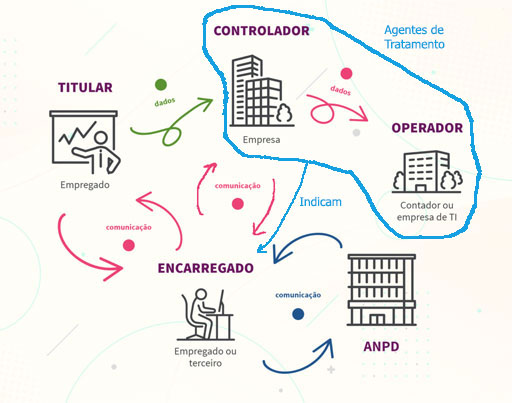

## Lei nº 13.709 de 14/Agosto/2018

### Capítulo 1 - Disposições Preliminares

**Objetivo:** O poder público deve proteger os dados sejam físicos ou digitais dos cidadãos, não permitindo violação das informações.

**Art. 1:** Esta lei dispõe sobre o tratamento de dados pessoais, **inclusive nos meios digitais, por pessoa natural ou por pessoa jurídica de direito público ou privado.**

**Art. 2:** Fundamentos
1. respeito à privacidade
2. autodeterminação da informação (indivíduo controlar e e proteger seus dados)
3. liberdade EICO (expressão, informação, comunicação e opinião)
4. Inviolabilidade IHI (intimidade, honra e imagem)
5. **desenvolvimento** ETI (econômico, tecnológico e inovação)
6. **livre** iniciativa, concorrência e defesa do consumidor
7. direitos humanos, o **livre desenvolvimento** PerDig ExeCid (personalidade, dignidade e exercício da cidadania)

**Art. 3:** Operação de **tratamento realizada em território nacional**, independente do lugar também que o coletor esteja localizado. 

> [!IMPORTANT]
> § 1 o Consideram-se coletados no território nacional os dados pessoais cujo titular nele se encontre no momento da coleta.

**Art. 4:** A lei não se aplica
1. para fins particulares
2. para fins **exclusivos** de 
	- de atividade jornalística e artística
	- acadêmicos
	- em atividades para uso na segurança pública, defesa nacional, segurança do Estado etc
	- investigação e repressão de infrações penais
- A lei também não se aplica se uma empresa estrangeira coleta dados no país estrangeiro e **não compartilha esses dados com o Brasil**, ex.: tudo é processado apenas dentro dos EUA.

**Art. 5:** Considerações
- Dado pessoal é o que identifica um indivíduo
- Dado sensível
	- Racial ou Ético
	- Convicção Religiosa
	- Opinião Política
	- Filiação de Sindicato ou Organização Religiosa, Filosófica ou Política
	- Referente à saúde ou vida sexual
	- Dado genético ou biométrico
- Dado anonimizado é aquele que não possa identificar o titular
- Banco de dados não é apenas o eletrônico, <u style="font-weight: bold;">físico também!</u>
- Titular é a pessoa natural a quem se referem os dados pessoais que são objeto de tratamento
- **Controlador:** Pessoa natural ou jurídica, seja de direito público ou privado, decide sobre os tratamento de dados pessoais
- **Operador:**  Pessoa natural ou jurídica, seja de direito público ou privado, realiza os tratamento de dados pessoais em nome do controlador.
- **Encarregado:** Pessoa indicada pelo <u>controlador e operador</u> para atuar como canal de comunicação entre controlador, titulares dos dados e Autoridade Nacional de Proteção de Dados (ANPD).
- **Agentes de Tratamento:** controlador e operador

- **Tratamento:** é **toda operação** realizada com dados pessoais, seja: coleta, produção, recepção, classificação, utilização, acesso, reprodução, transmissão, distribuição, processamento, arquivamento, armazenamento, eliminação, avaliação ou controle da informação, modificação, comunicação, transferência, difusão ou extração.
- **Anonimização:** é tirar a possibilidade de associação de um dado, **seja direta ou indireta.**
- Consentimento precisa ser uma manifestação livre, informada e inequívoca na qual o titular o dados concorde com o tratamento de seus dados para **uma finalidade específica.**
- **Bloqueio:** é a suspensão de qualquer tipo de operação de tratamento, seja dado pessoal ou em banco de dados.
- **Eliminação:** é a exclusão de dado ou de conjunto de dados armazenados em banco de dados
- **Transferência internacional de dados:** é a passagem dos dados para país estrangeiro ou organismo internacional que o país é membro.
- **Uso compartilhado de dados:** acontece por comunicação, difusão, transferência internacional, interconexão de dados pessoais ou tratamento compartilhado de bancos de dados pessoais 
- **Relatório de impacto à proteção de dados pessoais:** é a documentação **do controlador** que contém a descrição dos processos de tratamento de dados pessoais que podem gerar riscos às liberdades civis e aos direitos fundamentais
- **Órgão de pesquisa:** é a entidade da administração pública direta ou indireta ou pessoa jurídica de direito privado sem fins lucrativos, que tem como objetivo: pesquisa básica ou aplicada de caráter histórico, científico, tecnológico ou estatístico
- **Autoridade nacional:** é o órgão da administração pública responsável por zelar, implementar e fiscalizar o cumprimento da lei em território nacional.

**Art. 6:** Atividades de tratamentos através da boa-fé e conduta
- **Finalidade:** Tratamento para apenas aquilo que foi acordado e que o titular aceitou
- **Adequação:** Compatibilidade do tratamento com as finalidades informadas ao titular
- **Necessidade:** Limitação do tratamento ao mínimo necessário para realização de suas finalidades
- **Livre acesso:** garantir ao titular a consulta facilitada e gratuita sobre a forma e a duração do tratamento, bem como sobre a integralidade de seus dados pessoais
- **Qualidade dos dados:** garantia, aos titulares, de exatidão, clareza, relevância e atualização dos dados
- **Transparência:** garantia, aos titulares, de informações claras, precisas e facilmente acessíveis sobre a realização do tratamento e os respectivos agentes de tratamento, **observados os segredos comerciais e industriais.** 
- **Segurança:** medidas para proteção dos dados pessoais de acessos não autorizados e de situações acidentais ou ilícitas de destruição, perda, alteração, comunicação ou difusão.
- **Prevenção:** adoção de medidas para prevenir a ocorrência de danos em virtude do tratamento de dados pessoais
- **Não discriminação:** impossibilidade de realização do tratamento para fins discriminatórios ilícitos ou abusivos
- **Responsabilização e prestação de contas:** demonstração, <u>pelo agente</u>, das medidas para proteger os dados e a eficácia dessas medidas

### Capítulo 2 - Tratamento de Dados Pessoais
#### Seção I - Requisitos para Tratamento de Dados Pessoais

**Art. 7:** Autorizações para o tratamento de dados
- mediante o fornecimento de consentimento do titular
- obrigação legal ou regulatória pela controlador
- pela administração pública, para o tratamento e uso compartilhado de dados necessários à execução de de políticas públicas
- realizar estudos por órgãos de pesquisa, garantida, sempre que possível, a anonimização dos dados pessoais
- execução de contrato
- processo judicial, administrativo ou arbitral
- proteção da vida ou incolumidade física
> Incolumidade física é a preservação da integridade do corpo e da saúde de uma pessoa contra danos, lesões ou agressões.
- tutela da saúde, por profissionais de saúde
- interesses legítimos do controlado ou de terceiro, exceto em caso de prevalecerem direitos e liberdades fundamentais do titular
- proteção do crédito, não podendo repassar essas informações para outro controlador sem prévia autorização do titular
> Proteção do crédito” quer dizer **analisar, avaliar ou garantir a capacidade de pagamento de uma pessoa**, com o intuito de **evitar inadimplência** (calotes)

**Art;. 8:** Formas do consentimento
- por escrito ou por outro meio que demonstre a manifestação do titular
>Ex.: O titular confirmando através de prompts, formulários online, clicando em checkboxes, botões de "aceito os termos" / "estou ciente" etc. também são formas válidas para demonstrar a autorização do titular.
- Se for cláusula por escrito, deverá constar de cláusula separada das demais
- Cabe ao **controlador** o ônus da prova de que o consentimento foi fornecido, deve ter isso registrado de alguma forma
- Não pode induzir o titular a consentir
- As finalidades devem ser objetivas, se forem genéricas deverão ser desconsideradas
- O titular deve poder revogar consentimento a hora que ele quiser
- Caso haja alterações posteriores o titular precisa ser informado, podendo o titular, nos casos em que o consentimento é exigido, revogá-lo caso discorde da alteração.

**Art. 9:** O titular tem direito direito ao acesso facilitado às informações sobre o tratamento de seus dados, que deverão ser disponibilizadas de forma clara (...)
- finalidade específica do tratamento
- forma e duração do tratamento, observados os segredos comerciais e industriais
- identificação do controlador
- informações de contato do controlador
- informações acerca de uso compartilhado de dados pelo controlador e a finalidade
- responsabilidades dos agentes que realizarão tratamento
- direitos do titular
	- § 1º sem consentimento enganoso
	- § 2º avisar o titular em caso de mudanças e revogação de consentimento,
	- § 3º avisar o titular que ao adquirir um produto ou serviço deverá fornecer determinados dados

**Art. 10:** o legítimo interesse do controlador somente poderá fundamentar tratamento de dados pessoais para finalidades legítimas.
- A empresa pode usar os dados para melhorar, divulgar ou organizar suas próprias atividades.
- A empresa pode tratar os dados para garantir seus próprios direitos e também os direitos do titular, mas somente os dados necessários para interesse do controlador.
- Deve adotar medidas de transparência do tratamento dos dados
- ANPD poderá solicitar ao controlador relatório de impacto à proteção de dados pessoais, observados os segredos comercial e industrial.

#### Seção II - Do Tratamento de Dados Pessoais Sensíveis

**Art. 11:** Somente nas seguintes hipóteses:
- Quando consentido pelo titular
- Sem consentimento, nos casos:
	- obrigação legal pelo controlador
	- tratamento compartilhado de dados para administração ou políticas públicas
	- realização de estudos por órgão de pesquisa, sempre que possível realizando anonimização dos dados pessoais sensíveis.
	- (Lei de Arbitragem) resolução de conflitos extrajudiciais
	- proteção de vida ou incolumidade física do titular ou terceiros
	- tutela da saúde, por profissionais da área de saúde 
	- garantia da prevenção à fraude e à segurança do titular, nos processos de identificação e autenticação de cadastro em sistemas eletrônicos

**Art. 12:** Os dados anonimizados não serão considerados dados pessoais para os fins desta Lei, salvo quando o processo de anonimização ao qual foram submetidos for revertido.

**Art. 13:** Estudos em saúde pública, os órgãos de pesquisa poderão ter acesso a bases de dados pessoais, que serão tratados exclusivamente dentro do órgão, mantidos em ambiente controlado e seguro e com padrões éticos.
- § 1º Nunca revelando dados pessoais
- § 2º Nunca repassar dados para terceiros
- § 3º  acesso aos dados de que trata este artigo será objeto de regulamentação da ANPD

> [!IMPORTANT]
>   § 4º **Pseudonimização** é o tratamento por meio do qual um dado perde a possibilidade de associação, direta ou indireta, a um indivíduo

#### SEÇÃO III – Do Tratamento de Dados Pessoais de Crianças e de Adolescentes

**Art. 14:** 
- § 1º Com o consentimento específico e em destaque dado por pelo menos um dos pais ou pelo responsável legal.
- § 2º Os controladores deverão manter pública a informação sobre os tipos de dados coletados
- § 3º Poderão ser coletados dados pessoais de crianças sem o consentimento para:

> [!WARNING]
> Quando a coleta for necessária para contatar os pais ou o responsável legal, utilizados uma única vez e sem armazenamento, ou para sua proteção, e em nenhum caso poderão ser repassados a terceiro sem o consentimento 

- § 4º Os controladores não deverão condicionar a participação dos titulares (§ 1º)
	- em jogos, aplicações de internet ou outras atividades ao fornecimento de informações pessoais além das estritamente necessárias à atividade.
- § 5º O controlador deve realizar todos os esforços razoáveis para verificar que o consentimento a que se refere o § 1º foi realmente dado pelo responsável.
- § 6º As informações sobre o tratamento de dados referidas neste artigo deverão ser fornecidas de maneira simples, clara e acessíveis (inclusive a qualquer tipo de PcD)

#### SEÇÃO IV – Do Término do Tratamento de Dados

**Art. 15:** O término do tratamento de dados pessoais ocorrerá nas seguintes hipóteses:
1. finalidade foi alcançada, ou deixou de ser necessário para alcançar finalidade
2. fim do período de tratamento
3. revogação do titular
4. determinação da ANPD

**Art. 16:** Os dados pessoais serão eliminados após o término de seu tratamento, só podendo ser preservado para:
1. cumprimento de obrigação legal ou regulatória pelo controlador
2. estudo por órgão de pesquisa, sempre anonimizando dados pessoais
3. transferência a terceiro, desde que respeitados os requisitos de tratamento de dados dispostos nesta Lei
4. uso exclusivo do controlador, também anonimizando os dados

### CAPÍTULO III – Dos Direitos do Titular

**Art. 17:** Toda pessoa natural tem assegurada a titularidade de seus dados pessoais e garantidos os direitos fundamentais de liberdade, de intimidade e de privacidade.

**Art. 18:** O titular dos dados pessoais tem direito a obter do controlador, em relação aos dados do titular por ele tratados, a qualquer momento e mediante requisição:
1. confirmação da existência de tratamento
2. acesso aos dados
3. correção de dados incompletos, inexatos ou desatualizados
4. anonimização, bloqueio ou eliminação de dados desnecessários, excessivos ou tratados em desconformidade
5. portabilidade dos dados a outro fornecedor de serviço ou produto, mediante requisição expressa
6. eliminação dos dados pessoais tratados com o consentimento do titular, exceto nas hipóteses previstas no art. 16
7. informação das entidades públicas e privadas com as quais o controlador realizou uso compartilhado de dados
8. informação sobre a possibilidade de não fornecer consentimento e sobre as consequências da negativa
9. revogação do consentimento,
	- § 1º O titular dos dados pessoais tem o direito de peticionar em relação aos seus dados contra o controlador perante a autoridade nacional.
	- § 2º O titular pode opor-se a tratamento realizado com fundamento em uma das hipóteses de dispensa de consentimento
	- § 3º O direitos previstos serão exercidos mediante requerimento expresso do titular ou de representante legalmente constituído
	- § 4º Em caso de impossibilidade de adoção imediata da providência de que trata o § 3º
		- comunicar que não é agente de tratamento dos dados e indicar, sempre que possível, o agente
		- indicar as razões de fato ou de direito que impedem a adoção ime- diata da providência
	- § 5º O requerimento referido no § 3º será atendido sem custos para o titular, nos prazos e nos termos previstos em regulamento.
	- § 6º O responsável deverá informar, de maneira imediata, aos agentes de tratamento com os quais tenha realizado uso compartilhado de dados a correção, a eliminação, a anonimização ou o bloqueio dos dados, para que repitam idêntico procedimento, exceto nos casos em que esta comunicação seja comprovadamente impossível ou implique esforço desproporcional.
	- § 7º A portabilidade dos dados pessoais não inclui dados que já tenham sido anonimizados pelo controlador.
	- § 8º O direito a que se refere o § 1º também poderá ser exercido perante a defesa do consumidor.

> **Petionar:** Se a empresa não responder, negar sem justificativa ou não cumprir os prazos da lei, você pode **“peticionar”**, ou seja, **abrir uma reclamação formal** diretamente à **ANPD**, pedindo que ela intervenha.

**Art. 19:** Quando o titular pedir, o **controlador é obrigado** a fornecer os dados:
1. em formato simplificado, imediatamente
2. por meio de declaração clara e completa, que indique a origem dos dados, a inexistência de registro, os critérios utilizados e a finalidade do tratamento
	- § 1º Os dados pessoais serão armazenados em formato que favoreça o exercício do direito de acesso.
	- § 2 o As informações e os dados poderão ser fornecidos, a critério do titular
		- por meio eletrônico, seguro e idôneo para esse fim; ou
		- sob forma impressa.
	- § 3º Quando o tratamento tiver origem no consentimento do titular ou em contrato, o titular poderá solicitar cópia eletrônica integral de seus dados pessoais
	- § 4º A autoridade nacional poderá dispor de forma diferenciada acerca dos prazos previstos nos incisos I e II

**Art. 20:** O titular dos dados tem direito a solicitar a revisão de decisões tomadas unicamente com base em tratamento automatizado de dados pessoais que afetem seus interesses, incluídas as decisões destinadas a definir o seu perfil pessoal, profissional, de consumo e de crédito ou os aspectos de sua personalidade.

- § 1º O controlador deverá fornecer, sempre que solicitadas, informações claras e adequadas a respeito dos critérios e dos procedimentos utilizados para a decisão automatizada
- § 2º Em caso de não oferecimento de informações de que trata o § 1°, a autoridade nacional poderá realizar auditoria para verificação de aspectos discriminatórios em tratamento automatizado de dados pessoais.

**Art. 21:** Os dados pessoais referentes ao exercício regular de direitos pelo titular não podem ser utilizados em seu prejuízo.

**Art. 22:** A defesa dos interesses e dos direitos dos titulares de dados poderá ser exercida em juízo, **individual ou coletivamente**

| Individualmente                                                                         | Coletivamente                                                                                        |
| --------------------------------------------------------------------------------------- | ---------------------------------------------------------------------------------------------------- |
| Você mesmo entra com uma ação judicial contra a empresa ou órgão que violou seus dados. | Ministério Público     Defensoria Pública     Associações Entidades de defesa do consumidor |

### CAPÍTULO IV – Do Tratamento de Dados Pessoais pelo Poder Público

#### SEÇÃO I – Das Regras

**Art. 23:** O tratamento de dados pessoais pelas pessoas jurídicas de direito público (Lei de Acesso à Informação), deverá ser realizado para o atendimento de sua finalidade pública, na persecução do interesse público
1. fornecendo informações claras e atualizadas sobre a previsão legal, a finalidade, os procedimentos e as práticas utilizadas para a execução dessas atividades, em veículos de fácil acesso, preferencialmente em seus sítios eletrônicos
2. (vetado)
3. seja indicado um encarregado quando realizarem operações de tratamento de dados pessoais
4. (vetado)
	- § 1º A ANPD poderá dispor sobre as formas de publicidade das operações de tratamento.
	- § 2º qualquer pessoa jurídica
	- § 3º Os prazos e procedimentos para exercício dos direitos do titular perante o Poder Público, principalmente pela (Lei do Habeas Data), (Lei Geral do Processo Administrativo), e (Lei de Acesso à Informação).
	- § 4º Os **cartórios** (serviços notariais e de registro) são atividades públicas,  mas **são operados por pessoas físicas ou jurídicas privadas**, chamadas de _tabeliães_ ou _registradores_, por **delegação do Estado**. Mesmo sendo privados, esses cartórios devem ser tratados pela LGPD como órgãos públicos, porque exercem uma função pública.
	- § 5º Os órgãos notariais e de registro devem fornecer acesso aos dados por meio eletrônico para a administração pública

