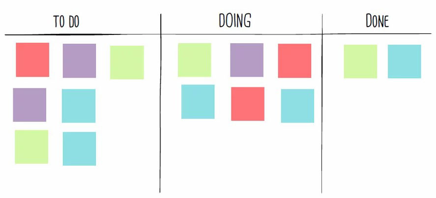

# Kanban

Kanban é de origem japonesa e significa "sinalização" ou "cartão", o método propõe o suo de cartões *post-its* para indicar e acompanhar o andamento da produção dentro da indústria. Trata-se de um sistema visual que busca gerenciar o trabalho conforme ele se move pelo processo.

> Lembre-se que Kanban e Scrum não são sinônimos. Kanban é um método, o Scrum é considerado como um framework.

A metodologia visualiza o fluxo previsto, com todas as etapas envolvidas e o trabalho real, e seu objetivo é identificar os possíveis gargalos, fazendo correções para que haja fluidez nas atividades da empresa.

- **to do:** <u>tarefas a serem feitas</u>, a primeira coluna à esquerda e contém os cartões das tarefas que devem ser feitas na sequência. Essa divisão costuma ser chamada de backlog e precisa ser gerenciada de maneira estratégica de acordo com a metodologia de trabalho. Ou seja, assim que uma tarefa sair da coluna seguinte (*doing*), o primeiro cartão na coluna de (*to do*) é movido para seu lugar.
- **doing:** <u>tarefas sendo executadas</u>, nesta coluna estão os cartões que o time está se dedicando no momento. Por ser um processo de entrega contínua, assim que um cartão sair desta coluna, outro será puxado.
- **done:** <u>tarefas concluídas</u>, se o cartão está nessa coluna, pode respirar mais aliviado: a tarefa foi concluída! O objetivo é arrastar todos os cartões para esta coluna com máxima agilidade. 

## Outros Fatores Importantes

- **Limite de trabalho em progresso:** não iniciar uma produção sem antes despachar um pedido pronto. Deve ser feito para evitar o atraso nas entregas e manter um bom fluxo de trabalho.
- **Otimizar a produtividade:** disponibiliza dados atuais de cada projeto, permitindo um maior controle dos processos e das atividades.
- **Priorizar tarefas importantes:** permite observar melhor o fluxo de trabalho, explorando atividades paradas e que foram finalizadas em tempo hábil. Seu esquema hierárquico, que pode ser composto por sinalizações de prioridade nos cartões, permite balancear as demandas, estruturando as mais importantes em detrimento das menos relevantes.
- **Reduzir Custos:** trabalhar com eficácia e estabelecer o fluxo de trabalho irá impactar a redução de gastos cortando o desperdício de materiais.
- **Incentivar a comunicação entre a equipe:** Comunicação interna, a troca de ideias e feedbacks, de forma a criar um ecossistema plural, mais centralizado na produção.
- **Melhorar o fluxo de demandas:** O sistema faz com que haja maior produtividade, mesmo que o fluxo de trabalho se mantenha o mesmo.

- **stories:** aqui ficam as histórias de usuário, <u>ideias ou tarefas que ainda não foram selecionadas para execução</u>. Normalmente representam o que precisa ser feito futuramente, mas ainda não foi priorizado.
- **to do:** são as <u>tarefas já priorizadas e prontas para começar</u>, significa que os requisitos estão claros, e a equipe pode começar a trabalhar nelas assim que houver disponibilidade.
- **in progress:** mostra <u>as tarefas em andamento</u>, ou seja, alguém está trabalhando nelas agora. Aqui é importante limitar o número de tarefas simultâneas (*WIP - Work in Progress*) para evitar sobrecarga.
- **testing:** <u>tarefas que já foram desenvolvidas</u>, mas estão em fase de verificação ou testes. Pode envolver testes de qualidade, revisão de código, validação de requisitos, ou homologação.
- **done:** são as <u>tarefas concluídas com sucesso</u>, passaram por todas as etapas anteriores (inclusive testes) e estão prontas para entrega ou já entregues.

## Referências

- [Scrum x Kanban](https://zup.com.br/blog/scrum-e-kanban/)

