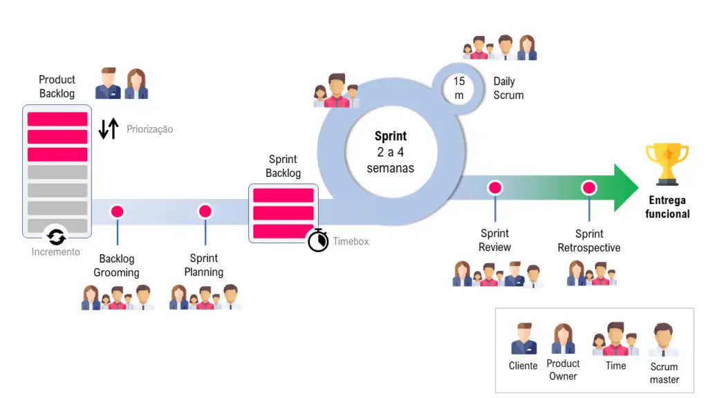
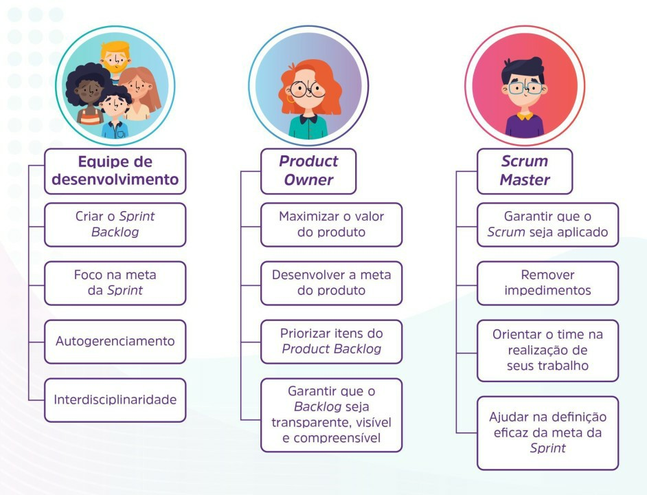

# Scrum

É uma metodologia ágil de gerenciamento de projetos, <u>não apenas para desenvolvimento de software.</u> É um framework para desenvolver, entregar e manter produtos complexos, é ideal para times pequenos. Consiste de times Scrum associados a papéis, eventos, artefatos e regras.

O time consiste de um *Product Owner*, Time de Desenvolvimento e *Scrum Master*. O time é auto-organizáveis e multifuncionais, entregam produtos de forma iterativa e incremental.

> Atenção❗ Não confundir o Time Scrum com o Time de Desenvolvimento.

## Metodologia Scrum

É um método ágil da gestão de projetos para torná-los menos dispendiosos, mais flexíveis e eficientes. Os processos são divididos em <u>ciclos chamados de Sprints</u>, onde cada sprint possui prazos e objetivos específicos.

### Pilares do Scrum

- **Transparência:** dos processos, requisitos de entrega e status. Todos os processos devem estar visíveis e alinhados com todos os responsáveis pelos resultados.
- **Inspeção:** Constante de tudo o que está sendo feito.
- **Adaptação:** Adaptar para a realidade e cultura da empresa.

### Ciclo da Scrum

## Atores

### Product Owner

- Expressar claramente os itens do Backlog o Produto
- Ordenar os itens do Backlog do Produto para alcançar melhor as metas e missões
- Otimizar o valor do trabalho que o Time de Desenvolvimento realiza
- Garantir que o Backlog do Produto seja visível transparente, claro para todos, e mostrar o que o Time Scrum vai trabalhar a seguir
- Garantir que o Time de Desenvolvimento entenda os itens do Backlog do Produto no nível necessário

### Scrum Master

Os 8 papéis de um Scrum Master
- Líder Servidor
- Coach
- Facilitador
- Professor
- Mentor
- Gerente
- Removedor de Obstáculos
- Agente da Mudança

### Time de Desenvolvimento

- auto-organizados
- multifuncionais
- não reconhece títulos para os integrantes
- não reconhece sub-times
- responsabilização do time como um todo

### Papéis

## Etapas
### Product Backlog

É o mapeamento de todas as funcionalidades visadas para um produto, é o pilar que representa toda a execução a ser feita pela equipe de desenvolvimento.

É a partir dele que as tarefas a serem cumpridas para que um produto seja lançado ou continue seu desenvolvimento serão estipuladas.

Essas tarefas <u>não precisam estar necessariamente prontas ou totalmente estruturadas logo no começo do projeto</u>, as metodologias ágeis propõem justamente isso, uma mudança e atualização constantes.

Fazendo com que o produto se desenvolva conforme as opiniões que os usuários emitem sobre ele, tendo o cliente como o centro do trabalho de toda a equipe.

#### Quem Define o Backlog do Produto?

Todas as Product Backlog <u>são definidas pelo Product Owner</u>. Através de seus contatos com os consumidores, ele estipulará quais são as funcionalidades a serem implementadas e aprimoradas.

#### Como o Product Backlog é ordenado?

O Product Backlog é ordenado conforme a prioridade das ações. Essas ações irão fazer parte dos Sprints da equipe, organizados conforme a importância de cada tarefa.

O Product Owner apresenta para a equipe quais são as necessidades dos usuários para esses itens, dividindo as etapas da construção do software em sprints e priorizando aqueles de maior dificuldade e que demandam mais tempo.

#### Etapas do Product Backlog

1. Mapeamento das necessidades dos usuários do produto pelo Product Owner, lembrando que pode ser um produto novo ou um que já esteja no mercado
2. Definição das Backlogs do produto a serem realizadas para que as necessidades dos usuários sejam atendidas
3. Apresentação das Backlogs para todo time da Scrum
4. Reuniões para transformar as Backlogs em Sprint. Uma das maneiras de realizar essa etapa é através do <u>Planning Poker</u>.
5. Caso seja necessário, nessa mesma reunião deve acontecer a divisão das Backlogs consideradas grandes em diferentes tipos
6. Definição, hierarquização e descrição do planejamento das Sprints conforme a importância do Product Backlog, seu grau de dificuldade e o tamanho da equipe envolvida
7. Se algum Product Backlog não ficou claro para a equipe ou foi considerado difícil, o Product Owner deverá reformular sua descrição e buscar maior clareza sobre as necessidades dos usuários
8. Por fim, o processo começa novamente, buscando sempre a evolução do produto, e sua adaptação às mudanças do mercado

o Product Owner responsável pela definição dos Product Backlogs deve ter em mente que esse trabalho é cíclico e está sujeito às mudanças constantes que envolvem o desenvolvimento do produto.

Todas as etapas do Scrum são passíveis de mudanças repentinas, como os Sprints e até mesmo as próprias Backlogs do produto, tendo em vista que a mentalidade do consumidor pode mudar rapidamente atualmente.

### *Backlog Grooming*/Refinement (Refinamento do Backlog)

*Grooming* significa "preparar", é o ato de detalhar, entender mais profundamente, adicionar características, estimar, priorizar, e manter o backlog do produto vivo.

Enquanto o time trabalha na sprint atual, o Product Owner (PO), com mais alguns convidados de seu interesse, começa a refinar e amadurecer as histórias e objetivos da próxima sprint ou release.

O Product Owner deve trazer o entendimento das necessidades de negócio já obtidas e apresentá-las ao time. O time por sua vez aproveita a oportunidade para tirar dúvidas e fazer perguntas ao PO a respeito dos itens que estão sendo “groomados”.

Com isso, o PO terá a oportunidade de responder as perguntas nas quais já tem as respostas enquanto o time entende melhor e toma decisões técnicas a respeito de como o item será completado.

Para as perguntas que o PO não tiver resposta ele poderá aproveitar para formular novas perguntas a serem feitas ao usuário final que deverão ser trazidas com as devidas respostas e o entendimento necessário para a próxima Sprint Planning.

## *Sprint Planning* (Refinamento da Sprint)

- Define o trabalho a ser realizado na Sprint
- *time-boxed* com no máximo 8 horas para uma Sprint de um mês de duração
- Responde as seguintes questões:
	- <u>O que</u> pode ser entregue como resultado do incremento da próxima Sprint?
	- <u>Como</u> o trabalho necessário para entregar o incremento será realizado?
## Sprint

- Intervalo de tempo em que será criado um incremento do produto, geralmente entre 2 até 4 semanas;
- Contém as seguintes etapas: 
	1. Planejamento da Sprint (até 8 horas / mês)
	2. Reuniões Diárias (15 minutos)
	3. Desenvolvimento 
	4. Revisão da Sprint (até 4 horas / mês)
	5. Retrospectiva da Sprint (até 3 horas / mês)
- O escopo (lista de requisitos) pode ser clarificado e renegociados entre o Product Owner e o Time de desenvolvimento quanto mais for aprendido.

### Sprint Backlog

- É uma lista de atividades que precisam ser feitas durante uma Sprint.
- No início de cada Sprint, olha-se para o Product Backlog e "puxa-se" o que será feito no Sprint. Essas "histórias" do Product Backlog são agora desmembradas em atividades para serem executadas no Sprint (Sprint Tasks)
- É um aspecto crucial, pois **indica todas as entregas a serem feitas**. Ou seja, além de ser uma forma de organizar as tarefas, são marcos que permitem controlar o andamento do projeto em cada Sprint.
### Cancelamento da Sprint

- <u>Somente o Product Owner</u> tem a autoridade para cancelar a Sprint
- A Sprint poderá ser cancelada se o objetivo da Sprint se tornar obsoleto
- Todos os itens de Backlog do produto incompletos são reestimados e colocados de volta no backlog do produto.

### *Daily Meeting / Daily Scrum*  (Reunião Diária)

- Evento de <u>15 minutos</u> para o time de desenvolvimento
- Planeja o trabalho para as próximas 24 horas
- Responde às questões:
	- O que eu fiz ontem que ajudou o time de desenvolvimento a atingir a meta da Sprint?
	- O que eu farei hoje para ajudar o time de desenvolvimento atingir a meta da Sprint?
	- Eu vejo algum obstáculo que impeça a mim ou o time de desenvolvimento na conclusão da meta da Sprint? Se sim, isso seria uma tarefa para o *Scrum Master* ajudar a solucionar.

### *Sprint Review* (Revisão da Sprint)

- Realizada no final da Sprint para inspecionar o incremento e adaptar o Backlog do Produto se necessário
- O Time Scrum e as partes interessadas colaboram sobre o que foi feito
- O resultado da Revisão da Sprint é um Backlog do Produto revisado que define os prováveis itens de Backlog do Produto para a próxima Sprint.

### Sprint Retrospective (Retrospectiva da Sprint)

- Oportunidade para o Time Scrum inspecionar a si próprio e criar um plano para melhorias a serem aplicadas na próxima Sprint
- Ocorre depois da Revisão da Sprint e antes do planejamento da próxima Sprint
- Ao final da Retrospectiva da Sprint, o Time Scrum deverá ter identificado melhorias que serão implementadas na próxima Sprint
## Referências

- [Product Backlog](https://www.oitchau.com.br/blog/product-backlog)
- [Grooming / Refinement](https://robsoncamargo.com.br/blog/Conheca-as-melhores-praticas-de-uma-backlog-grooming)

