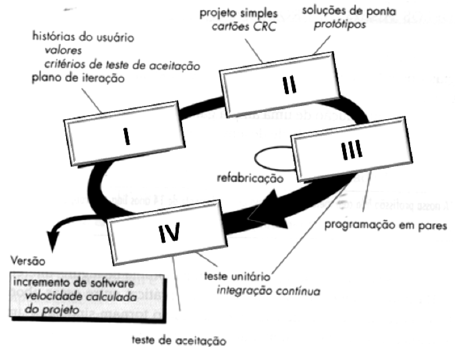

# Questões - eXtreme Programming

### 2025

**(Cebraspe - 2025)** As principais características do teste em programação extrema (XP) são o desenvolvimento orientado a testes a partir de cenários com participação do usuário e o uso de _frameworks_ automatizados para garantir qualidade contínua.

~~~
Certo
~~~

**(Cebraspe - 2025)** No XP (_Extreme Programming_), o papel do _Scrum Master_ é responsável por facilitar as reuniões e garantir que a equipe siga os princípios ágeis da metodologia.

~~~
Errado
Scrum Master pertence ao ecossistema de metodologias ágeis Scrum
~~~

**(FUNDATEC - 2025)** As características abaixo estão relacionadas à metodologia ágil XP (Extreme Programming):

1. Programação em Pares. (Certo)
2. Refatoração contínua de código. (Certo)
3. Reuniões diárias de 15 minutos com o time de desenvolvimento. (Errado)

~~~
(3) Diz a respeito de reuniões diárias do Scrum
~~~

**(Cebraspe - 2025)** Na metodologia XP, o refatoramento consiste na implementação das funcionalidades cujos componentes do código-fonte devem ser integrados várias vezes, à medida que tais funcionalidades sejam desenvolvidas e testadas unitariamente.

~~~
Errado
Refatoramento é uma melhoria do código sem alterar o comportamento externo
~~~

**(Cebraspe - 2025)** O XP (programação extrema) enfatiza a entrega frequente de versões operacionais do _software_, desenvolvimento _test-first_, refatoração e integração contínua como mecanismos para gerenciar mudanças e manter a qualidade do _software_.

~~~
Certo
~~~

**(FGV - 2025)** Em um sistema que utiliza a prática de Integração Contínua, o código é frequentemente integrado e testado automaticamente. A metodologia XP enfatiza a prática de Refatoração como essencial para a qualidade contínua.
No contexto da Refatoração contínua, o conceito de _Technical Debt_ representa

A - o custo financeiro total do desenvolvimento, incluindo salários e _software_.
B - o atraso na entrega de novas funcionalidades devido à má documentação dos requisitos.
C - a diferença entre o cronograma do projeto e o cronograma real de desenvolvimento.
==D - o custo futuro de retrabalho imposto por decisões de _design_ ou implementações de baixa qualidade feitas no passado.==
E - a quantidade de testes unitários que a equipe ainda precisa escrever para atingir 100% de cobertura.

**(FCPC - 2025)** No XP, as práticas centrais consistem em um conjunto de metodologias e técnicas destinadas a melhorar a qualidade do software e a capacidade de adaptação às mudanças nas necessidades dos clientes. Marque a opção que **NÃO** faz parte das práticas centrais do XP.

==A - Especificação formal detalhada.==
B - Programação em pares.
C - Refatoração contínua.
D - Integração contínua.

**(Cebraspe - 2025)** Em XP, a velocidade do projeto é calculada após a entrega do primeiro incremento, o que permite estimar prazos de entregas futuras e ajustar o conteúdo dos incrementos ou datas caso haja _overcommitment_ de histórias.

~~~
Certo
~~~

>[!Note]
>**Overcommitment de histórias** significa assumir mais histórias de usuário do que o time consegue entregar dentro de uma iteração (sprint).
>
>Isto viola principalmente o **Ritmo sustentável** (_Sustainable Pace_), que resulta em falta de entregas, códigos incompletos etc.

**(FGV - 2025)** O _Pair Programming_ é uma prática central do XP, onde dois desenvolvedores trabalham juntos em um único computador na mesma tarefa. Um atua enquanto Piloto e o outro como Navegador.

Além da melhoria imediata na qualidade do código, o benefício intangível de longo prazo mais significativo do _Pair Programming_ para o conhecimento da equipe será

A - a eliminação da necessidade de _Unit Tests_, já que o código é revisado em tempo real.
B - a redução dos custos com licenças de _software_ e computadores.
C - o aumento da Coesão do código e redução do Acoplamento Externo.
==D - a disseminação do conhecimento e expertise do sistema entre os membros da equipe.==
E - o aumento da velocidade de codificação em 100% por ter dois desenvolvedores.

**(Cebraspe - 2025)** Em _extreme programming_, os requisitos são uma lista de funções, requeridas pelo sistema, implementados em pequenos _releases_ pela equipe de desenvolvimento.

~~~
Errado
Ao afirmar que em XP, os requisitos são uma lista de funções, dá a entender que as listas de funções são estáticas, e vale ressaltar que as listas de funções são estorias de usuário (user stories).
~~~

**(Cebraspe - 2025)** XP é um método leve, recomendado para desenvolver software com requisitos vagos ou sujeitos a mudanças, sendo definido por meio de um conjunto de valores, princípios e práticas de desenvolvimento.

Os três principais valores do XP são

==A - comunicação, simplicidade e feedback.==
B - humanidade, economicidade e benefícios mútuos.
C - criatividade, responsabilidade e qualidade de vida.
D - melhorias contínuas, falhas acontecem e _baby steps._
E - _design_ incremental, programação pareada e _build_ automatizado.

**(Cebraspe - 2025)** A metodologia XP é explicitamente orientada às pessoas, de modo que evita a troca dos desenvolvedores durante o desenvolvimento de um projeto.

~~~
Certo
~~~

### 2024

**(Cebraspe - 2024)** Um dos métodos ágeis bastante utilizados para implementação de _softwares_ é o XP (Extreme Programming), que contempla um elevado nível de envolvimento do cliente durante o processo de implementação. Uma prática característica do XP consiste

A - no ritmo acelerado com elevada quantidade de horas extras.
B - nas grandes _releases_.
C - no modelo em cascata.
D - nas ilhas de conhecimento especializado.
==E - na integração contínua.==

**(Instituto Verbena - 2024)** As metodologias ágeis revelam-se cada vez mais importantes dentro do gerenciamento de projetos, proporcionando entregas com conceito de maior benefício para o cliente. No âmbito dos projetos de desenvolvimento de software, a prática utilizada na metodologia ágil XP (do inglês, _Extreme Programming_) para reduzir o custo das alterações é conhecida como

==A - _incremental design._==
B - _slack._
C - _pair programming._
D - _test-fast programming._

**(FUNDATEC - 2024)** Assinale a alternativa que corresponde à metodologia de desenvolvimento ágil que tem a programação em pares como uma de suas características.

A - FDD (Feature Driven Development).
==B - XP (Extreme Programming).==
C - MDA (Model Driven Architecture).
D - MDD (Model Driven Development).
E - Scrum.

**(Consulplam - 2023)** Sobre os Métodos ágeis (_XP – Extreme Programming_ e _SCRUM_), analise as afirmativas a seguir.

I. Na atividade de codificação, o método XP trabalha programação em pares, ou seja, recomenda que duas pessoas trabalhem juntas em uma mesma estação de trabalho para criar código para uma história. (Certo)

II. Na metodologia _Scrum_, o número de _sprints_ necessários para cada atividade metodológica varia (dependendo do tamanho e da complexidade do produto), sendo adaptado ao problema em questão e definido; e, muitas vezes, modificado em tempo real pela equipe _Scrum_. (Certo)

III. O método _Extreme Programming_ (Programação Extrema) envolve um conjunto de regras e práticas constantes no contexto de quatro atividades metodológicas: requisitos; análise; projeto; evolução; e, entrega.

IV. Em uma situação ideal, antes de começar outra reunião de planejamento do _sprint_, o _Scrum master_ marca uma reunião de três horas (para um _sprint_ de quatro semanas) com a equipe de desenvolvimento, chamada de retrospectiva do _Sprint_. (Certo)

~~~
III - O XP tem 4 atividades metodológicas:
- Planejamento (Requisitos)
- Projeto (Design)
- Codificação
- Testes 
~~~

**(Cebraspe - 2024)** A XP (_Extreme Programming_) estimula o uso de cartões classe-responsabilidade-colaborador (CRC) para identificar e organizar como deve ser realizada a refatoração com vistas a melhorar o _software_.

~~~
Errado
O XP encoraja o uso de cartões CRC (Class- Responsibility-Colaborator) como um mecanismo efetivo para raciocinar sobre o software no contexto orientado à objetos.
~~~

**(Instituto AOCP - 2024)** O departamento de Ciência da Computação da Universidade Federal de Sergipe (UFS) decide iniciar um projeto de desenvolvimento de um novo sistema para gerenciamento acadêmico usando a metodologia ágil XP (_eXtreme Programming_). O time de desenvolvimento é composto por programadores seniores e juniores. Eles enfrentam um dilema sobre como incorporar práticas de programação em pares e integração contínua efetivamente. Qual das alternativas a seguir seria a abordagem mais apropriada de acordo com os princípios XP?

A - Incentivar que programadores juniores formem pares apenas entre si, para não retardar o progresso dos programadores seniores.
==B - Empregar uma abordagem de programação em pares misturando programadores seniores e juniores e aplicar integração contínua desde o início.==
C - Implementar integração contínua apenas nas fases finais do projeto para economizar tempo.
D - Desconsiderar programação em pares e focar unicamente em revisões de código após a implementação.
E - Limitar a programação em pares aos programadores seniores e deixar os juniores trabalharem de forma independente.

**(FGV - 2024)** As chamadas _metodologias ágeis_, apesar de compartilharem os mesmos fundamentos, possuem procedimentos particulares.

Assinale a opção que indica a metodologia ágil que se caracteriza por organizar programadores em pares e focar na refatoração frequente.

A - _Scrum._
B - LSD.
==C - _Extreme programming._==
D - Kanban.
E - FDD.

**(UNIFIL - 2024)** 

_Cenário 01_

Uma determinada startup de tecnologia adotou a metodologia ???? para criar um aplicativo de gerenciamento de tarefas em um prazo curto. A equipe prioriza a comunicação constante, desenvolvimento interativo e testes contínuos para garantir a entrega rápida e iterativa de funcionalidades essenciais.

_Cenário 02_

Uma determinada empresa gerencia sistemas críticos e decide adotar a metodologia ???? para realizar a manutenção contínua do sistema. A equipe de desenvolvimento trabalha em pequenos incrementos, implementando melhorias, correções e novos recursos em ciclos curtos. As práticas de programação em par e testes automatizados são fundamentais para garantir a estabilidade do sistema.

Considerando os cenários apresentados, assinale a alternativa que apresenta o tipo de metodologia de desenvolvimento de software que está sendo predominantemente utilizado.

==A - O primeiro cenário está utilizando Scrum enquanto o segundo utiliza a metodologia XP.==
B - O primeiro cenário está utilizando XP enquanto o segundo utiliza a metodologia Scrum.
C - Os dois cenários estão utilizando a metodologia Scrum.
D - Os dois cenários estão utilizando a metodologia XP.

**(Instituto Acesso - 2024)** A Aliança Ágil definiu um manifesto contendo doze princípios aos quais as metodologias ágeis de desenvolvimento de software devem se adequar. Assinale a alternativa cuja afirmação **NÃO** está de acordo com esses princípios:

A - Atenção contínua a excelência técnica e a um bom projeto aumentam a agilidade.
B - Entregar software em funcionamento com frequência de algumas semanas a alguns meses, de preferência na menor escala de tempo.
C - Simplicidade é essencial.
D - O método mais eficiente de levar informações para uma equipe de desenvolvimento e fazê-las circular é a conversa cara a cara.
==E - Nossa maior prioridade é satisfazer à equipe desenvolvedora, mediante entregas de software de valor em tempo hábil e continuamente.==

**(FUNCERN - 2024)** A _Extreme Programming_ (Programação Extrema) envolve um conjunto de regras e práticas constantes no contexto de quatro atividades metodológicas:

A - requisitos, projeto, codificação e testes.
==B - planejamento, projeto, codificação e testes.==
C - requisitos, testes, codificação e implantação.
D - planejamento, codificação, revisão de código e implantação.

~~~
A Extreme Programming (XP) organiza suas práticas em torno de quatro atividades metodológicas principais:

Planejamento (Planning) – envolve o planejamento iterativo e colaborativo com o cliente para definir os requisitos e priorizar as funcionalidades.

Projeto (Design) – foca na simplicidade do design, permitindo ajustes rápidos e contínuos.

Codificação (Coding) – inclui práticas como a programação em par e o envolvimento constante do cliente para garantir a entrega de funcionalidades.

Testes (Testing) – a XP enfatiza fortemente os testes automatizados e os testes de aceitação para garantir a qualidade contínua.
~~~

**(CENTEC - 2024)** A escolha de um modelo de desenvolvimento adequado é fundamental para o sucesso de um projeto de software. Durante as aulas, foram explorados vários modelos, incluindo o modelo em cascata, ágil, espiral, entre outros, cada um com suas vantagens e desvantagens. Qual dos seguintes modelos de desenvolvimento de software enfatiza a entrega rápida e contínua de pequenas incrementações funcionais?

A - Modelo em Cascata
B - Modelo Espiral
C - Modelo Iterativo
==D - Modelo Ágil==
E - Modelo Big Bang

**(FGV - 2024)** A fase de testes de software em processos ágeis se caracteriza pela elaboração dos testes antes da implementação do código, permitindo a execução do teste enquanto o código está sendo escrito.

A característica do XP que tem como fundamento esse conceito de teste é o:

A - desenvolvimento de testes incrementais a partir de cenários;
B - denvolvimento dos usuários no desenvolvimento de testes e validação;
==C - desenvolvimento de test-first;==
D - uso de frameworks de testes automatizados;
E - uso de workflows em testes.

**(FUNCERN - 2024)** Entre as metodologias de desenvolvimento de software, a Extreme Programming- XP procura melhorar a qualidade do produto por meio de práticas que refletem métodos ágeis de desenvolvimento. Sobre essas práticas é correto afirmar que

A - os releases do sistema não devem adicionar funcionalidade ao primeiro release.
==B - a excessiva quantidade de horas extras de trabalho, para um ritmo sustentável, não é considerada aceitável.==
C - o representante do usuário final precisa estar disponível apenas no início do processo, para que possa transmitir os requisitos para equipe de desenvolvimento.
D - os desenvolvedores devem trabalhar em áreas específicas do sistema, visando construir uma expertise que possa acelerar o processo de desenvolvimento.

**(Legalle Concursos - 2024)** Considerando o Extreme Programming (XP), uma metodologia ágil de desenvolvimento de software, baseada em uma série de valores orientadores, analise as assertivas abaixo, sobre alguns desses valores, julgando-as V, se verdadeiras, ou F, se falsas.

( V ) Comunicação é um dos princípios, o qual indica que se deve priorizar a comunicação eficaz entre os membros da equipe e com os clientes, buscando garantir que todos estejam alinhados e informados sobre o progresso e os objetivos do projeto.

( V ) Feedback é um dos princípios que preconiza a valorização do feedback continuo, tanto dos clientes quanto dos membros da equipe, a fim de assegurar que o produto atenda às necessidades do cliente e que a equipe possa aprimorar continuamente seu processo de desenvolvimento.

( V ) Coragem é um dos princípios que afirmam que se deve promover a coragem para enfrentar desafios técnicos e comerciais, assumir riscos calculados e buscar constantemente a melhoria.

**(Cebraspe - 2024)** Entre os principais métodos ágeis, o Lean é indicado para projetos reduzidos e mais objetivos, o Scrum é indicado para projetos de diferentes áreas que tenham prazos apertados e requisitos mutáveis, e o XP passou a ser indicado para _startups_ e empresas em processo de consolidação, pois tem como principal objetivo fortalecer a relação entre colaboradores e clientes.
~~~
Certo
~~~

**(IDECAN - 2024)** Dentre as metodologias ágeis amplamente utilizadas no desenvolvimento de software, destaca-se uma abordagem que enfatiza a colaboração contínua entre desenvolvedores e clientes, utilizando práticas como histórias de usuário, integração contínua e testes automáticos. Esta metodologia valoriza a simplicidade no design e encoraja a melhoria constante do código por meio da comunicação efetiva e da retroalimentação constante.

Considerando essa descrição, a metodologia ágil que está sendo destacada no texto é:

A - Scrum
B - Kanban
C - TDD (Test-Driven Development)
==D - XP (Extreme Programming)==

**(FGV - 2024)** As chamadas _metodologias ágeis_, apesar de compartilharem os mesmos fundamentos, possuem procedimentos particulares. Assinale a opção que indica a metodologia ágil que se caracteriza por organizar programadores em pares e focar na refatoração frequente.

A - _Scrum._
B - LSD.
==C - _Extreme programming._==
D - _Kanban._
E - FDD.

**(UFMT - 2024)** A coluna da esquerda apresenta os métodos ágeis XP e Scrum para o desenvolvimento de software e a da direita, suas características. Numere a coluna da direita de acordo com a da esquerda.

1. XP
2. Scrum

( 2 ) Utiliza ciclos de desenvolvimento denominados _sprints._
( 2 ) Possui equipes e papéis bem definidos.
( 1 ) Adota flexibilidade no planejamento.

**(ACAFE - 2024)** Uma equipe de desenvolvimento de software está trabalhando em um novo projeto utilizando a metodologia XP. A equipe está em sua quarta iteração de desenvolvimento e já implementou diversas funcionalidades do sistema. Durante a reunião de planejamento da próxima iteração, o cliente solicita a alteração de uma funcionalidade já implementada e testada.

Assinale a alternativa que a equipe de desenvolvimento deve apresentar ao cliente, considerando os princípios da metodologia XP.

A - Explicar ao cliente que a alteração da funcionalidade exigirá um novo ciclo de desenvolvimento e testes e, desta forma, ela só poderá ser implementada na próxima iteração.
B - Informar ao cliente que a alteração da funcionalidade não pode ser realizada na próxima iteração, pois o código já foi finalizado e testado.
C - Negociar com o cliente a priorização da alteração da funcionalidade em detrimento de outras funcionalidades já planejadas para a próxima iteração.
D - Aceitar a solicitação do cliente e se comprometer a alterar a funcionalidade na próxima iteração, mesmo que isso signifique trabalhar horas extras.
==E - Solicitar mais tempo ao cliente para analisar a necessidade da alteração e definir um prazo realista para sua implementação, caso seja viável.==

**(FGV - 2024)** Os analistas do Time de Desenvolvimento de Software (TDS) estão utilizando User Story (História de Usuário) do Extreme Programming (XP) para todos os novos projetos, em substituição aos Casos de Uso em UML.

Na escrita das User Stories, os analistas devem:

A - considerar que histórias podem ser construídas em mais de uma iteração;
B - ordenar a escrita das histórias, visto que há uma dependência entre elas;
C - detalhar os critérios de testes a serem executados com base na história;
==D - considerar que uma história pode ser um ou mais cenários em um caso de uso;==
E - focar nos objetivos do usuário e em como a interação com o sistema satisfaz esses objetivos.

**(Nosso Rumo - 2024)** No _Extreme Programming_ (XP), a prática de “cliente presente” é valorizada, o que significa que os clientes participam ativamente do processo de desenvolvimento. Isso proporciona benefícios, tais como:

==A - maior alinhamento entre as necessidades do cliente e as funcionalidades desenvolvidas.==
B - aumento da burocracia, que se reflete em menor necessidade de aprovação constante do cliente.
C - controle da flexibilidade do projeto, uma vez que as mudanças são limitadas pela presença do cliente.
D - aumento da complexidade do processo de desenvolvimento devido à necessidade de envolvimento do cliente.
E - revisão dos níveis de qualidade do software, que pode ser impactada pela falta de especialização técnica por parte do cliente.

**(Cebraspe - 2024)** A XP recomenda a criação de protótipos operacionais, denominados soluções pontuais, que devem ser implementados e avaliados.
~~~
Certo
~~~

>[!Note]
>**Protótipos operacionais**, também chamados de **soluções pontuais**, são **implementações rápidas e funcionais** criadas para **resolver um problema específico e imediato**, sem a intenção inicial de se tornarem a solução definitiva do sistema.

**(Instituto Verbera - 2024)** No eXtreme Programming (XP), uma metodologia ágil de desenvolvimento de software, a qualidade do código e a produtividade da equipe são prioridades fundamentais. Qual prática é adotada no XP para melhorar a qualidade do código e a produtividade da equipe?

A - Reuniões diárias prolongadas.
B - Desenvolvimento baseado em componentes.
C - Documentação extensa.
==D - Programação em pares.==

**(Quadrix - 2024)** Simplicidade e coragem são valores fundamentais da metodologia XP.
~~~
Certo
~~~

**(IDCAP - 2024)** Extreme Programming é uma metodologia de desenvolvimento de software que combina rapidez, produtividade, qualidade de forma simples e que atende as necessidades do cliente. Extreme Programming traz em sua base valores e práticas que sempre procuram garantir ao cliente versatilidade e satisfação com o produto final, como por exemplo:

A - Eficácia.
==B - Simplicidade.==
C - Autonomia.
D - Interatividade.
E - Abertura.

**(FUNDEP - 2024)** São práticas de programação adotadas pelo método XP, **EXCETO**

A - Design Incremental.
B - Programação pareada.
C - Integração contínua.
==D - Levantamento arquitetural.==

**(FGV - 2024)** A metodologia de desenvolvimento ágil _eXtreme Programming_ (XP) visa à qualidade do _software_ e à capacidade de resposta às mudanças de requisitos do cliente.

Assinale a opção que apresenta práticas típicas da metodologia XP.

A - Pair programming, sprint planning e continuous integration.
==B - refactoring, continuous integration e pair programming.==
C - user stories, burndown charts e test-driven development.
D -test-driven development, retrospectives e daily stand-ups.
E - planning poker, refactoring e backlog grooming.

### 2023

**(FUNCERN - 2023)** A metodologia _Extreme Programming_ (XP) é uma abordagem ágil de desenvolvimento de _software_ que se concentra em valores como comunicação, _feedback_, simplicidade e coragem. Essa metodologia

A - é considerada adequada para projetos de grande porte com requisitos de _software_ bem definidos.
==B - é frequentemente combinada com outras práticas ágeis, como o _Agile Modeling_, para melhorar ainda mais a eficácia do desenvolvimento de software.==
C - enfatiza o processo de desenvolvimento de software em cascata, em que as etapas são realizadas em sequência, seguindo uma ordem linear diariamente.
D - propõe a prática da codificação em pares, em que dois programadores trabalham juntos em um único computador, evitando os frequentes testes de integração e minimizando o tempo necessário para resolvê-los.

>[!Warning]
>D - *"evitando os frequentes testes de integração"*
>Fazer codificação em pares não reduz testes, são etapas distintas

**(FUNDATEC - 2023)** A Extreme Programming (Programação Extrema) emprega uma metodologia orientada a objetos como seu paradigma de desenvolvimento e envolve um conjunto de regras e práticas constantes no contexto das seguintes atividades metodológicas, **EXCETO:**

A -Planejamento.
B - Projeto.
C - Codificação.
==D - Documentação.==
E - Testes.

**(COSEAC - 2023)** Suponha que você faz parte de uma equipe que está trabalhando no desenvolvimento ágil de software utilizando _extreme programming_ (XP). Quando você está focado em possíveis melhorias para o _software_ sem alterar a funcionalidade e na implementação imediata destas melhorias, está estabelecida a prática de:

==A - refatoração==
B - programação em pares
C - integração contínua
D - planejamento incremental
E - pequenos releases

**(FUNDATEC - 2023)** Assinale a alternativa que apresenta uma característica da metodologia ágil Extreme Programming (XP).

A - Reuniões diárias de 15 minutos.
B - Modelos como artefato primário do processo de desenvolvimento.
==C - Programação em dupla.==
D - Ciclos adaptáveis.
E - Desenvolvimento dirigido a funcionalidades.

**(Legalle Concursos - 2023)** A _Extreme Programming_ (XP) emprega uma abordagem orientada a objetos, e envolve um conjunto de regras e práticas constantes no contexto das atividades metodológicas. Assinale a atividade que NÃO corresponde ao processo de desenvolvimento da metodologia XP.

A - Planejamento.
==B - Validação.==
C - Projeto.
D - Codificação.
E - Teste.

**(Legalle Concursos - 2023)** Assinale a alternativa que NÃO corresponde aos princípios da metodologia ágil _Extreme Programming_ (XP)

A - Planejamento incremental.
B - Refatoração.
==C - Propriedade individual.==
D - Integração continua.
E - Programação em pares.

**(Consulplan - 2023)** Metodologia ágil é uma forma de construir _software_ através de conjuntos de práticas para atender às especificações de um projeto, como agir e realizar o desenvolvimento com eficiência, agilidade e entrega do produto final com rapidez e qualidade. Das metodologias ágeis, o processo de desenvolvimento de _software_ XP (_Extreme Programming_) é considerado o mais radical e que possui característica específica para a construção do projeto; uma dessas características trata sobre as necessidades de melhoria no projeto e que para isso deverá ser realizada através de um tipo de processo específico; assinale-a.

A - Testes de aceitação.
==B - Refatoração (_refactoring_).==
C - Reuniões de planejamento (_planning_ _game_).
D - Entregas frequentes ao cliente (_small releases_).

**(Cebraspe - 2023)** O _just in time_ e o _poka yoke_ são duas ferramentas utilizadas no método ágil XP para desenvolvimento de _software_.

~~~
Errado
Poka Yoke é um termo de origem japonesa e que significa “à prova de erros”. Trata-se de uma ferramenta de inspeção criada com o objetivo de prevenir falhas humanas e corrigir erros eventuais.

Just in time é uma técnica de gestão da produção, que influencia no controle de estoque. É um tipo de metodologia lean, projetada para aumentar a eficiência, cortar custos e diminuir o desperdício. O sistema just in time ajuda no gerenciamento dos processos encontrados ao longo da cadeia produtiva.
~~~

**(FEPESE - 2023)** São práticas abordadas, recomendadas ou discutidas pela eXtreme Programming (XP):

1. Desenvolvimento baseado em testes. (Certo)
2. Integração Contínua ou Continuada (IC). (Certo)
3. Refatoração. (Certo)
4. Iterações curtas. (Certo)

**(Quadrix - 2023)** A metodologia XP (_Extreme Programming_) é definida como uma

==A - metodologia ágil que prioriza a comunicação constante com o cliente, iterações curtas e _feedback_ contínuo.==
B - abordagem de desenvolvimento de _software_ com base em modelos de processo tradicionais, com ênfase na documentação detalhada e planejamento extensivo.
C - técnica de programação extensiva que se concentra principalmente na otimização de código-fonte para melhor desempenho.
D - metodologia de gerenciamento de projetos que utiliza técnicas de análise de risco para minimizar possíveis problemas durante o desenvolvimento de _software_.
E - estrutura de teste de _software_ que se concentra principalmente na execução de testes de unidade automatizados.

**(Quadrix - 2023)** Para garantir uma comunicação eficiente, a metodologia XP recomenda o uso de equipes grandes e uma hierarquia rigorosa.
~~~
Errado
~~~

**(Instituto Verbena - 2023)** O desenvolvimento ágil é uma prática muito comum na indústria. Ele permite entregar software com qualidade e de forma ágil sem se ater demasiadamente à documentação excessiva dos processos de engenharia de software mais rigorosos. _Extreme Programming_ (XP) é uma das técnicas mais conhecidas dentre aquelas utilizadas para desenvolvimento ágil. Dentre seus valores, pode-se destacar a comunicação, a simplicidade e o _feedback_. Os outros dois valores são

A - programação por pares e entrega contínua.
==B - coragem e respeito.==
C - agilidade e responsabilidade.
D - abraçar mudanças e qualidade.

>[!Warning]
>Questão a respeito dos **valores do XP** , cuidado com a alternativa A.

**(Quadrix - 2023)** A XP enfatiza a colaboração entre os desenvolvedores e os clientes, promovendo a comunicação constante e a entrega de um _software_ funcional, em pequenos incrementos.

~~~
Certo
~~~

**(VUNESP - 2023)** Na produção de _software_, pode-se decidir por utilizar um método ágil de desenvolvimento. Dessa forma, assinale a alternativa que contém um desses métodos ágeis.
A - SWOT – _Strenghts, Weaknesses, Opportunities, Threats._
B - JSON – _Java Script Object Notation._
==C - XP – _Extreme Programming._==
D - Python.
E - OLAP – _OnLine Analytical Processing._

**(Cesgranrio - 2023)** Uma das práticas de eXtreme Programming (XP) é a programação em pares.
Um dos objetivos dessa prática é

==A - otimizar a qualidade do código produzido devido ao mecanismo de inspeção em tempo real.==
B - permitir que o cliente valide as histórias à medida que são implementadas.
C - integrar ao sistema, de forma regular e contínua, o código recém-concluído.
D - escrever os testes unitários antes de escrever o código a ser testado.
E - escrever os casos de testes junto com o código a ser testado

**(Avança SP - 2023)** Analise as assertivas a seguir sobre Conceitos de desenvolvimento ágil:

I. O SCRUM é uma forma de gestão ampla para projetos que não depende da área de conhecimento.  (Certo)

II. O XP tem sua aplicação mais restrita, focada basicamente no mundo de desenvolvimento de sistemas. (Certo)

III. O SCRUM é uma metodologia ágil de desenvolvimento de softwares focada na agilidade de equipes e na qualidade dos projetos e tem como seus valores a simplicidade, o feedback, a comunicação, a coragem, o respeito. (Errado)

IV. O XP é uma metodologia ágil de trabalho onde é usada para estabelecer conjuntos de regras e práticas de gestão para conseguir o sucesso de um projeto. (Errado)

~~~
III - Esses valores são do XP
IV - Não são práticas de gestão, mas sim de técnicas para desenvolvimento de software.
~~~

**(Quadrix - 2023)** A integração contínua e os testes automatizados, entre outros, caracterizam a metodologia XP.
~~~
Certo
~~~

**(FGV - 2023)** As metodologias ágeis se tornam cada vez mais presentes no mercado de criação de software, sendo comum a adoção de SCRUM ou XP pelas equipes de desenvolvimento.

Em termos do modelo XP, é correto afirmar que:

A - apenas o sistema completo deve ser entregue;
B - o cliente não deve ser incomodado com perguntas;
C - os testes são definidos logo após a codificação;
==D - utiliza programação em duplas;==
E - código pronto não pode ser modificado.

**(FEPESE - 2023)** 

1. Está dentre as metodologias ágeis mais prescritivas. (Certo)
2. Seus ciclos de desenvolvimento são geralmente longos, de três a quatro semanas. (Errado)
3. Apresenta papéis e responsabilidades bem segmentadas e bem definidas para cada membro do time de desenvolvimento. (Errado)
~~~
2 e 3 são a respeito do Scrum
~~~

**(Cebraspe -  2023)** Enquanto a metodologia Scrum traz uma abordagem mais voltada para a gestão, com maior foco nas reuniões, no planejamento e na melhoria contínua, a metodologia XP tem maior enfoque nas práticas técnicas.

~~~
Certo
~~~

**(Cebraspe - 2023)** Na metodologia XP, todo código deve possuir testes de unidade, os quais devem ser executados com sucesso antes que uma entrega seja feita.

~~~
Certo
~~~

**(FUNDEPES - 2023)** Tanto o Processo Unificado, anteriormente conhecido como _Rational Unified Process_ (RUP), quanto o _Extreme Programming_ (XP) são metodologias de desenvolvimento de _software_ amplamente conhecidas e utilizadas. Apesar de essas metodologias apresentarem características bastantes distintas, elas se assemelham em alguns aspectos.

Assinale a alternativa que apresenta, corretamente, uma semelhança entre o Processo Unificado e o XP.

A - Ambos são baseados em um modelo de desenvolvimento com prototipação.
B - Ambos enfatizam o uso de diagramas _Unified Modeling Language_ (UML).
C - Ambos são aplicáveis apenas a projetos de pequeno porte.
D - Ambos são focados em práticas de programação extrema.
==E - Ambos seguem uma abordagem iterativa e incremental.==

**(SSPM - 2023)** De acordo com Sommerville (2019), em Programação Extrema (XP), assinale a opção que apresenta a prática que adota a seguinte orientação: "Assim que o trabalho em uma tarefa é concluído, ele é integrado ao sistema completo. Após qualquer integração desse tipo, todos os testes de unidade no sistema devem passar".

A - Desenvolvimento orientado a testes _(test-driven development)._
B - Lançamentos pequenos.
==C - Integração contínua.==
D - Propriedade coletiva.
E - Planejamento incremental.

**(Instituto Verbena - 2023)** Em uma equipe de desenvolvimento de _software_, o projeto está seguindo a metodologia _Extreme Programming_ (XP). Durante uma iteração, a equipe recebeu _feedback_ do cliente solicitando uma alteração significativa no sistema já implementado.

De acordo com os princípios do XP, como a equipe deveria reagir a essa situação?

A - A equipe deve rejeitar a solicitação do cliente, pois o XP prioriza a entrega rápida e não permite alterações significativas durante uma iteração em andamento.
B - A equipe deve parar o trabalho atual, realizar uma análise de impacto completa e, em seguida, iniciar uma nova iteração para atender à solicitação do cliente.
==C - A equipe deve colaborar com o cliente para entender completamente a solicitação e negociar a inclusão da alteração na iteração atual, garantindo que todas as funcionalidades sejam testadas e entregues.==
D - A equipe deve adiar a solicitação do cliente para a próxima iteração, pois o XP enfatiza a entrega incremental e as alterações significativas devem ser planejadas com antecedência.

**(FURB - 2023)** _Extreme Programming_ (XP) é uma abordagem desenvolvida para impulsionar práticas reconhecidamente boas, como o desenvolvimento iterativo, a níveis extremos. Em XP, várias novas versões de um sistema podem ser desenvolvidas, integradas e testadas em um único dia por programadores diferentes. Registre V, para verdadeiras, e F, para falsas:

( V ) O desenvolvimento incremental é sustentado por meio de pequenos e frequentes releases do sistema. Os requisitos são baseados em cenários ou em simples estórias de usuários, usadas como base para decidir a funcionalidade que deve ser incluída em um incremento do sistema.

( F ) No princípio ou prática de especialista, é necessário que haja desenvolvedores especialistas em determinadas funcionalidades no sistema para que assuma responsabilidade sobre parte do código.

( V ) Cada projeto é realizado para atender às necessidades atuais e nada mais.

~~~
F - o XP defende a propriedade coletiva do código, não a especialização rígida por módulos ou funcionalidades.

2º V - esse é o princípio YAGNI (You Aren’t Gonna Need It / Você não vai precisar disso), central no XP.
~~~

**(Instituto AOCP - 2022)** A _eXtreme Programming_, também conhecida como XP, é um dos precursores dos métodos agéis. Sabendo disso, assinale a alternativa que apresenta corretamente três das boas práticas da XP.

==A - Planning Game (Planejando o jogo), Simple Design (Simplicidade de projeto) e Test First Design (Teste primeiro).==
B - Refactoring (Refatoração), Product Owner (Dono ou responsável pelo Produto) e Metaphor (Metáforas).
C - 40-hour week (Semana de 40 horas), Sprint (Jornada) e Pair Programming (Programação aos pares).
D - Coding Standard (Padronização de código), Backlog (Lista de funcionalidades) e Extreming test (Teste ao extremo).
E - Energized Work (Trabalho com energia), Planning Work (Planejamento de trabalho) e Pair Assist (Assistência aos pares).

### 2022

**(VUNESP - 2022)** Na metodologia XP, ganha destaque e importância a realização de testes do programa em desenvolvimento, sendo uma das características dos testes em XP o chamado _test-first_, que consiste em

==A - definir e escrever os testes antes de codificar o programa em desenvolvimento.==
B - restringir-se aos testes de alto nível do programa em desenvolvimento.
C - executar cada conjunto de testes pelo menos por duas vezes, em sequência.
D - executar os testes em um ambiente distinto do ambiente de desenvolvimento do programa.
E - utilizar um conjunto padrão de testes definido para a metodologia XP.

**(IADES - 2022)** _Extreme Programming_ (XP) é um processo iterativo de desenvolvimento ágil que proporciona a entrega rápida de sistemas completos e suficientemente flexíveis para aceitar mudanças. Considerando essa característica, assinale a alternativa correta.

A - XP é uma metodologia de desenvolvimento adequada apenas a projetos de grande complexidade.
B - A interação entre o time de desenvolvimento e o cliente é mínima, para evitar ruídos na definição dos requisitos.
C - XP deve ser empregado apenas em projetos de curta duração que possuem previsão de uma única entrega ao cliente, que é o produto finalizado.
D - A abordagem tradicional de XP envolve o trabalho de apenas um desenvolvedor por funcionalidade.
==E - XP propõe entregar e validar de maneira rápida o maior volume possível de requisitos em uma _sprint_. Assim, requisitos confusos não obstam a evolução do produto.==

**(Quadrix - 2022)** Assinale a alternativa que apresenta a prática de XP (_Extreme Programming_) que é definida como uma técnica disciplinada para reestruturar um corpo de código existente, alterando a sua estrutura interna sem alterar seu comportamento externo. Essa prática mantém a semântica do código, ou seja, após as mudanças, o código ainda funciona da mesma forma.

==A - refatoração==
B - metáfora
C - _test-driven development_
D - _coding standards_
E - _on-site customer_

**(FCC - 2022)** Das abordagens principais dos processos de _software_, apresenta pelo menos três princípios ou características do método Extreme Programming (XP):

A - propriedade coletiva, diagrama de bolhas, _product owner_ e modelo de visão.
B - modelagem de negócio, revisão de sprint, refatoração e diagrama funcional.
C - revisão de _sprint_, programação em pares, diagrama de fluxo de dados e _product owner_.
D - diagrama funcional, modelo de processo, _product_ _backlog_ e refatoração.
==E - refatoração, _product backlog_, propriedade coletiva e programação em pares.==

**(Cebraspe - 2022)** Em relação à metodologia XP e seus valores fundamentais, assinale a opção que apresenta aquele que permite ao cliente conduzir diariamente o desenvolvimento e garantir que a equipe direcione suas atenções àquilo que irá gerar mais valor.

A - comunicação
==B - _feedback_==
C - coragem
D - simplicidade

**(Instituto AOCP - 2022)** Extreme Programming (XP) é um dos mais conhecidos e mais utilizados métodos ágeis da atualidade. Ele estabelece o princípio da refatoração de código. Assinale a alternativa que melhor descreve esse princípio.

A - Assim que o trabalho em uma tarefa é concluído, ele é integrado ao sistema como um todo.
B - Grandes quantidades de horas extras não são consideradas aceitáveis, pois o resultado final, muitas vezes, é a redução da qualidade do código e da produtividade a médio prazo.
C - Os desenvolvedores trabalham em pares, verificando o trabalho dos outros e prestando apoio para um bom trabalho sempre.
D - Um framework de testes iniciais automatizados é usado para escrever os testes para uma nova funcionalidade antes que a funcionalidade em si seja implementada.
==E - Todos os desenvolvedores devem revisar o código continuamente assim que promoverem melhorias no código. Isso mantém o código simples e manutenível.==

**(IDECAN - 2022)** Uma metodologia ágil de desenvolvimento de _software_ bastante praticada por empresas mundo a fora é o _Extreme Programming_ (XP). Ela valoriza, dentre outras coisas, abordagem incremental no desenvolvimento das atividades, bem como a comunicação intensa entre a equipe e o _feedback_ constante. Além disso, XP possui um conjunto de práticas que são altamente recomendadas para o dia a dia de um time de desenvolvimento.

Marque a alternativa que indica, corretamente, somente práticas de XP.

A -Testes de Aceitação, TDD e Respeito.
==B - Integração Continua, Programação Pareada e Jogo do Planejamento==
C - Feedback, Comunicação e Padronização de Código.
D - Integração Contínua, Simplicidade e Coragem.
E - Jogo do Planejamento, Programação Pareada e Respeito.

>[!Note]
>Programação Pareada (Pair Programming): dois desenvolvedores trabalhando no mesmo código, o **driver** escreve o código, enquanto que o **navigator** revisa e sugere melhorias e pensa na solução.
>Jogo do Planejamento (Planning Game): é o planejamento colaborativo entre clientes e time de desenvolvimento. O cliente define "o que", enquanto que o time definirá "quanto e quando".

**(Quadrix - 2022)** Na metodologia XP (_Extreme Programming_), a prática para determinar rapidamente o alcance do próximo lançamento (_release_), combinando-se as prioridades do negócio e as estimativas técnicas, é denominada

A - metáfora.
B - _design_ simples.
C - refatoração.
D - _small releases._
==E - _planning game._==

**(IADES - 2022)** Assinale a alternativa correspondente ao processo de desenvolvimento de _software_, cujos valores centrais são comunicação, simplicidade, _feedback_, coragem e respeito.

A - Scrum
B - TDD
C - Modelo interativo
==D - XP==
E - Modelo incremental

**(Avança SP - 2022)** No método de desenvolvimento ágil XP, o conjunto de valores servem como um critério que norteiam as pessoas envolvidas no desenvolvimento do software, além de se complementarem. Das alternativas abaixo, qual NÃO é um dos valores do desenvolvimento XP?

==A - Planejamento.==
B - Simplicidade.
C - Comunicação.
D - Feedback.
E - Respeito.

**(VUNESP - 2022)** O método ágil de desenvolvimento de software _Extreme Programming_ (XP) é composto por quatro atividades, executadas em loop, sendo certo que, especificamente,

==A - as histórias de usuário são criadas na atividade de planejamento.==
B - a programação em pares é realizada na atividade de teste.
C - um eventual protótipo do Sistema denomina-se _master plan_.
D - testes de aceitação são também chamados de testes de aprendizado.
E - o processo admite uma única história de usuário, fixa durante todo o desenvolvimento de _software_.

**(IBFC - 2022)** Quanto aos conceitos fundamentais sobre XP (_Extreme Programming_), explicitados em Sommerville (2011), analise as afirmativas a seguir e dê valores Verdadeiro (V) ou Falso (F).

( V ) Os requisitos são expressos como cenários (chamados de histórias do usuário), que são implementados diretamente como uma série de tarefas.

( F ) Em um processo de XP, o cliente jamais poderá ser considerado um membro da equipe de desenvolvimento.

( F ) Os pares de desenvolvedores trabalham somente em suas áreas específicas, e não em todas as áreas do sistema.

~~~
F - XP considera o cliente peça fundamental de interatividade com o time de desenvolvimento, onde irá fornecer feedbacks a respeito dos releases
F - Desenvolvimento em pares não significa ficar limitado a uma tarefa específica, desenvolvedores devem ter conhecimento macro do projeto.
~~~

**(VUNESP - 2022)** A utilização da chamada História de Usuário é uma técnica utilizada no seguinte método de desenvolvimento de _software_:

A - Modelagem Ágil.
B - Crystal.
C - Desenvolvimento Adaptativo de _Software_ (DAS).
==D - _Extreme Programming_ (XP).==
E - _Rapid Application Development_ (RAD).

**(Consulplan - 2022)** A metodologia _Extreme Programming_ (XP) surgiu como uma tentativa para solucionar os problemas causados pelos ciclos de desenvolvimento longos dos modelos de desenvolvimento tradicionais. Assinale os quatro princípios-chave desta metodologia.

A - _Feedback_; Coragem; Vontade; e, Persistência.
B - Comunicação; Coragem; Vontade; e, Compromisso.
==C - Comunicação; Simplicidade; _Feedback_; e, Coragem.==
D - Comunicação; Simplicidade; Compromisso; e, Persistência.

**(Cebraspe - 2022)** Na metodologia XP (Extreme Programming), a atividade de planejamento se inicia com o levantamento de requisitos, em que são obtidas histórias de usuários, similares aos casos de uso; a seguir, clientes e desenvolvedores trabalham juntos para decidir como agrupar essas histórias.

~~~
Certo
~~~

**(Avança SP - 2022)** No desenvolvimento XP é utilizado o .......................... Primeiro são criados os testes unitários e depois o código para que os testes funcionem essa abordagem é complexa no início, mas os testes unitários são essenciais para que a qualidade do projeto seja mantida.”

A alternativa que completa corretamente a lacuna é:

A - Desenvolvimento orientado código.
B - Desenvolvimento orientado a qualidade.
C - Desenvolvimento orientado a resultados.
D - Desenvolvimento orientado a histórias.
==E - Desenvolvimento orientado a testes.==

**(FGV - 2022)** A metodologia _Extreme Programming_ (XP) define uma série de práticas para desenvolvimento de _software_.

Assinale a opção que apresenta a prática desta metodologia que contribui para produção de _softwares_ de alta qualidade.

A - Testes de aceitação devem ser construídos por analistas especializados, sem a participação do cliente.
B - Programadores devem ter autonomia para utilizar seu próprio estilo de codificação desde que seja inteligível.
C - Postergar sempre que possível o merge do trabalho dos desenvolvedores em uma linha principal compartilhada.
==D - Programar em par/dupla num único computador para assegurar que o código seja sempre revisto por duas pessoas.==
E - Vedar a refatoração de códigos já testados e aprovados para evitar a introdução de novos erros.

**(UNICENTRO - 2022)** A metodologia XP (Extreme Programming) preza valores a fim de caracterizar um projeto de software. Esses valores incluem

A - coragem, agilidade e simplicidade.
B - legalidade, agilidade e feedback.
==C - comunicação, simplicidade, feedback e coragem.==
D - agilidade, qualidade, feedback e coragem.

**(Cebraspe - 2022)** Na metodologia XP (Extreme Programming), a atividade de planejamento se inicia com o levantamento de requisitos, em que são obtidas histórias de usuários, similares aos casos de uso; a seguir, clientes e desenvolvedores trabalham juntos para decidir como agrupar essas histórias.

~~~
Certo
~~~

**(Cebraspe - 2022)** Um aspecto central na XP é o fato de que a elaboração do projeto ocorre tanto antes quanto depois de se ter iniciado a codificação.

~~~
Certo
~~~

**(Cebraspe - 2022)** Com relação aos conceitos de _storytelling_, assinale a opção correta.

A - _Storytelling_ é um método destinado, exclusivamente, a contar histórias apenas para entreter as pessoas.
==B - O _storytelling_ tem como propósito assegurar a construção de histórias de usuários, com a finalidade de corrigir falhas ou inconsistências existentes no modelo proposto por outras metodologias, a exemplo da metodologia XP.==
C - Uma das linhas abordadas pelo _storytelling_ é a exibição, a qual procura estabelecer como ocorre a interação entre usuário, história e personagens.
D - Com a utilização do _storytelling_, é possível identificar problemas no ambiente de trabalho, como redundâncias, exceções e atrasos. Entretanto, ele não permite transmitir conhecimento.

**(Consulplan - 2022)** Existem diferentes papéis sugeridos pela metodologia XP para diferentes fases, práticas e ferramentas necessárias ao longo do projeto. O papel representado pela pessoa responsável pelo processo como um todo, que guiará os outros envolvidos no projeto a executar o processo de forma adequada é:

A - Chefe.
B - Monitor.
C - Consultor.
==D - Treinador.==

**(Consulplan - 2022)** Dentro das metodologias ágeis, o processo de desenvolvimento de software especificado pela Programação Extrema (_eXtreme Programming_, _XP_) possui algumas características específicas. Uma das características do XP versa sobre as necessidades de melhoria no projeto, que devem ser realizadas através de um tipo de processo específico para este fim. Assinale a alternativa com o nome deste tipo de processo.

A - Testes.
==B - Refatoração.==
C - Histórias do Usuário.
D - Programação em Pares.

**(Fundatec - 2022)** Para descobrir, o mais cedo possível, possíveis problemas técnicos e explorar soluções em potencial, reduzindo o risco, utiliza-se, no método ágil XP, construções de pequenas peças de software, que geralmente são descartadas após fornecer as respostas esperadas. Esses artefatos são conhecidos como:

A - Refactoring.
B - Proof of Concept.
==C - Spike solutions.==
D - Testes de aceitação.
E - Teste unitários.

>[!Note]
>**Spike Solutions (ou Spikes)** são investigações técnicas rápidas e descartáveis, feitas para **reduzir incertezas** antes de implementar uma funcionalidade real.

**(Quadrix - 2022)** Um dos valores da metodologia XP é que os processos e as ferramentas devem prevalecer sobre indivíduos e interações.

~~~
Errado, é exatamente o contrário
~~~

**(FUNDATEC - 2022)** Assinale a alternativa que apresenta as atividades-chave da metodologia ágil XP (extreme Programming).

A - Análise, desenvolvimento e implantação.
==B - Planejamento, projeto, codificação e testes.==
C - Organização, feedback diário, revisão e encerramento.
D - Geração de modelos e geração de código.
E - Entrada, tarefa, verificação e saída.

**(IDECAN 2022)** _Extreme Programming_ (XP) é uma metodologia ágil de desenvolvimento de _software_ com grande aceitação por parte da comunidade, principalmente quando falamos do desenvolvimento de sistemas onde os requisitos são vagos e as mudanças ocorrem de forma recorrente. Essa metodologia é composta por práticas, mas também por valores, que são defendidos e compartilhados pelos envolvidos no projeto. Marque a alternativa que indica, corretamente, apenas valores de XP.

A - Testes, _Stand Up_ e Retrospectiva.
B - Comunicação, Testes e Revisão.
C - _Feedback_, Comunicação e Refatoração.
D - Simplicidade, Revisão e Testes.
==E - Coragem, Respeito e Simplicidade.==

**(FCC - 2022)** Um engenheiro de _software_, trabalhando em um projeto baseado na metodologia ágil XP, utiliza a prática

A - _15-Minute Build_, cujo objetivo é compilar todo o sistema e executar todos os testes em 15 minutos. Essa prática incentiva a equipe a usar esse processo de compilação automatizado para executar todos os testes diariamente.
==B - _Incremental Design_, visando reduzir o custo das alterações, permitindo que se tomem decisões de projeto quando necessário com base nas informações mais atuais disponíveis e deixando o projeto mais simples, removendo a duplicação de processos.==
C - _Test-Fast Programming,_ que usa o ciclo “desenvolver código -> escrever testes -> executar testes”, visando identificar e resolver falhas de forma rápida.
D - _Slack_, que busca não deixar que nenhuma tarefa ou história de baixa prioridade seja adicionada nos ciclos semanais e trimestrais, para que o engenheiro de _software_ não se atrase e cumpra fielmente as estimativas previstas.
E - _Pair Programming_, visando melhorar a qualidade do código, mesmo que leve o dobro do tempo. O engenheiro de _software_ trabalha em um computador e seu par trabalha em outra máquina, lado a lado. Ao final do dia um revisa o código do outro e a melhor solução é incorporada ao sistema.

~~~
E - Errado, pois ambos devem trabalhar juntos no mesmo computador, enquanto um programa o outro deve analisar o código tem tempo real.
~~~

**(FUNDATEC - 2022)** O processo de desenvolvimento de software especificado pela Programação Extrema (_eXtreme Programming – XP_) começa com uma fase de planejamento, na qual são levantados e descritos requisitos para o software na forma de ............................. O projeto e desenvolvimento dos requisitos busca focar nas necessidades imediatas. Necessidades de melhoria no projeto são realizadas através de processos de ............................. Além disso, se recomenda que a atividade de codificação ocorra em ............................. e seja guiada por .............................

Assinale a alternativa que preenche, correta e respectivamente, as lacunas do trecho acima.

A - histórias de usuários – refatoração – quartetos – testes
==B - histórias de usuários – testes – pares – casos de uso==
C - histórias de usuários – refatoração – pares – testes
D - modelos de domínio – refatoração – pares – testes
E - modelos de domínio – testes – quartetos – casos de uso

**(Cebraspe - 2022)** Na XP, as histórias dos usuários (casos de uso) devem descrever os detalhes dos requisitos da solução, tais como a tecnologia a ser utilizada e a modelagem do banco de dados; isso irá permitir planejar melhor a interface do usuário na _release planning_ e, consequentemente, o desenvolvimento da solução.

~~~
Errado, as histórias de usuários são simples e mais focadas no "o que" ele deseja que seja criado.
~~~

**(Cebraspe - 2022)** Uma das práticas da XP é a integração contínua que visa aperfeiçoar o projeto de codificação do sistema de _software_, tal que a estrutura interna se aprimora sem que seu comportamento se altere.

~~~
Errado, o conceito descreve a refatoração.
Integração contínua é a prática de interagir e construir o sistema várias vezes por dia, mantendo os programadores em sintonia.
~~~

**(Cebraspe - 2022)** Para a metodologia XP (_Extreme Programming_), as releases devem ser entregues em curtos períodos de tempo para obter _feedback_.

~~~
Certo
~~~

**(Objetiva Concursos - 2022)** Em relação à caracterização da metodologia de desenvolvimento de _software_, analisar a sentença abaixo e assinalar a alternativa a que ela se refere:

_Ela se concentra mais sobre o processo de engenharia das soluções e aborda análise, desenvolvimento e testes com abordagens inovadoras, que fazem grande diferença na qualidade final dos sistemas._

A - _Microsoft Solutions Framework._
B - _Scrum._
C - _Smart_.
==D - _Extreme Programming_ (XP).==
E - _Dynamic Systems Development Method_ (DSDM).

**(Cebraspe - 2022)** A metodologia XP define que a programação seja feita em pares: dois desenvolvedores codificam o mesmo programa, ao mesmo tempo e no mesmo computador.

~~~
Certo
~~~

### 2021

**(IADES - 2021)** A metodologia Extreme Programming, ou simplesmente XP, propõe um conjunto de práticas para aumentar sua eficácia. Considerando essas práticas, assinale a alternativa correspondente à pratica conhecida por traduzir as palavras do cliente para o código, permitindo, para todos os envolvidos, uma rápida associação entre a nomenclatura utilizada e o seu significado.

A - Integração contínua
B - Refatoração
==C - Metáfora==
D - Jogo do planejamento
E - Propriedade coletiva

**(FAFIPA - 2021)** Assinale a alternativa que apresenta apenas práticas da metodologia ágil _Extreme Programming_:

A - Modelagem Orientada a Objetos do Domínio; Desenvolvimento por Funcionalidade; Gerenciamento de Configuração.
B - Classe Proprietária; Integração Contínua; Refatoração.
C - Programação em Pares; Classe Proprietária; Modelagem Orientada a Objetos do Domínio.
D - Desenvolvimento por Funcionalidade; Gerenciamento de Configuração; Programação em Pares.
==E - Desenvolvimento _test-first_; Refatoração; Integração Contínua.==

**(Instituto AOCP - 2021)** O XP (Extreme Programming) é um método ágil para o desenvolvimento de sistemas. Assinale a alternativa correta em relação a esse método.

A - É recomendado para qualquer tipo de projeto, produto ou situação.
B - Busca agilidade na entrega do software e, portanto, não exige uma etapa de planejamento para não perder tempo.
==C - A entrega do software é feita de maneira incremental, ou seja, através de “releases” menores.==
D - Recomenda o desenvolvimento de forma individual, ou seja, cada desenvolvedor cuida sozinho do desenvolvimento de código para uma história.
E - Tenta prever, de modo antecipado, tudo o que o cliente pode querer solicitar futuramente, adiantando o desenvolvimento desses módulos previstos e facilitando a entrega final.

**(Consulplan - 2021)** O XP (_Extreme Programming_), uma metodologia ágil de desenvolvimento, foi empregado, pela primeira vez, em 1996, em um projeto da Chrysler, chamado de C3 (_Chrysler Comprehensive Compensation_). Considerando que são apresentados cinco principais valores, assinale, a seguir, dois desses valores.

A - Revisão e Respeito.
==B - Coragem e Respeito.==
C - Simplicidade e Revisão.
D - _Feedback_ e Informação.

**(Instituto AOCP - 2021)** José está implantando a metodologia de desenvolvimento ágil denominada _Extreme Programming_ (XP) dentro do seu time de desenvolvimento de software. Com isso, ele compartilhou com sua equipe que são princípios do XP, **EXCETO**

A - feedback rápido.
==B - mudança disruptiva.==
C - assumir simplicidade.
D - trabalho de qualidade.
E - abraçar mudanças.

**(Cebraspe - 2021)** Em XP, a estruturação do valor _feedback_ pode ser alcançada de forma rápida por meio de testes automatizados de _software_, que validam ou não um código produzido ou alterado.
~~~
Certo
~~~

**(IUDS - 2021)** O Extreme Programmin (XP) é um método de desenvolvimento ágil. Analise as afirmações, a seguir, acerca do desenvolvimento XP.

I - Bom gerenciamento de projeto e um envolvimento constante do cliente são cruciais para o sucesso do projeto. (Certo)
II - Provê pouco suporte para o gerenciamento de projeto e o cliente está, constantemente, sob pressão. (Errado)
III - É motivado por 2 elementos cruciais: comunicação efetiva entre as pessoas envolvidas no projeto e a divisão de responsabilidades entre pessoas da área técnica e o cliente. (Certo)

~~~
(2) o cliente não fica sob pressão, ele fornece feedbacks conforme os small releases são entregues.
~~~

**(FEPESE - 2021)** Analise as afirmativas abaixo sobre as metodologias de desenvolvimento de software RUP e XP.

1. Tanto RUP quanto XP têm como alicerce e são baseados em casos de uso. (Errado)
2. Tanto RUP quanto XP são baseadas em iterações, e ambas são orientadas ao cliente. (Certo)
3. Tanto RUP quanto XP implementam o papel de Gerente de Projetos, embora XP não tenha uma disciplina explícita de Gerência ou Gestão de projetos. (Errado)

~~~
(1) XP é baseado em user stories
(3) XP não define o papel de Gerente de Projetos nem possui uma disciplina explícita de gestão
~~~

**(VUNESP - 2021)** Considerando a Programação Extrema (_Extreme Programming_ – XP), uma de suas fases consiste no projeto. Nessa fase, pode ser necessário que se adote a chamada “Solução de Ponta”, que consiste

==A - na criação de um protótipo operacional de uma parte do projeto considerada como sendo de difícil solução.==
B - na substituição de parte da equipe de projeto XP para solucionar um problema complexo.
C - no aporte de mais recursos, visando acelerar o processo de projeto como um todo.
D - no emprego temporário de uma técnica convencional de projeto, como o modelo em cascata.
E - na utilização de técnicas de teste de caminho básico.

### 2020

**(Ministério da Defesa / Marinha - 2020)** Qual prática de Ex_treme Programming_ (XP) que se refere à rejeição de grandes quantidades de horas-extras?

A - Integração contínua.
B - Refatoração.
C - Projeto simples.
D - Planejamento incremental.
==E - Ritmo sustentável.==

**(IBFC - 2020)** Para aplicar valores e princípios do XP (_Extreme Programming_), durante os processos e práticas ágeis de desenvolvimento de software, se propõe uma série específica de práticas. Assinale a alternativa que apresenta algumas dessas "boas práticas" utilizadas tradicionalmente em projetos, usando XP.

A - _Reformation - Pair Programming - PlayStation Game_
==B - _Refactoring - Pair Programming - Planning Game_==
C - _Reformation - Pair Production - Planning Game_
D - _Refactoring - Pair Production - Playstation Game_

**(Ministério da Defesa / Marinha - 2020)** Em .desenvolvimento ágil de software, a abordagem _Extreme Programming_ (XP) enfatiza a importância dos testes. Sobre os testes em XP, é correto afirmar que:

A - são escritos logo após a codificação.
B - são executados sem nenhuma participação do cliente.
==C - o teste de aceitação deve ser realizado com dados do cliente.==
D - o teste de aceitação deve ser com dados fictícios.
E - as especificações do teste devem ser esclarecidas durante sua implementação.

**(Ministério da Defesa / Marinha - 2020)** No contexto de desenvolvimento ágil de software, sobre a prática de programação em pares em _Extreme Programming_ (XP), é correto afirmar que:

A - garante aceleração no processo de desenvolvimento.
B - cada indivíduo é responsabilizado pelos erros em seu código.
C - aumenta os riscos de um projeto a partir da saída de um membro da equipe.
==D - a equipe tem responsabilidade coletiva sobre o código.==
E - cada linha de código é revisada por apenas uma pessoa.

### 2018

**(Instituto AOCP - 2018)** Uma das práticas do Extreme Programming é o uso do código coletivo, na qual todos os desenvolvedores têm acesso ao código.

~~~
Certo
~~~

**(Cebraspe - 2018)** A refatoração recomendada pela metodologia XP consiste na reorganização interna do código-fonte sem alteração no seu comportamento, o que permite melhorias no projeto, mesmo após o início da implementação.

~~~
Certo
~~~

**(AOCP - 2018)** Qual das alternativas a seguir apresenta somente métodos ágeis de desenvolvimento de software?

==A - XP e Scrum.==
B - Cascata e XP.
C - Incremental e XP.
D - Evolucionário e Scrum.
E - Incremental e Evolucionário.

Na metodologia ágil Extreme Programming (XP), a propriedade do código é coletiva, dessa forma, todos compartilham o mesmo orgulho e as mesmas críticas. Considerando o exposto, assinale a alternativa que apresenta uma das regras da codificação em XP.

==A - No Overtime.==
B - Eliminar gargalos de hardware no início.
C - O usuário não deve participar do planejamento das interfaces.
D - No Outsourcing.
E - No Sprint.

~~~
Overtime seria um tempo extra, hora extra. O que fere o príncípio de ritmo sustentável, que busca evitar o esgotamento da equipe e prioriza a qualidade do trabalho ao invés da quantidade de horas trabalhadas
~~~

**(UNIFAL - 2018)** Aqui estão alguns dos princípios (ou práticas) da _Extreming Programing:_  

1. Todos os requisitos são expressos como cenários ou histórias do usuário; (Certo)
2. Cada história é implementada como uma série de tarefas; (Certo)
3. Os programadores desenvolvem testes para cada tarefa logo após a escrita do código; (Errado)
4. Quando um novo código é integrado ao sistema, apenas o teste desse código é executado; (Errado)
5. Há um pequeno espaço de tempo entre os _releases_ do sistema. (Certo)

**(FUNRIO - 2018)** A figura abaixo ilustra a metodologia Extreme Programming (XP) que usa uma abordagem orientada a objetos, incluindo um conjunto de regras e práticas que ocorrem ao longo do desenvolvimento do projeto.

As fases I, II, III e IV são denominadas respectivamente:

A - modelagem, construção, implantação e homologação.
B - planejamento, construção, codificação e homologação.
C - planejamento, projeto, implantação e teste.
==D - planejamento, projeto, codificação e teste.==
E - modelagem, projeto, codificação e homologação.

**(FCC - 2018)** Considere a definição de algumas práticas da eXtreme Programming − XP.

I. Todo o código desenvolvido pelo time é incorporado em um repositório comum várias vezes ao dia. Isso garante que qualquer problema de integração ao longo do projeto possa ser notado e corrigido rapidamente.

II. Qualquer programador do time pode alterar qualquer seção do código, se necessário. Por mais que esta prática pareça perigosa, ela aumenta a velocidade do desenvolvimento e problemas em potencial podem ser detectados pelos testes de unidade.

III. Traz a ideia de que qualquer pessoa do time seja capaz de verificar o código sendo desenvolvido em alto nível e ter uma compreensão clara de qual funcionalidade do sistema está sendo trabalhada.

IV. Permite aplicar melhorias ao código sem mudar sua funcionalidade, visando sua simplificação. Se o cliente deseja alterar alguma coisa no produto final, o time pode fazer os ajustes rapidamente, e esta prática contribui para alcançar este objetivo.

As práticas de I a IV são, correta e respectivamente,

A -_pair programming – test-driven development – system metaphor – continuous integration._
B - _planning game – pair programming – system simplicity – continuous integration._
C - _planning game – test-driven development – system simplicity – refactoring._
D - _continuous integration – pair programming – feedback – planning game._
==E - _continuous integration – collective code ownership – system metaphor – refactoring._==

**(IFRS - 2018)** Sobre as práticas encontradas na metodologia ágil de desenvolvimento de software, conhecida por Programação Extrema (_XP Programming_), de acordo com Dooley (2017) no livro _Software Development_, _Design and Coding_, classifique cada uma das afirmativas abaixo como verdadeira (V) ou falsa (F) e assinale a alternativa que apresenta a sequência CORRETA, de cima para baixo:

( V ) Participação intensa do representante do cliente no desenvolvimento do projeto.
( V ) Testes são realizados continuamente. Quando todos os testes forem aprovados, o módulo foi concluído.
( V ) Programação em par: enquanto um escreve o código, o outro monitora falhas, realiza testes, faz sugestões e planeja próximas ações.
( V ) Lançamentos frequentes de novas versões.
### 2016

**(IFMG - 2016)** Extreme Programming (XP) é uma metodologia de desenvolvimento de software nascida nos Estados Unidos no final da década de 90. Tal metodologia tem feito sucesso em diversos países, por ajudar a criar sistemas de melhor qualidade, que são produzidos em menos tempo e de forma mais econômica que o habitual.

Todas as alternativas abaixo representam práticas adotadas pelo XP, **EXCETO**:

A - Cliente presente, Programação em par, Refatoração, Releases curtos.
B - Código coletivo, Programação em par, Ritmo sustentável, Reunião de pé.
C - Código coletivo, Desenvolvimento guiados por testes, Programação em par, Releases curtos.
==D - Cliente presente, Código Coletivo, Design simples, Pressão do par.==
E - Código coletivo, Design simples, Reunião de pé, Integração Contínua.

**(IFMS - 2016)** São práticas do método de desenvolvimento ágil XP – _Extreme Programming:_

1. cada desenvolvedor implementa apenas em uma área específica. (Errado)
2. _cliente on-site._ (Certo)
3. desenvolvimento de testes somente após a conclusão da implementação de alguma funcionalidade. (Errado)
4. programação em pares. (Certo)
5. _refactoring_ (Certo)

~~~
(1) Desenvolvedores devem ter conhecimento de todo projeto
(3) Em pprocessos ágeis se caracteriza pela elaboração dos testes antes da implementação do código, permitindo a execução do teste enquanto o código está sendo escrito
~~~

Na Extreme Programming (XP) são estimuladas reuniões entre clientes e desenvolvedores para captar e definir as user stories e para estimar o tempo ideal das interações, dentre outras atividades. Considere um projeto que defina, como tempo padrão, 2 semanas para cada interação e que há 60 estórias a serem implementadas. Após a análise e priorização das estórias junto ao cliente, foi decidido que seriam implementadas 4 estórias por interação. Neste cenário, é correto afirmar que

A - esta prática da XP denomina-se 40 _Hour Week._
B - esta prática da XP denomina-se _Continuous Integration._
C - o tempo total estimado para que sejam implementadas todas as estórias é de 15 semanas.
==D - o tempo total estimado para que sejam implementadas todas as estórias é de 30 semanas.==
E - esta prática não existe na XP, pois uma estória sempre necessita de mais de 2 interações e o tempo não pode ser estimado de forma precisa.

~~~
60 / 4 = 15 interações, sendo que cada interação tem 2 semanas
Logo, 15 x 2 = 30 semanas
~~~

**(FCC - 2016)** Os métodos ágeis de desenvolvimento de _software_ como eXtreme Programming – XP consideram um conjunto de valores fundamentais derivados do manifesto ágil. Assim, estes métodos valorizam MENOS

A - os indivíduos e a interação entre eles, do que os processos e ferramentas.
B - o _software_ funcionando, do que uma documentação abrangente.
C - a colaboração com o cliente, do que negociação de contratos.
D - a resposta rápida a mudanças, do que seguir um plano previamente definido.
==E - a rigorosidade dos processos, do que a adaptação às mudanças.==

**(COPEVE/UFAL FUNDEPES - 2016)** Assinale a alternativa que contém apenas características ou práticas relacionadas ao método ágil para desenvolvimento de softwares _Extreme Programming_ (XP).

==A - Planejamento incremental, cliente disponível em tempo integral e programação em pares.==
B - Requisitos expressos como cenários, programação incremental e programação individual.
C - Cliente não participa do desenvolvimento, desenvolvimento em cascata e programação em pares.
D - Equipe heterogênea especializada, requisitos expressos como histórias e desenvolvimento em espiral.
E - Toda equipe altera qualquer parte do código, desenvolvimento em cascata e programação individual.

**(FCC - 2016)** eXtreme Programming − XP é uma metodologia de desenvolvimento de _software_ que segue um conjunto de práticas que dizem respeito à gerência do projeto, à programação e aos testes. Dentre elas,

==A - antes de programar uma unidade devem-se definir e implementar os testes pelos quais ela deverá passar.==
B - trabalhar mais de 8 horas por dia, com remuneração extra, para agilizar o processo de desenvolvimento.
C - o dono do código é sempre quem o desenvolveu, e para alterá-lo, é necessário pedir autorização formal.
D - deve-se esperar até o final de um ciclo de desenvolvimento para integrar uma nova funcionalidade.
E - deve-se fazer entregas ao cliente apenas após a conclusão do desenvolvimento de todo o sistema.

**(COPEVE/UFAL FUNDEPES - 2016)** Para a definição dos requisitos de um software, os métodos ágeis XP e Scrum baseiam-se, respectivamente, em

A - histórias de usuários e histórias de usuários com auxílio de diagramas UML de classe e de sequência.
==B - histórias de usuários e requisitos listados agrupados de acordo com uma prioridade, gerando um _Product Backlog_.==
C - documentos ricos em diagramas UML e requisitos listados agrupados de acordo com uma prioridade, gerando um _Product Backlog._
D - histórias de usuários e desenvolvimento centrado na arquitetura, definindo os requisitos juntamente com a arquitetura do sistema.
E - requisitos listados agrupados de acordo com uma prioridade, gerando um _Product Backlog_ e descrições sucintas das funcionalidades do sistema.

**(IFSE - 2016)** A Programação Extrema (_Extreme Programming_ - XP) possui diversas práticas. Analise as afirmativas abaixo.

1. As releases do sistema são frequentes e incrementais. (Certo)
2. Os requisitos são representados através de casos de uso. (Errado)
3. Os desenvolvedores não trabalham em pares. (Errado)
4. Depois de qualquer integração, todos os testes de unidade devem passar. (Certo)

~~~
(2) Embora seja possível usar casos de uso de forma combinada, a essência do XP são os user stories
(3) Errado, no XP devem trabalhar em pares de programadores, um programando outro analisando em tempo real
~~~

### 2015

**(Cetro - 2015)** Assinale a alternativa que **NÃO** apresenta um princípio/ valor da metodologia de desenvolvimento de software XP _(Extreme Programming)._

A - Simplicidade.
==B - Programação individual ou não em pares.==
C - Comunicação.
D - Coragem.
E - _Feedback._

**(Unioeste - 2015)** No processo de desenvolvimento de software, adotar um método ágil como Programação Extrema (XP) ou Scrum estimula os desenvolvedores a

==A - entregar realeases do software com frequência.==
B - gerar toda a documentação do sistema antes de iniciarem a programação do mesmo.
C - evitar a comunicação com o cliente.
D - apenas codificar o sistema em uma linguagem de programação.
E - definir todos os requisitos do software antes de iniciar a programação.

**(Exatus PR - 2015)** 

I - Os princípios do _SCRUM_ são consistentes com o manifesto ágil e são usados para orientar as atividades de desenvolvimento dentro de um processo que incorpora as seguintes atividades estruturais: requisitos, análise, projeto, evolução e entrega. Em cada atividade metodológica, ocorrem tarefas a realizar dentro de um padrão de processo chamado sprint. (Certo)

II - A _Extreme Programming – XP_ emprega uma abordagem orientada a objetos como seu paradigma de desenvolvimento preferido e envolve um conjunto de regras e práticas constantes no contexto de quatro atividades metodológicas: planejamento, projeto, codificação e testes. (Certo)

**(FGV - 2015)** Um sistema está sendo desenvolvido pela equipe FaixaPretaSistemas, um grupo de desenvolvedores extremamente experientes, que está utilizando o seguinte processo:

1. O sistema tem entregas contínuas correspondentes às histórias (metáforas) dos usuários.
2. Os usuários trabalham em conjunto com a equipe de desenvolvimento.
3. Os projetos de implementação do sistema são simples e correspondem somente ao que será implementado imediatamente.
4. À medida que as classes estão sendo desenvolvidas, a equipe elabora testes unitários para cada operação.
5. A cada entrega, as histórias dos usuários são usadas como base para testes de aceitação.

O modelo de processo utilizado pela equipe FaixaPretaSistemas é o:

A - Cascata;
B - Incremental;
C - Evolutivo;
==D - Extreme Programming (XP);==
E - Processo Unificado.

### 2014

**(FCC - 2014)** O principal objetivo da XP é dar agilidade ao desenvolvimento do projeto, buscando garantir a satisfação do cliente. As práticas, regras e os valores da XP garantem um agradável ambiente de desenvolvimento de _software_ para os seus seguidores, que são conduzidos por estes 4 norteadores básicos:

A - comunicação - simplicidade - _feedback_ - coragem
B - planejamento - metáfora - _refactoring_ - testes
C - _feedback_ constante - abordagem incremental - encorajamento - colaboração
D - colaboração - integração contínua - cliente presente - abordagem incremental
E - pessoas e interações - _software_ executável - cliente presente - respostas ágeis

**(FUNCAB - 2014)** São características do Extreme Programming (XP), **EXCETO:**

A - apresentar desenvolvimento incremental.
==B - admitir a existência de uma especificação detalhada.==
C - utilizar programação com pares de desenvolvedores.
D - permitir a integração de usuário com o time de desenvolvimento.
E - suportar testes automáticos contínuos.

**(FGV - 2014)** Uma das práticas do método ágil XP (eXtreme Programming) é:

A - documentação extensiva;
B - prototipação;
C - ciclos longos de desenvolvimento;
==D - desenvolvimento orientado a testes (TDD);==
E - utilização de todos os artefatos do RUP.

**(FCC - 2014)** O código do projeto pertence a todos os membros da equipe. Isto significa que qualquer pessoa que percebe que pode adicionar valor ao código, mesmo que ele próprio não o tenha desenvolvido, pode fazê-lo, desde que faça os testes necessários e não prejudique as funcionalidades atuais. Isto é possível porque todos são responsáveis pelo _software_. Caso um membro da equipe deixe o projeto antes do fim, a equipe consegue continuar o projeto sem grandes dificuldades, pois todos conhecem todas as partes do _software_, mesmo que não seja de forma detalhada. Esta prática é:

A - parte dos princípios do Manifesto Ágil e é incorporada por todas as metodologias ágeis.
B - uma das bases do empirismo e foi incorporada pela metodologia ágil Scrum.
C - denominada abordagem incremental e faz parte das práticas tanto do Scrum como da XP.
D - a principal característica das metodologias tradicionais de desenvolvimento, como o modelo cascata, e é rejeitada pelas metodologias ágeis.
==E - denominada propriedade coletiva e faz parte da XP.==

**(FUNDATEC - 2014)** 

I. Os cartões de história são as principais entradas para o processo de planejamento, chamado de "Jogo de Planejamento". (Certo)

II. Cada cartão de história é detalhado em _"sprints"_, pela equipe de desenvolvimento, que tem a responsabilidade ainda de estimar os recursos, custos e prazos necessários para codificar cada história. Após essas estimativas, a equipe de desenvolvimento prioriza a implementação das histórias e inicia, imediatamente, a construção daquela que for mais significativa para os negócios, devendo gerar uma _release_ em um prazo máximo de quatro semanas. (Errado)

III. No XP, um _"spike"_ consiste em uma ou mais sessões de programação em pares com a participação do cliente, na qual é gerada uma nova _release._ (Errado)

~~~
II - As histórias não são tão detalhadas, e os prazos máximo não são de quatro semanas e sim até cerca de 2 meses.
III - spike são investigações técnicas rápidas e descartáveis, feitas para reduzir incertezas antes de implementar uma funcionalidade real.
~~~
### 2010

**(Cesgranrio - 2010)** O XP (Extreme Programming) usa uma abordagem orientada a objetos como seu paradigma de desenvolvimento predileto. Nessa perspectiva, analise as afirmativas abaixo.

I - A atividade de Codificação começa com a criação de um conjunto de histórias que descreve as características e as funcionalidades requeridas para o software a ser construído. (Errado)

II - O XP encoraja o uso de cartões CRC (Class- Responsibility-Colaborator) como um mecanismo efetivo para raciocinar sobre o software no contexto orientado a objetos. (Certo)

III - O XP emprega a técnica de refectoring na codificação, mas desaconselha a utilização da programação por pares. (Errado)

IV - A criação de testes unitários antes da codificação começar é uma prática do XP. (Certo)

V - Se um difícil problema de projeto é encontrado como parte do projeto de uma história, o XP recomenda a criação imediata de um protótipo operacional daquela parte do projeto. (Certo)

~~~
I - Planejamento e não Codificação
~~~

### 2009

**(Cebraspe 2009)** O _extreme programming_ (XP) constitui método ágil de desenvolvimento de _software_. Uma das práticas que se enquadram nos princípios dos métodos ágeis é a programação em pares, que promove o compartilhamento da autoria do código do sistema. Além dessa vantagem, a programação em pares atua como processo informal de revisão porque cada linha de código é vista por pelo menos duas pessoas.

~~~
Certo
~~~

**(Cebraspe - 2009)** Extreme Programming é um modelo de processo de desenvolvimento de software para equipes com grande número de pessoas, que desenvolvem software com base em requisitos vagos e que são modificados rapidamente.

~~~
Errado, equipes pequenas ou médias
~~~

**(Cebraspe - 2009)** As seguintes práticas são recomendadas pelo XP: dividir o projeto em iterações; iniciar cada iteração com o seu planejamento; empregar cartões CRC no projeto simplificar o projeto seguir padrões de codificação; freqüentemente, testar e integrar; executar testes de unidade; programar em pares; incentivar participantes a trabalharem em diferentes partes do projeto.

~~~
Certo
~~~

**(Cebraspe - 2009)** No XP, não é necessário detalhar o planejamento para todo o projeto; tal planejamento pode ser atualizado a cada iteração; estórias menos relevantes são realizadas primeiro; as estórias são divididas em tarefas de programação; cada tarefa deve ser extensa de modo a ser executada ao longo de várias iterações.

~~~
Errado, estórias mais relevantes são realizadas primeiro.
~~~

### 2006

**(FCC - 2006)** A XP (Extreme Programming) é baseada em um conjunto de regras, também conhecidas como best practices. Nesse aspecto, analise:

I. The Customer is Always Available: Na XP todas as decisões sobre o rumo do projeto devem ser tomadas pelo cliente. Ele deve priorizar as tarefas, ser responsável pelos testes de aceitação, e, acima de tudo, orientar e tirar dúvidas dos desenvolvedores durante o processo de programação.

II. A técnica de Continuous Integration diz que o código desenvolvido por cada par de desenvolvedores deve ser integrado ao código base constantemente. Quanto menor o intervalo entre cada integração, menor a diferença entre os códigos desenvolvidos e maior a probabilidade de identificação de erros, pois cada vez que o código é integrado, todos os unit tests devem ser executados, e, se algum deles falhar, é porque o código recém integrado foi o responsável por inserir erro no sistema.

III. Pair Programming – na XP todo o código deve ser produzido por duas pessoas utilizando o mesmo computador. Enquanto um dos parceiros se preocupa com detalhes da implementação, ficando responsável pela digitação do código, o outro deve tentar ter uma visão mais ampla da rotina, imaginando as suas peculiaridades.

IV. Collective Code Ownership – O código deve ser de propriedade de todos e todos devem ter permissão para alterar o que for necessário para que seu trabalho possa ser desenvolvido e, também, para se evitar atrasos no desenvolvimento, devido à necessidade de alterações nas rotinas.

~~~
Todas estão corretas
~~~

**(Cesgranrio - 2006)** Assinale a metodologia de desenvolvimento de software que tem como prática a programação em pares.

A - MSF
==B - XP==
C - RUP
D - PMBOK
E - CMMI

### 2005

**(FCC - 2005)** A característica básica da metodologia RUP/XP, que tem origem tanto no processo RUP quanto nas práticas adotadas pelo XP, é

A - a integração contínua dos componentes desenvolvidos.
B - o processo de desenvolvimento dividido em 4 fases.
C - a utilização do diagrama de casos de uso.
==D - o uso de iterações.==
E - o refatoramento dos códigos.

**(FCC - 2005)** São três práticas da _Extreme Programming_ (XP):

A - Cliente junto aos desenvolvedores, propriedade individual e semana livre.
B - Fases extensas, propriedade individual e testes.
C - Programação individual bem definida, semana livre e dispensa de testes.
D - _Design_ complexo, programação em pares e propriedade individual.
==E - Propriedade coletiva, programação em pares e semana de 40 horas (5 dias, 8 horas por dia).==