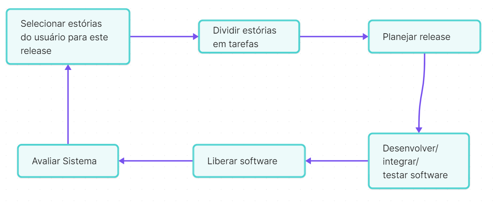

# Extreme Programming

É uma tecnologia ágil de desenvolvimento de software, que visa entregar valor ao cliente de forma rápida e contínua, adaptando-se às mudanças e priorizando a qualidade do produto final. Suas práticas consistem de práticas extremas de programação colaborativa, testes contínuos e feedback rápido.

## O Clico de Release

No XP, o desenvolvimento de software é organizado em ciclos curtos e repetitivos chamados de *releases*. Cada release representa uma versão funcional do software que é entregue ao cliente para obtenção de feedback. O ciclo de release contínuo do XP segue uma abordagem **iterativa e incremental**, em que novas funcionalidades são adicionadas em cada iteração, priorizadas com base no valor para o cliente.

## Princípios ou Práticas do XP

### Planejamento Incremental

O planejamento do XP é feito de forma incremental, com foco em entregar funcionalidades de alto valor de forma iterativa. Isso permite que o software evolua de maneira adaptativa, à medida que novos requisitos são descobertos ou priorizados.

### Pequenos Releases

O XP preconiza a entrega de pequenos releases frequentes, permitindo que o cliente experimente e forneça feedback rapidamente. Isso ajuda a mitigar o risco e a incerteza, garantindo que o software atenda às necessidades reais do usuário.

### Projeto Simples

A simplicidade é valorizada no XP, com foco na implementação da solução mais simples que atenda aos requisitos. Isso promove uma arquitetura flexível e fácil de dar manutenção, evitando o excesso de complexidade desnecessária.

### Desenvolvimento Test-First

No XP, os testes são escritos antes da implementação do código, seguindo o princípio do Test-Driven Development (TDD). Isso garante que o código seja testado continuamente e que novas funcionalidades sejam implementadas com base em requisitos claros e testáveis.

Os testes incluem tanto os testes unitários, escritos antes da implementação do código (TDD), quanto os testes de aceitação, que validam o comportamento do sistema como um todo. Essa abordagem garante a qualidade do software, detecta problemas precocemente e permite uma entrega contínua de valor ao cliente.

### Refatoração

A refatoração é uma prática essencial no XP, que consiste na melhoria contínua do código sem alterar seu comportamento externo. Isso ajuda a manter o código limpo, legível e fácil de dar manutenção, promovendo a evolução constante do software.

### Programação em Pares

Os programadores trabalham em pares no XP, colaborando e revisando o código uns dos outros em tempo real. Isso promove a comunicação eficaz, o compartilhamento de conhecimento e a melhoria da qualidade do código.

A prática de programação em pares no XP envolve dois programadores trabalhando juntos em um único computador. Um dos programadores escreve o código, enquanto o outro observa, revisa e oferece sugestões em tempo real. 

Essa colaboração promove a troca de conhecimento, a melhoria da qualidade do código e a redução de erros, resultando em um software mais robusto e de alta qualidade.

### Propriedade Coletiva

No XP, todo o código pertence à equipe como um todo, incentivando a colaboração e a responsabilidade compartilhada pela qualidade do software. Isso evita silos de conhecimento e garante que todos os membros da equipe se sintam responsáveis pelo sucesso do projeto.

### Integração Contínua

A integração contínua é uma prática essencial no XP, em que as alterações de código são integradas e testadas automaticamente várias vezes ao dia. Isso ajuda a detectar e corrigir problemas rapidamente, mantendo o software sempre em um estado funcional e pronto para entrega.

### Ritmo Sustentável

O XP promove um ritmo de trabalho sustentável, evitando o esgotamento da equipe e priorizando a qualidade do trabalho ao invés da quantidade de horas trabalhadas. Isso ajuda a manter a motivação e o engajamento da equipe ao longo do tempo.

### Cliente no Local

No XP, o cliente é uma parte integrante da equipe de desenvolvimento, fornecendo feedback contínuo e colaborando na definição de prioridades. Isso garante que o software atenda às necessidades reais do usuário e que as decisões sejam baseadas em dados concretos.

## Referências

- [eXtreme Programming  - Estratégia Concursos](https://www.estrategiaconcursos.com.br/blog/extreme-programming-xp-cef-ti/)

