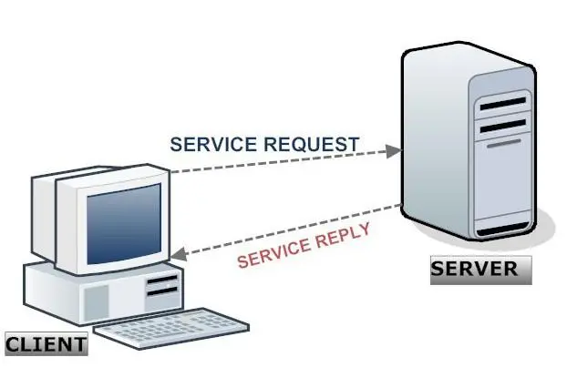
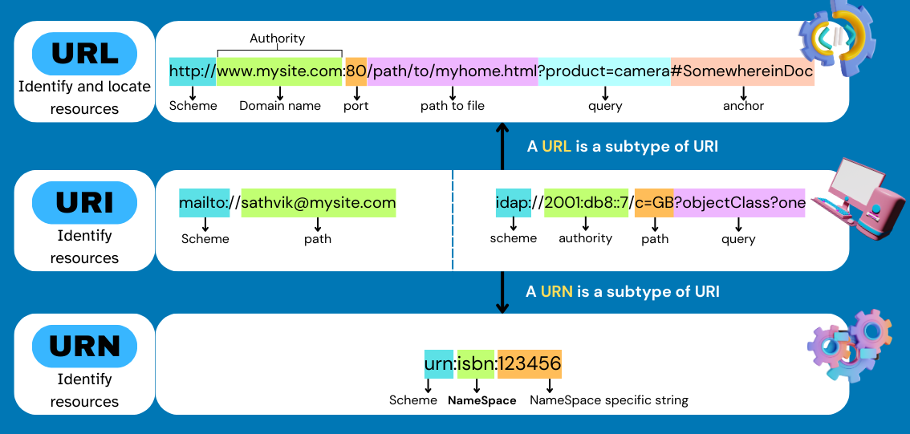

# Arquitetura Web

O <u>cliente web</u> é um programa ou aplicação específica, geralmente um navegador (browser), também é conhecido como agente de usuário (*user agent*) que envia requisições via protocolo HTTP(S) a uma outra aplicação, o <u>servidor web</u> através de uma rede de computadores como a internet.

O <u>servidor web</u> é um programa que recebe requisições HTTP(S), interpreta a URL e em seguida envia resposta ao <u>cliente web</u> com o recurso solicitado (Arquivo HTML, CSS, JavaScript, Imagens, Vídeos, etc.) por meio da rede.

O <u>internet</u> é uma rede mundial de computares baseada no [protocolo TCP/IP](../../Infraestrutura%20de%20TI/Protocolos/TCP%20IP.md), onde todo computador conectado é denominado *host* (hospedeiro) e possui um identificador através de um <u>endereço IP</u> (*Internet Protocol*) no padrão A.B.C.D.

## URI, URL, URN

A URI (*Uniform Resource Identifier*) é um padrão para o endereçamento de recursos disponíveis na rede que engloba os conceitos de URL (*Uniform Resource Locator*) e URN (*Uniform Resource Name*).

A URL é um tipo de URI, é o texto que vai na parte superior do browser e que indica qual recurso o usuário deseja acessar. 

| Parte         | Exemplo               | Função                     |
| ------------- | --------------------- | -------------------------- |
| **Scheme**    | `https`               | Protocolo usado            |
| **Authority** | `www.exemplo.com:443` | Domínio e porta            |
| **Path**      | `/docs/manual.html`   | Caminho até o recurso      |
| **Query**     | `?id=10`              | Parâmetros                 |
| **Fragment**  | `#top`                | Âncora dentro do documento |

A URN é um tipo de URI que identifica um recurso específico *namespace specific string* (NSS) pelo nome em um *namespace identifier* (NID). Exemplos:

1. Livro do George Orwell, 1984
~~~
urn:isbn:9788535914849
~~~
>[ISBC Search](https://isrcsearch.ifpi.org/) para distribuição de livros

2. Áudio da banda Iron Maiden, Fear of the Dark (2015)
~~~
urn:isrc:GBCHB1800082
~~~
> [ISRC Search](https://isrcsearch.ifpi.org/) para distribuição de áudios

3. Dvd do Titanic
~~~
urn:upc:097361552248
~~~
>[Barcode Search ](https://www.barcodelookup.com) para pesquisa de UPC e outros
>[Dvd UPC Search](https://dvdupc.com/) site focado em dvd apenas

| Authority de uma URL            | Path de uma URI de scheme mailto:            |
| ------------------------------- | -------------------------------------------- |
| www.site.com                    | name@mysite.com                              |
| www é o domínio (domain)        | name é o usuário (user)                      |
| site é o subdomínio (subdomain) | mysite.com é o nome de hospedagem (hostname) |
| .com é o domínio de topo (TLD)  |                                              |

## Protocolo HTTP

O protocolo HTTP é a forma como clientes e servidores se comunicam na rede. As requisições e as respostas obedecem aos padrões estabelecidos pelo protocolo HTTP. 

A requisição HTTP é um pacote de dados enviado ela rede pelo cliente web para o servidor web e identifica o recurso solicitado. A resposta HTTP é formada por pacotes de dados enviados pelo servidor web para o cliente web com os recursos solicitados.

