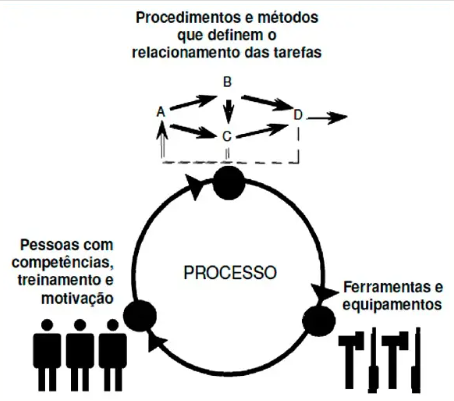

# CMMI 2.0

Capability Maturity Model Integration é um modelo de maturidade para melhoria de processo, destinado ao desenvolvimento de produtos e serviços, e composto pelas melhores práticas associadas a atividades de desenvolvimento e de manutenção que cobrem o ciclo de vida do produto desde a concepção até a entrega e manutenção.

As 3 visões diferentes não excludentes:
- CMMI Desenvolvimento
- CMMI Serviços
- CMMI Gestão de Fornecedor

Em outras palavras, CMMI é um **modelo de maturidade** que prescreve boas práticas para o desenvolvimento e manutenção de software.

| Sigla       |                                                                                      |
| ----------- | ------------------------------------------------------------------------------------ |
| Capability  | Qualidade de ser capaz ou apto a realizar uma determinada tarefa ou ação.            |
| Maturity    | Estado de estar maduro, totalmente desenvolvido em determinada área.                 |
| Model       | Representação de algo em diferentes contextos (Software, Aquisições, Operações etc.) |
| Integration | Consistência entre modelos e funções orgnizacionais                                  |
## Dimensões do Modelo

Um processo é uma sequência de passos executados para se realizar uma determinada atividade. A figura seguinte ilustra as **três dimensões críticas** nas quais as organizações geralmente concentram-se: pessoas, procedimentos e métodos, e ferramentas e equipamentos.

## Níveis Evolutivos

| Níveis                               | Descrição                                                                                                                                                                                                              |
| ------------------------------------ | ---------------------------------------------------------------------------------------------------------------------------------------------------------------------------------------------------------------------- |
| Nível 5 (Otimização)                 | Baseia-se nas práticas do nível 4. Utiliza técnicas estatísticas e outras técnicas quantitativas para **otimizar a realização de objetivos de qualidade e desempenho de processo.**                                 |
| Nível 4 (Gerenciado Quantativamente) | Baseia-se nas práticas do nível 3. Utiliza técnicas estatísticas e outras técnicas quantitativas para **detectar, refinar ou prever a área de foco para alcançar objetivos de desempenho de qualidade e processo.** |
| Nível 3 (Definido)                   | Baseia-se nas práticas do nível 2. Utiliza **padrões organizacionais e customização para tratar do projeto e de características do trabalho.** Os projetos utilizam e contribuem para os ativos da organização.     |
| Nível 2 (Gerenciado)                 | Incorpora as prátiacs do nível 1. Um simples, mas completo, **conjunto de práticas que abordam a intenção completa da área de prática.** Não requer o uso de ativos organizacionais.                                |
| Nível 1 (Inicial)                    | **Abordagem inicial** para atender a intenção da área de prática. Não é um conjunto completo de práticas para atender a total intenção da área de prática.                                                             |
| Nível 0 (Incompleto)                 | **Abordagem incompleta** para atender a intenção da área de prática. Pode ou não atender a intenção de qualquer práticas.                                                                                              |

