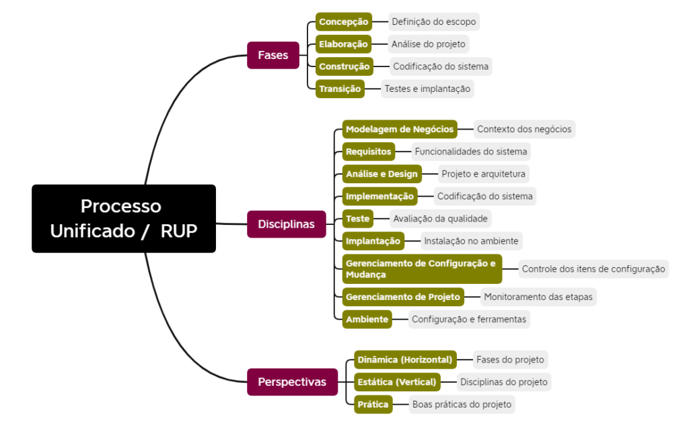

# O que é RUP?

O processo unificado, também conhecido como RUP (Rational Unified Process), é um _framework_ que visa apoiar o desenvolvimento de _software_. Seguem as suas principais características:

| Interativo e Incremental | Refinamentos sucessivos, com entregas divididas                          |
| ------------------------ | ----------------------------------------------------------------------- |
| Guiados por casos de uso | Eventos descritivos da interação do usuário com o sistem                 |
| Centrado na arquitetura  | Concepção dos componentes do siste                                       |
| Orientados à objetos     | Paradigma que facilita o reuso e a manutenção do sist                    |
| Focado em riscos      Gerenciamento de possíveis eventos que possam vir a impactar o projeto. ctar  |
O processo unificado é organizado em fases, disciplinas e perspectivas. Uma visão clássica para representá-lo é por meio do gráfico de baleias:

## Fases do RUP

- **Concepção:** fase responsável pela definição do escopo do projeto, ou seja, as tarefas que o projeto se propõe a entregar. Normalmente, efetua-se o levantamento inicial de requisitos nesta etapa.
- **Elaboração:** fase em que se concentra a análise do projeto, incluindo planejamento, especificações detalhadas e arquitetura do sistema. Apesar do nome, a elaboração também contempla o início da codificação.
- **Construção:** fase caracterizada pela codificação e testes de sistema propriamente ditos.  Ações relativas à implantação no ambiente também realizam-se massivamente nesta etapa.
- **Transição:** última fase do projeto, que contempla majoritariamente a conclusão dos testes e a implantação do sistema no ambiente. Se necessários, acertos finais no código também são bem-vindos.

## Disciplinas do RUP - Parte 1

- **Modelagem de Negócios:** identifica o contexto de negócios do sistema, incluindo o funcionamento da organização em que a solução será implantada.
- **Requisitos:** alinhamento do que o sistema deve fazer, ou seja, definição das funcionalidades necessárias ao sistema, segundo as expectativas do cliente.
- **Análise do Design:** definição da arquitetura do sistema, de acordo com os requisitos levantados na etapa anterior. Em outras palavras, é a fase responsável pela modelagem do projeto.
- **Implementação:** além de realizar a codificação da solução propriamente dita, em conformidade com a análise prévia realizada, esta etapa também contempla testes unitários.
- **Teste:** etapa que realiza a maior parte dos testes da aplicação, visando localizar e documentar defeitos na qualidade do _software_ desenvolvido.

## Disciplinas do RUP - Parte 2

- **Implantação:** cria uma nova versão do produto, instalando-o no ambiente e distribuindo-a para a utilização dos usuários. Em outras palavras, essa é a etapa que coloca a solução em produção.
- **Gerenciamento de Configuração e mudança:** responsável por gerenciar o versionamento do produto / itens de configuração, além de apoiar eventuais processos de mudança.
- **Gerenciamento de Projetos:** conjunto de ações para realizar um apoio ao monitoramento e à gestão dos projetos de _software_. Fique atento, pois essa disciplina não tem relação com PMBOK (ao contrário, é bem mais simples).
- **Ambiente:** etapa que disponibiliza as ferramentas necessárias no ambiente para o desenvolvimento do sistema, incluindo também configuração de _hardware_ e _software_.

## Perspectivas do RUP

- **Dinâmica:** perspectiva horizontal do gráfico de baleias, que mostra as fases do projeto ao longo do tempo.
- **Estática:** perspectiva vertical do gráfico de baleias, que mostra as disciplinas do projeto ao longo do tempo.
- **Prática:** recomendações de boas práticas para a utilização no projeto (nem todos os autores da literatura reconhecem esta perspectiva).

