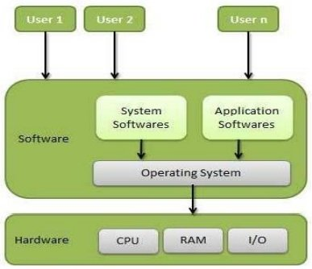

# Fundamentos do Sistema Operacional

## Tipos de Serviços

- Executar programa
- Operações de Entrada → Processamento de Dados → Saída (ciclo)
- Manipulação do Sistema de Arquivos
- Detecção de Erros
- Alocação de Recursos
- Proteção

## Principais Conceitos

- [Processos](processos.md)
- Gerenciamento de Memória
- Chamadas ao Sistema
- Estrutura do Sistema Operacional

Sistema Operacional é um programa ou mesmo um conjunto de programas cuja a função é, gerenciar os recursos do sistema, define qual parte do programa recebe atenção do processador, gerencia a memória, cria e gerencia o sistema de arquivos, fornece interface entre usuário e o computador. 

Usuário ↔ Software ↔ Sistema Operacional ↔ Hardware

O sistema operacional possui basicamente <u>duas funções</u>:
1. Apresentar ao usuário uma máquina estendida ou mesmo uma máquina virtual
2. Gerenciar um sistema super complexo

O sistema operacional controla todas as transações entre os programas de usuário e o hardware, estas tarefas são realizadas através das chamadas de sistemas, conhecido no meio técnico como: **system calls**

<u>O centro do sistema operacional é o Kernel</u>, é o núcleo que contra todo o sistema, no caso do SO Windows o Kernel é fechado, no Linux é possível realizar modificações. 

No **módulo Kernel** a aplicação pode ser executada com instruções privilegiadas e instruções não privilegiadas, nessas instruções estão aquelas que oferecem risco ao sistema operacional.

Já no **módulo usuário**, as aplicações só podem ser executadas as que não possuem privilégios, ou seja, instruções que não oferecem risco ao sistema operacional.

#### Tipos de Kernel

- **Monolítico:** neste modelo, o controle do dispositivo e as extensões são executadas no espaço de núcleos, eles possuem acesso completo ao hardware. O problema deste modelo é: como todos módulos são executados em um mesmo espaço de endereçamento, havendo ocorrência de erros, todos serão afetados.
- **Microkernel:** o núcleo é super reduzido, levando-o a executar em pequenos espaços do kernel. Muito destes processos são executados no próprio espaço do usuário, a grande vantagem é que, caso ocorra erros, basta que reiniciemos apenas aquele serviço, diferente do modelo de Kernel Monolítico.
- **Híbrido:** Neste modelo, o nome já diz tudo, é meio que uma junção dos modelos de kernel existentes. O hibrido faz algo muito interessante, ele combina a estabilidade e a segurança do microkernel com o desempenho do monolítico, como dizem é “unir o útil ao agradável!

## Referências
- [Fundamentos dos Sistemas Operacionais](https://free-content.direcaoconcursos.com.br/demo/curso-11607.pdf)

