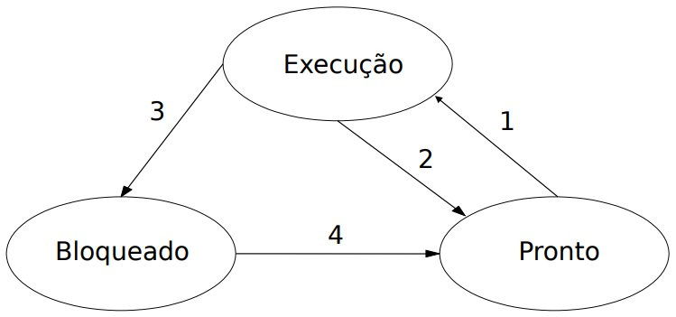

# Processos (Chave do SO)

- Caracterizado por um programa em execução
- Cada processo possui
	- Um espaço de endereçamento
	- Uma lista de alocação de memória (mínimo, máximo)]
	- Um conjunto de registradores (contador de programa)
- O Sistema Operacional controla todos os processos, sejam os criados pelos usuários, e os criados por ele mesmo

## Estados de um Processo

- **Execução:** em um sistema monoprocessado, apenas um processo pode estar fazendo uso da seção de processamento da CPU, em sistemas multiprocessados, apenas de existirem vários processos em execução simultânea, <u>vale ressaltar que cada núcleo de processamento executa somente uma por vez.</u>;
- **Bloqueado:** quando um processo não pode prosseguir com sua execução, pois necessita que algum evento ocorre antes;
- **Pronto:** o processo encontra-se carregado na memória pronto para iniciar sua execução, bastando somente ser selecionado pelo escalonador de processos.

### Processo Bloqueado (Suspenso)

Quando o SO suspende um processo P1 temporariamente para executar um processo P2, o processo P1 deve ser reiniciado exatamente no mesmo estado no qual estava ao ser suspenso.

Todas as informações a respeito do processo P1 são armazenadas em uma **tabela de processos** (*process table*). Essa tabela é implementada com <u>um vetor ou uma lista encadeada de estruturas.</u>

### Processos-Filhos

Quando um processo executa outro processo, as características para a hierarquia de processos:
- Comunicação (Interação) e Sincronização
- Segurança e Proteção
- Uma árvore de, no máximo, três níveis
- A árvore é chamada de (*process tree*)
- Normalmente através de chamadas:
	- `fork()` (Linux/Unix)
	- `CreateProcess()` (Windows)

Processo A (pai)
 ├── Processo B (filho)
 │     ├── Processo D (filho de B)
 │     └── Processo E (filho de B)
 └── Processo C (filho)

#### Hierarquia no Linux/Unix

1. **Processo raiz:** PID 1 (init/systemd): Todo o sistema começa com o processo PID 1, ele é o pai de todos os processos.
2. **Criação com fork() e exec():** Onde o `fork()` cria um clone do processo atual e `exec()` substitui o coteúdo do clone por outro programa
3. **Herança:** Processos filhos herdam do pai
	- Variáveis do ambiente
	- Descritores de arquivos abertos
	- Permissões (em partes)
	- Diretório Atual
	- Prioridades (dependendo do SO)
4. **Zombies e Orphans:** Hierarquia também explica dois fenômenos
	- **Processo Zumbi:** O processo terminou, mas o pai não chamou `wait()`, logo continuará como entrada na tabela de processos
	- **Processo Orfão:** O pai terminou antes do filho, o sistema adota o filho para que ele seja o processo 1 (*init/systemd*)
### Hierarquia no Windows

No Windows a hierarquia é **mais fraca**:
- Processos também têm pai (quem os criou).
- Mas o Windows **não usa** a hierarquia para controle de execução ou herança estrutural como o Linux faz
- O processo pai pode **não** continuar controlando o filho.
- O Windows usa **Jobs**, um mecanismo mais moderno para agrupar processos com regras de recursos e segurança.

Essa diferença faz com que "árvores de processos" no Windows sejam menos determinantes.

### Escalonadores de Processos (*Schedulers*)

Processo que escolhe qual será o próximo processo a ser executado, decidem qual processo vai usar a CPU, quando, e por quanto tempo. Sem eles, vários programas não conseguiriam compartilhar  processador de maneira eficiente. Vai lidar com:
- Performance
- Justiça (Todos ter chance de ser executado)
- Rapidez de resposta
- Uso eficiente da CPU
- Evitar bloqueio e gargalos

Os sistemas operacionais geralmente têm **três níveis** de escalonamento:

1. **Escalonador de Longo Prazo (Long-Term Scheduler):** 
	- Também chamado de <u>admissão de jobs</u>
	- Tem a função de decidir quais processos entram no sistema
	- Atua com menor frequência
	- Pode recusar novos processos se o sistema estiver cheio
2. **Escalonador de Médio Prazo (Medium-Term Scheduler):** 
	- Também conhecido como <u>swap scheduler</u>
	- Decide quais processos devem ser movidos para o disco (*swap*) e depois trazê-los de volta
	- Libera RAM quando o sistema estiver cheio
	- Suspender processos com pouca prioridade
	- Otimizar desempenho
3. **Escalonador de Curto Prazo (Short-Term Scheduler):** 
	- Também chamado de <u>dispatcher</u>
	- Escolhe qual processo/thread vai usar a CPU a cada pequeno intervalo
	- Atua muito rapidamente (milhões de vezes por segundo)
	- Fundamental para multitarefa

### Algoritmos de Escalonamento mais importantes

1. **FIFO/FCFS (First Come, First Served):** O primeiro que chegar, será o primeiro a ser executado.
2. **SJF/STRF (Shortest Job First / Shortest Remaning Time First):** Prioriza processos mais curtos, pode causar fome (*Starvation*) de processos longos.
3. **RR (Round Robin):** Cada processo recebe um **quantum** (tempo fixo de CPU), muito usado em sistemas interativos
4. **Prioridades (Priority Scheduling):** Cada processo tem uma prioridade, pode causar **fome**. Em sistemas modernos usam <u>envelhecimento</u> (*aging*) para evitar isso
5. **Fila Múltiplas (Multilevel Queue):** Várias filas com prioridades diferentes (ex.: sistema, usuário, lote), os processos não mudam de fila.
6. **MFQ (Multilevel Feedback Queue):** Processos podem mudar de fila conforme comprotamento

### Comunicação entre Processos (Inter-Process Communacation)

É um mecanismo que permite que dois ou mais processos realizem a troca de dados entre si. Isso é extremamente útil devido ao fato que um processo possui sua própria região de memória onde outros processos não tem a permissão de acessar aquele espaço de memória.

#### Tipos de IPC

- **pull-based:** requer um meio, um armazenamento para compartilhar os dados, isso porque os processos que querem ler esses dados precisam dar um *pull* desses dados. Neste caso será lido pelo elemento intermediário como um repositório de dados, onde um processo pode escrever dados nesse repositório enquanto outro processo realiza a leitura desses dados. É fortemente recomendado realizar a sincronia para que não haja concorrência. São eles:
	- **FIFO:** É uma fila de mensagens com arquivo presente no *filesystem*, onde o processo que envia deve escrever nesse arquivo, e o processo interessado nesses dados deve ler esse arquivo, e pode se comunicar entre processos não relacionados.
	- **Shared File:** é um arquivo comum onde os processos podem se comunicar através do mesmo.
	- **Shared Memory:** permite a comunicação entre processos de forma simples através de leitura e escrita de uma posição de memória especificada. Possui implementações em System V e POSIX
	- **Message Queue:**  é como _FIFO_, mas sem a complexidade associada de abrir e fechar o arquivo, provê um jeito razoavelmente fácil de transmitir dados entre processos não relacionados. Tem vantagem sobre a _FIFO_, e a fila de mensagem existe independentemente dos processos de envio e recepção. Possui implementações em System V e POSIX
	- **MMAP:** é similar à _Shared Memory_ porém está associado ao _filesystem_
	- **Semaphore:** é um mecanismo que permite que os processos sejam sincronizados para evitar concorrência no acesso aos dados compartilhados. Possui implementações em System V e POSIX
- **push-based:** Os dados são entregues diretamente ao processo que está realizando a leitura, são eles:
	- **Signals:** são mecanismos para comunicação e manipulação de processos. Um _Signal_ é uma mensagem especial enviada para um processo. _Signals_ são assincronos; quando um processo recebe um _Signal_, é processado imediatamente
	- **Socket:** é um dispositivo de comunicação bidirecional que pode ser usado para comunicar um processo com outro processo na mesma máquina ou com um processo executando em uma outra máquina. A conexão entre os processos pode ocorrer através de Bluetooth, TCP, UDP.
	- **PIPE:** é um dispositivo de comunicação que permite comunicação unidirecional. O dado é escrito para o _“write end”_ do _PIPE_ e é lido do _“read end”_. Os _PIPE’s_ são disposivos seriais, o dado é sempre lido na mesma ordem que foi escrito.
	- **DBUS:** é um barramento de mensagens de sistema, um jeito simples para aplicações conversar umas com as outras. Além da comunicação intra-processos, ajuda a coordenar o ciclo de vida do processo, tornando simples e confiável a codificação de um aplicativo ou _daemon_ de uma única instância, e inicia os aplicativos e _daemons_ sob demanda quando o serviço for requisitado.
## Referências

- [Sistemas Operacionais - Noções Principais](https://www.professores.uff.br/mquinet/wp-content/uploads/sites/42/2017/08/2.pdf)
- [Comunicação entre Processos - IPC](https://embarcados.com.br/comunicacao-entre-processos/)